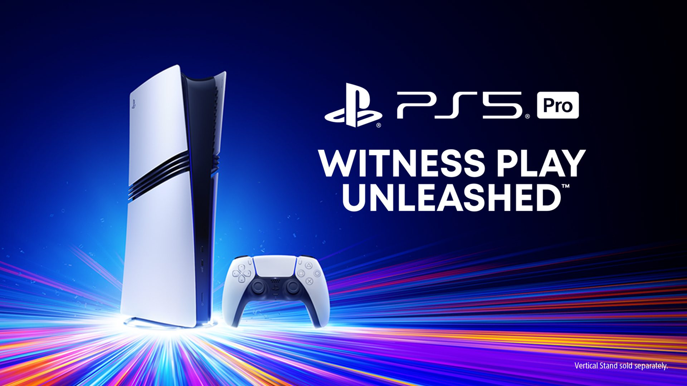
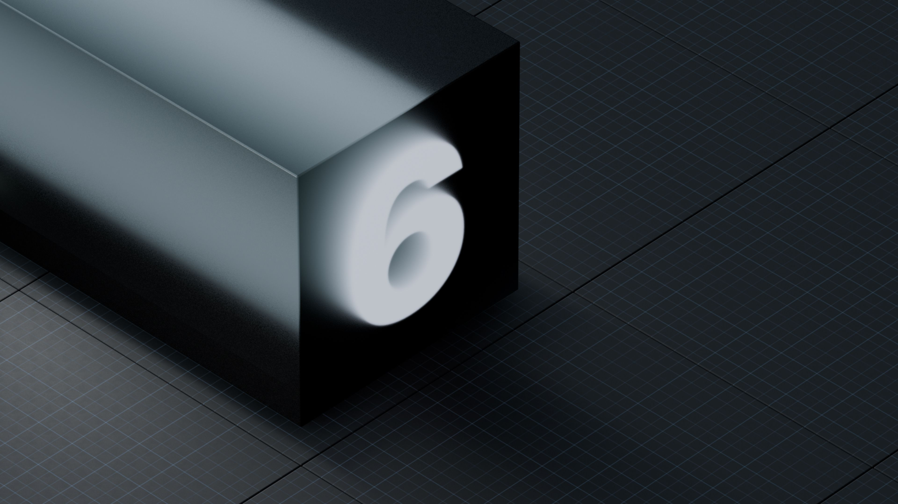
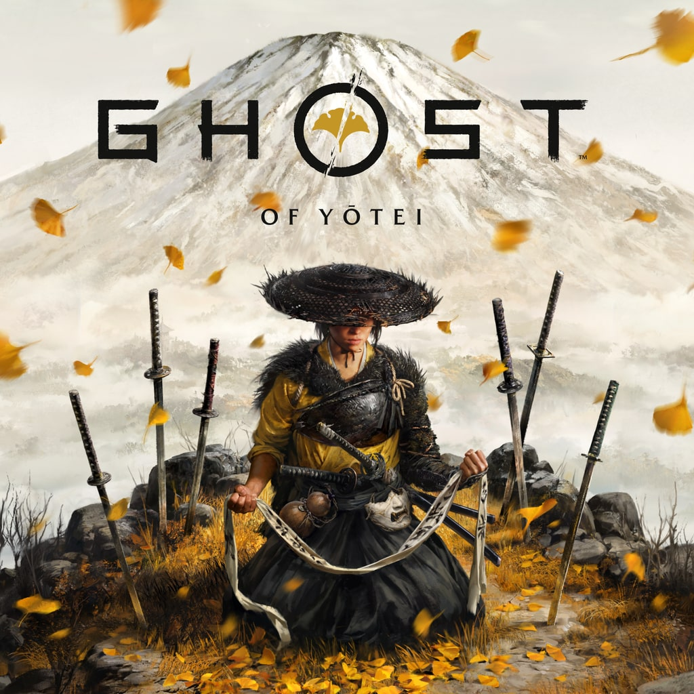
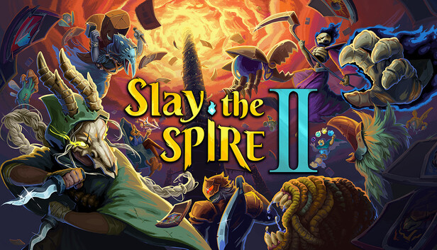
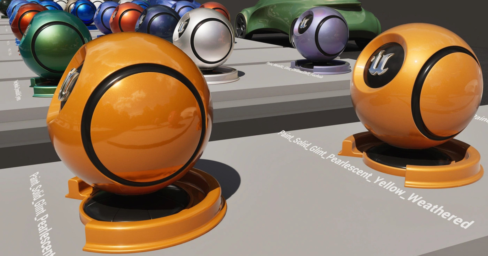
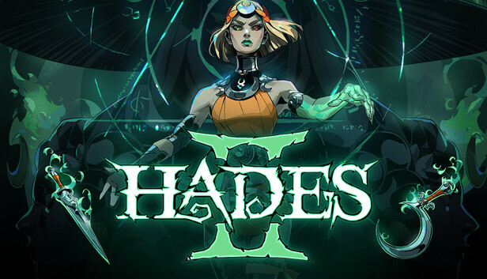
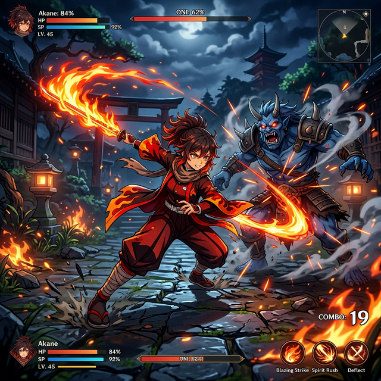
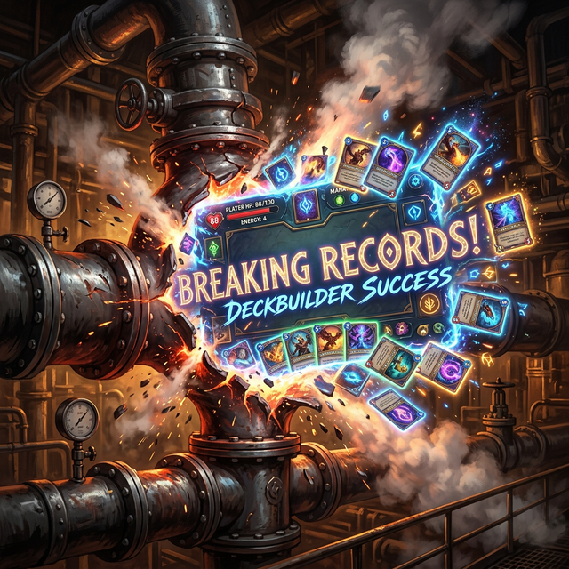

# Ultimate Daily Full Report (2026-03-08)

## 【今日頭條】
**動態提取新血脈：Substrate 與 PSSR 2.0 震撼產業**

*(圖：PlayStation 5 Pro 引入硬體級 PSSR AI 升頻技術)*
- **動態關鍵字提取**：今日從 GDC 2026 與三巨頭最新 Roadmap 爬萃出三大新興技術關鍵字：**「Substrate」** (UE5.7 高度自定義材質核心)、**「PSSR 2.0」** (Sony 全新升級 AI 升頻技術)、**「GPU Resident Drawer」** (Unity 6 大規模實例化最佳化)。
- **PSSR 2.0 落地**：Sony 的 PSSR 2.0 已於本月透過系統更新強制推進至 PS5 Pro，其神經網絡重構演算法與 AMD FSR 4 高度整合，解決了過去的邊緣閃爍問題。
*[資料來源]: https://blog.playstation.com/2024/09/10/welcome-playstation-5-pro-the-most-visually-impressive-way-to-play-games-on-playstation/, https://80.lv/*

## 【三巨頭引擎動態】

*(圖：Unity 6 帶來了 GPU Resident Drawer 巨幅減少 Draw Call 消耗)*
- **Unreal Engine**:
  - **技術面**: UE 5.7 全面預設啟用 **Substrate**，取代老舊的 Default Lit shading models。全新的「Slab」分層材質運算讓金屬、玻璃、漆面等混合材質得以達成物理級真實混色。此外，Lumen 全域光照進一步強化了硬體光追效能，提升了場景反射精度。
  - **產業資訊面**: Epic Games 於 GDC 行銷重點放在拓展虛幻商城（Fab）生態，並加強與各方 3D 資產平台的整合，提供更優惠的分潤機制以吸引更多獨立開發者從其他引擎轉移。
- **Unity 6**:
  - **技術面**: 宣布 URP (Universal Render Pipeline) 將於 2026 年成為絕對主流的唯一管道，HDRP 正式進入維護模式。技術亮點包含 **GPU Resident Drawer** (巨幅減少 Draw Call) 與 **GPU Occlusion Culling**，以及針對行動端極致優化的 Adaptive Probe Volumes。
  - **產業資訊面**: 在近期歷經定價風波後，Unity 積極重塑開發者信任，主打「穩定與回歸核心」，取消了備受爭議的運行費並提供更透明的訂閱方案，專注於提供中小型團隊穩健的開發環境與廣告變現生態。
- **Godot**:
  - **技術面**: Godot 4.x 持續強化 Vulkan 渲染後端。在 GDC 2026 探討中，展示了改善的 Forward+ 渲染器，並且在 2D 物理引擎與 TileMap 系統引入最佳化，極大提升了巨型 2D 世界的執行效率。
  - **產業資訊面**: 雖然在 3A 繪圖光環中聲量較小，但在開源社群強烈推動下，Godot 獲得大量企業贊助。其輕量化與快速開發迭代特性，使其成為獨立遊戲圈、行動端與 2D 專案的新標竿。
*[資料來源]: https://unity.com/releases/unity-6, https://godotengine.org/news/, https://www.unrealengine.com/*

## 【大作動態與發售預期】

*(圖：Ghost of Yōtei 展現 PS5 極致的開放世界武士美學)*
- **近期發售戰報**：《Resident Evil Requiem (惡靈古堡：安魂曲)》於 2 月 27 日發售，短短五天全球銷量突破 **500 萬套**，成為系列史上銷售最快的作品。同時登上各大平台，包括 Nintendo Switch 2。
- **即將到來 (2026 戰局)**：
  - **3月10日**：《Ghost of Yōtei: Legends (羊蹄戰鬼：傳奇)》多人模式擴充包免費上線。
  - **3月19日**：迎來傳奇對決！《Death Stranding 2 (死亡擱淺 2)》PC 版與重磅開放世界動作遊戲《Crimson Desert (赤血沙漠)》同日發售，將是近期玩家黏著度的雙重考驗。
- **硬體情報前瞻**：
  - **Nintendo Switch 2**：已開啟 2026 第一波黃金陣容，包含今日提及的《RE: Requiem (惡靈古堡：安魂曲)》，後續 3 月 26 日更帶來《Super Mario Bros. Wonder (超級瑪利歐兄弟 驚奇) - NS2 Edition》。
  - **PlayStation 6 (PS6) 傳聞**：分析師普遍認為 PS6 將於 2027 年末至 2028 年初發布。最新洩漏指向其將採用台積電 3nm 製程的 AMD "Orion" APU，達成 4K 120fps 光追標準。
*[資料來源]: https://www.playstation.com/en-us/games/ghost-of-yotei/, https://www.techpowerup.com/*

## 【Steam 本週戰報】

*(圖：Slay the Spire 2 突破驚人首發玩家數)*
- **空前絕後，Slay the Spire 2 突破 Steam 極限**：2026 年三月最大的市場地震，《Slay the Spire 2》在 Steam 首週末突破了驚人的 **526,793 最高同時在線人數 (CCU)**，直接成為 Steam 歷史上規模最大的 Roguelite 產品首發。
*[資料來源]: https://store.steampowered.com/app/2868840/Slay_the_Spire_2/, https://steamdb.info/*

## 【TA相關】

*(圖：三巨頭引擎在 TA 技術與工作流上的新世代升級)*
- **Unreal Engine 5.7 (Substrate 材質架構)**：
  - **核心技術點**：Substrate 將材質架構從固定參數轉變為 Slab 模塊化建構。開發者可以自由拼湊 Interface 與 Medium，精確控制 F0、F90 與 MFP (Mean Free path)。
  - **對「PCG 建築專案」的啟發**：突破過往依賴簡單 Material Instance 切換的限制。透過 Substrate，隨機產生的建築塗層、窗戶玻璃與鏽蝕，能在單一 Master Material 中完美相容，保持極高的物理過渡真實度。
- **Unity 6 (Shader Graph 擴充與渲染剖析)**：
  - **可視化進階除錯**：Render Graph API 引入高度視覺化工具，讓 TA 直接在編輯器檢視 Render Pass 執行順序與記憶體頻寬消耗，提升行動端優化 (Overdraw、Draw Call) 精準度。
  - **Shader 後端增強**：Shader Graph 現在提供更深度的 Custom Function Node 整合，讓資深 TA 輕鬆嵌入複雜的光照微積分 HLSL 碼。
- **Godot 4.x (視覺著色器與後處理)**：
  - **簡化的風格化渲染工作流**：大幅補強 Visual Shader 的內建節點種類 (如高階噪音、 SDF 運算)。透過全新 Compositor API，TA 可以更輕鬆地在全螢幕階段自定義 Post-Processing 濾鏡，大幅降低中小團隊撰寫著色器的門檻。
*[資料來源]: https://80.lv/articles/, https://unity.com/features/graphics, https://godotengine.org/features/rendering/*

## 【產業重點大事項】

*(圖：Hades II 等頂級 Roguelite 品質標竿拉高了市場門檻)*
- **全球市場趨勢深度分析**：Steam 上的「生存 Roguelike」板塊已經飽和。然而「牌組建構 Roguelite」(Deckbuilder) 卻迎來了文藝復興。《Slay the Spire 2》與《Hades 2》的成功證實只要機制夠深厚，硬核玩家的購買力依然驚人，但也意味著未來的獨立遊戲打磨標準越拉越高。
*[資料來源]: https://store.steampowered.com/app/1145350/Hades_II/, https://howtomarketagame.com/*

## 【在地社群】

*(圖：台灣本土開發的 3D 動作遊戲《炎姬》展現亮眼的美術與動作設計)*
- **台灣開發圈動態**：伴隨著 2026.3.3 任天堂舉辦的「Indie World」，台灣 Crimson Dusk 團隊研發的《炎姬》正式宣佈登島 Switch 2。本土團隊極為出色的 3D 動作開發實力與日系美術，成為近日社群的熱門討論話題。
*[資料來源]: https://www.ptt.cc/bbs/GameDesign/*

## 【今日全方位深度總結 (Global Synthesis)】
- **今日頭條**：Substrate 材質與 PSSR 2.0 AI 升頻技術的問世，標示著次世代畫面渲染進入全新紀元。
- **引擎動態**：三大引擎在技術優化與商業策略上均有重大進展，開發者需依專案規模靈活選擇。
- **大作預期**：2026 年初迎來多款 3A 大作同台競技，獨立團隊應謹慎避開 3 月中下的發布高峰。
- **Steam 戰報**：《Slay the Spire 2 (殺戮尖塔 2)》創下史無前例的在線人數紀錄，展現卡牌 Roguelite 的龐大潛力。
- **TA 相關技術**：各大引擎工具鏈持續升級，未來美術資產的物理正確性與渲染管理將成為技術核心。
- **產業趨勢**：機制深度的「牌組建構」產品再次成為市場焦點，進一步拉高了獨立遊戲的打磨標準。
- **在地社群**：台灣本土 3D 動作遊戲《炎姬》以高品質日系美術與動作設計成功登陸 NS2，引發強烈關注。

*(圖：由 Antigravity 依據「Steam 本週戰報」自動生成的具象化視覺，象徵牌組建構遊戲突破市場紀錄的驚人氣勢)*
