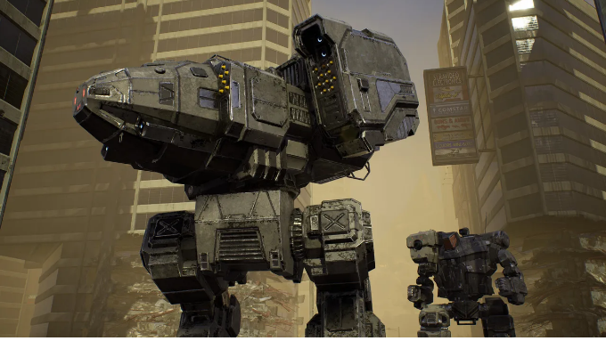
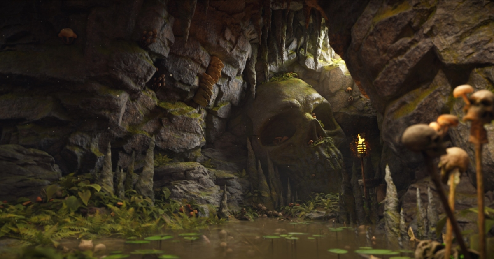
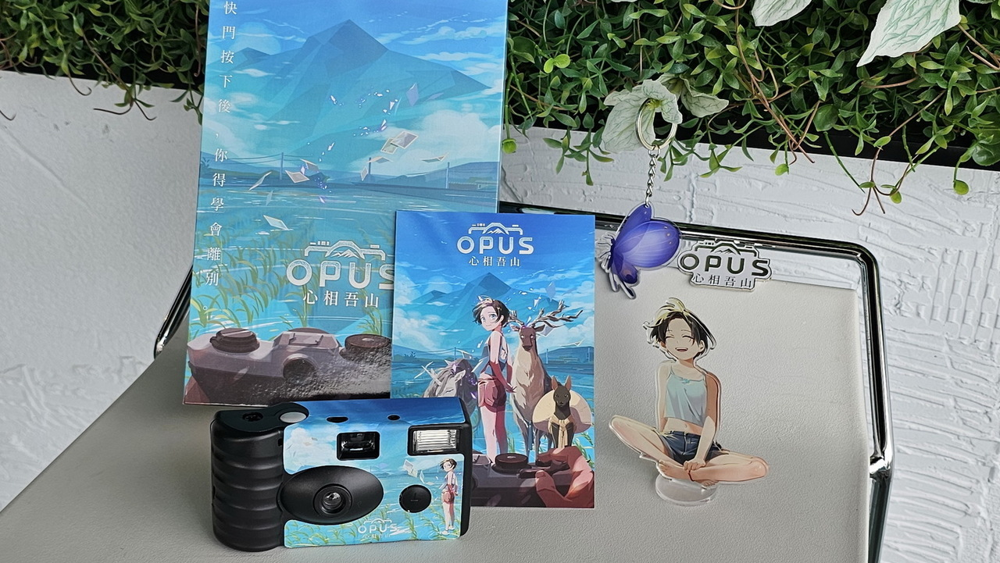

# 📅 Ultimate Daily Full Report — 2026-04-04

**📢 【今日頭條】**

《機甲戰士》開發商 Piranha Games 宣布裁員 30%，執行長 Russ Bullock 證實這是艱難的一天，但團隊仍將繼續開發 DLC。此次裁員反映了遊戲產業持續面臨的經濟壓力與挑戰，對員工和工作室的未來發展造成顯著影響。
[資料來源]
[Game Developer - MechWarrior dev Piranha Games lays off 30% of staff](<https://www.gamedeveloper.com/business/mechwarrior-dev-piranha-games-lays-off-30-of-staff-says-ceo>)
---
**🎨 【引擎相關】**

- **Unreal Engine**：
  - Productivity Software Group 正利用 UE5 轉型建築與製造業，透過即時配置器提升產品設計與交付效率，應對歐洲產業的勞動力短缺與生產力挑戰。
  - Unreal Engine 成為兒童動畫領域的首選工具，其快速迭代與專案周轉能力，為獨立工作室帶來速度與成本效益。
  - Arm Accuracy Super Resolution (ASR) 技術為 UE 行動遊戲帶來桌面級視覺效果，透過時間升級技術降低 GPU 負載、提升能效，並提供驚艷的圖形表現。
  - Epic Games 在三月份推出豐富的學習內容，涵蓋 Substrate 材質、MetaHuman 製作、主機遊戲開發及音效設計等，協助開發者提升技能。
  - 2.5D 電影風格平台遊戲《達爾文悖論》展示了 Unreal Engine 在打造沉浸式視覺與遊戲體驗方面的關鍵作用。
  - 採用 UE5 開發的合作戰術射擊遊戲《DarkSwarm》旨在提供刺激的戰鬥與難忘的多人遊戲體驗。
- **Unity**：
  - Eden Games 在《Gear.Club Unlimited 3》中實現了 500 公里/小時的渲染速度，證明了 Unity 在賽車遊戲中兼顧性能與視覺保真度的能力。
  - Unity 探討了傳統 3D 工具的隱藏成本，並提出更智能的方式來構建互動體驗，強調 3D 可視化在各行業的應用。
  - Unity Ads 推出由 Vector 驅動的 D28 IAP ROAS 廣告活動與簡化後的 ROAS 廣告活動上線流程，旨在幫助開發者擴展用戶獲取能力。
- **Godot Engine**：
  - Godot 4.6.2 維護版本已發布，帶來多項修復與改進，確保引擎穩定性。
  - Godot 4.7 dev 3 開發快照推出，預計將徹底改變 Godot 中 GUI 的設計方式，提升使用者介面開發效率。
  - Godot XR 團隊發布了 2026 年 3 月的更新，介紹了新的功能、平台支援以及即將舉行的遊戲開發活動。
- **3D/CG/VFX 工具**：
  - 一個使用 ZBrush 和 Unreal Engine 5 創建的瑪雅洞穴地牢場景展示了精湛的環境藝術與技術美術結合。
  - 一款免費工具的推出，旨在簡化 Houdini 函式庫的安裝過程，提升技術藝術家與特效師的工作流程效率。
  - 關於如何創建受 12 世紀蒙古戰士啟發的逼真角色，提供了角色建模與材質製作的深度見解。
  - 今日無映CG InCG Media相關新聞。
[資料來源]
[Unreal - UE5 transforms construction and manufacturing](<https://www.unrealengine.com/spotlights/productivity-software-group-uses-ue5-to-transform-construction-and-manufacturing>)
[Unreal - UE delivers speed and cost efficiency for kids’ animation](<https://www.unrealengine.com/spotlights/unreal-engine-delivers-speed-and-cost-efficiency-for-the-new-wave-of-kids-animation>)
[Unreal - March’s Epic learning content](<https://www.unrealengine.com/learning/marchs-epic-learning-content-substrate-metahuman-and-more>)
[Unreal - Darwin’s Paradox developer interview](<https://www.unrealengine.com/developer-interviews/a-stealthy-octopus-takes-center-stage-in-the-cinematic 2.5d-platformer-darwins-paradox>)
[Unreal - Bringing stunning visuals to UE mobile games with Arm Accuracy Super Resolution](<https://www.unrealengine.com/tech-blog/bringing-stunning-visuals-to-ue-mobile-games-with-arm-accuracy-super-resolution>)
[Unreal - DarkSwarm built with UE5](<https://www.unrealengine.com/developer-interviews/built-with-ue5-darkswarm-aims-to-deliver-visceral-combat-and-memorable-multiplayer-moments>)
[Unity - Rendering at 500 km/h in Gear.Club Unlimited 3](<https://unity.com/blog/eden-games-gear-club-unlimited-3>)
[Unity - The hidden costs of traditional 3D tools](<https://unity.com/blog/hidden-costs-traditional-3d-tools>)
[Unity - Introducing Vector-Powered D28 IAP ROAS Campaigns](<https://unity.com/blog/uads-march-updates>)
[Godot - Maintenance release: Godot 4.6.2](<https://godotengine.org/article/maintenance-release-godot-4-6-2/>)
[Godot - Dev snapshot: Godot 4.7 dev 3](<https://godotengine.org/article/dev-snapshot-godot-4-7-dev-3/>)
[Godot - Godot XR update — March 2026](<https://godotengine.org/article/godot-xr-update-mar-2026/>)
[80.lv - Mayan Caves Dungeon Scene with ZBrush and UE5](<https://80.lv/articles/check-out-this-mayan-caves-dungeon-scene-created-with-zbrush-and-unreal-engine-5>)
[80.lv - Free Tool To Simplify Houdini Libraries Installation](<https://80.lv/articles/free-tool-to-simplify-houdini-libraries-installation>)
[80.lv - Creating Realistic Character Inspired By 12th-Century Mongolian Warriors](<https://80.lv/articles/creating-realistic-character-inspired-by-12th-century-mongolian-warriors>)
---
**🎮 【獨立遊戲市場觀察】**

- Steam 平台持續為《Team Fortress 2》發布更新，修復客戶端崩潰、聲音問題及視覺錯誤等，確保遊戲穩定運行。
- 劇情導向的探索遊戲《OPUS：心相吾山》即將發售，媒體限定紀念組合的開箱預覽，讓玩家搶先一窺其獨特的世界觀與氛圍。
- 電影風格的 2.5D 動作冒險遊戲《達爾文悖論》正式登場，以一隻隱匿的章魚為主角，展現了獨立遊戲在敘事與美術上的創新。
- Unity 博客深入探討了《Esoteric Ebb》這款非線性 RPG 的互動寫作挑戰，揭示了複雜敘事設計的幕後故事。
[資料來源]
[Steam News - Team Fortress 2 Update Released](<https://store.steampowered.com/news/265516/>)
[巴哈姆特 GNN - 章魚英雄大顯身手！ 電影風格動作冒險遊戲《達爾文悖論》正式登場](<https://gnn.gamer.com.tw/detail.php?sn=302948>)
[巴哈姆特 GNN - 【開箱】距離《OPUS：心相吾山》發售倒數兩週](<https://gnn.gamer.com.tw/detail.php?sn=302943>)
[Unity - The challenge of interactive writing: Designing a nonlinear RPG like Esoteric Ebb](<https://unity.com/blog/interactive-writing-challenges-for-nonlinear-rpg-design>)
---
**🤝 【在地社群】**

- 「2026 A.C.F 秋葉原動漫祭」即日起在台北松菸文創園區盛大開幕，形象大使 Enako 帶領眾多嘉賓與活動登場，現場還原秋葉原街道，集結動漫、Cosplay、遊戲與 IP 元素，為在地社群帶來豐富的文化交流體驗。
[資料來源]
[巴哈姆特 GNN - 2026 A.C.F 秋葉原動漫祭即日起於松菸開幕](<https://gnn.gamer.com.tw/detail.php?sn=302946>)
---
**💼 【製作人週記建議】**

- Owlchemy Labs 執行長 Andrew Eiche 在 GDC 的訪談中分享了遊戲開發與經營的經驗，為製作人提供了寶貴的行業洞察。
- Unity 博客提醒開發者在啟動第一個 3D 專案前應思考的 10 個關鍵問題，幫助製作人避免潛在的隱藏成本與挑戰。
- Running With Scissors 的執行長分享了《Postal》系列的演變以及作為獨立發行工作室的經驗，為製作人提供了關於自我發行與品牌發展的建議。
- 深入了解非線性 RPG《Esoteric Ebb》的互動寫作挑戰，為製作人與敘事設計師提供了複雜敘事結構管理的實用案例。
[資料來源]
[Game Developer - Laptop mishaps and a GDC chat with Owlchemy Labs CEO Andrew Eiche](<https://www.gamedeveloper.com/design/laptop-mishaps-and-a-gdc-chat-with-owlchemy-labs-ceo-andrew-eiche>)
[Unity - 10 questions to ask before starting your first 3D project](<https://unity.com/blog/10-questions-first-no-code-3d-project>)
[80.lv - Running With Scissors CEO on The Evolution of Postal and Being a Self-Publishing Studio](<https://80.lv/articles/running-with-scissors-ceo-on-the-evolution-of-postal-and-being-a-self-publishing-studio>)
[Unity - The challenge of interactive writing: Designing a nonlinear RPG like Esoteric Ebb](<https://unity.com/blog/interactive-writing-challenges-for-nonlinear-rpg-design>)
---
**🌌 【今日全方位深度總結】**

遊戲產業持續面臨裁員壓力，凸顯了當前市場的嚴峻挑戰與不確定性。
引擎技術方面，Unreal Engine 與 Unity 在跨產業應用、行動視覺優化及渲染性能上持續精進，同時 Godot 也透過維護更新與開發快照提升功能，技術美術師需關注這些工具在效能與工作流程上的突破。
獨立遊戲市場展現多元活力，從敘事豐富的 RPG 到電影風格的平台遊戲，同時 Steam 平台也持續為經典遊戲提供更新支持。
在地社群活動如秋葉原動漫祭，為玩家與動漫愛好者提供了重要的交流平台，促進文化與產業的連結。
製作人應著重於 3D 專案的成本效益評估、敘事設計的複雜性管理，並從成功工作室的經驗中汲取自我發行與品牌發展的策略。
---
