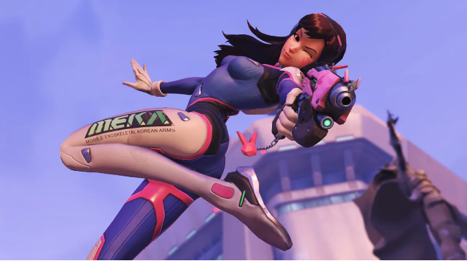

# 📅 Ultimate Daily Full Report — 2026-04-06

**📢 【今日頭條】**

遊戲巨頭 Take-Two 傳出裁員消息，其 AI 部門主管與多名團隊成員已離職，這反映了業界在 AI 整合與組織調整上的持續變動。此舉可能預示著大型發行商在 AI 策略上的重新評估，以及對內部資源配置的調整。
[資料來源]
- [Game Developer - Take-Two AI Layoffs](<https://www.gamedeveloper.com/business/report-take-two-lays-off-the-head-of-ai-and-unknown-number-of-team-members>)
---
**🎨 【引擎相關】**

- **Unreal Engine**：
  - Productivity Software Group 正利用 UE5 打造即時配置器，革新歐洲建築與製造業的產品設計與交付流程，展現了遊戲引擎在非遊戲領域的巨大潛力。
  - Unreal Engine 憑藉其速度與成本效益，正成為兒童動畫領域的首選工具，助力獨立工作室快速迭代並縮短專案週期。
  - Epic Games 公布了三月份的學習內容，涵蓋 Substrate 材質、MetaHuman 等進階主題，持續為開發者提供技能提升資源。
  - 2.5D 電影風格平台遊戲《Darwin’s Paradox!》的開發團隊分享了 Unreal Engine 在其首款作品中扮演的關鍵角色，特別是在視覺效果方面的應用。
  - Arm Accuracy Super Resolution (ASR) 技術為 UE 行動遊戲帶來桌面級視覺效果，透過時間升級技術降低 GPU 負載並提升能效，為行動平台提供更佳的圖形表現。
  - 採用 UE5 開發的合作戰術射擊遊戲《DarkSwarm》旨在提供沉浸式戰鬥與難忘的多人遊戲體驗，展示了 UE5 在多人遊戲開發中的應用。
- **Unity**：
  - Unity 探討了傳統 3D 工具的隱藏成本，並提出更智慧的方式來建構互動體驗，強調 3D 內容在設計、行銷與訓練等領域的廣泛應用。
  - Eden Games 分享了在《Gear.Club Unlimited 3》中以 500 公里/小時的速度進行渲染的挑戰，展示了 Unity 在賽車遊戲中兼顧性能與視覺保真度的能力。
  - Unity 提供了在啟動首個 3D 專案前應詢問的 10 個問題，旨在幫助開發者更好地規劃與執行互動式 3D 體驗。
- **Godot Engine**：
  - Godot Engine 發布了 4.6.2 維護版本，修復了多項錯誤，確保引擎的穩定性與可靠性。
  - Godot 4.7 dev 3 開發快照已推出，預計將徹底改變 Godot 中 GUI 的設計方式，為使用者介面開發帶來新功能。
  - Godot 4.5.2 維護版本為 4.5 用戶帶來了重要更新，特別是針對行動平台和 D3D12 的渲染錯誤修復，提升了跨平台的渲染表現。
  - Godot XR 團隊發布了 2026 年 3 月的更新，預告了即將到來的遊戲開發馬拉松、新功能與新平台支援，顯示其在 XR 領域的持續投入。
- **3D 模型技術**：
  - 一位藝術家展示了使用 ZBrush 和 Unreal Engine 創作的《血源詛咒》粉絲藝術，突顯了 ZBrush 在高細節模型製作上的能力。
  - 另一位藝術家分享了利用 ZBrush 和 Unreal Engine 5 打造的瑪雅洞穴地城場景，展現了 ZBrush 在複雜環境建模中的應用。
[資料來源]
- [Unreal - 建築製造業應用 UE5](<https://www.unrealengine.com/spotlights/productivity-software-group-uses-ue5-to-transform-construction-and-manufacturing>)
- [Unreal - 兒童動畫應用 UE](<https://www.unrealengine.com/spotlights/unreal-engine-delivers-speed-and-cost-efficiency-for-the-new-wave-of-kids-animation>)
- [Unreal - 三月學習內容](<https://www.unrealengine.com/learning/marchs-epic-learning-content-substrate-metahuman-and-more>)
- [Unreal - Darwin’s Paradox! 開發訪談](<https://www.unrealengine.com/developer-interviews/a-stealthy-octopus-takes-center-stage-in-the-cinematic-25d-platformer-darwins-paradox>)
- [Unreal - Arm ASR 行動遊戲視覺](<https://www.unrealengine.com/tech-blog/bringing-stunning-visuals-to-ue-mobile-games-with-arm-accuracy-super-resolution>)
- [Unreal - DarkSwarm UE5 開發](<https://www.unrealengine.com/developer-interviews/built-with-ue5-darkswarm-aims-to-deliver-visceral-combat-and-memorable-multiplayer-moments>)
- [Unity - 傳統 3D 工具成本](<https://unity.com/blog/hidden-costs-traditional-3d-tools>)
- [Unity - Gear.Club Unlimited 3 渲染](<https://unity.com/blog/eden-games-gear-club-unlimited-3>)
- [Unity - 首次 3D 專案問題](<https://unity.com/blog/10-questions-first-no-code-3d-project>)
- [Godot - 4.6.2 維護版本](<https://godotengine.org/article/maintenance-release-godot-4-6-2/>)
- [Godot - 4.7 dev 3 快照](<https://godotengine.org/article/dev-snapshot-godot-4-7-dev-3/>)
- [Godot - 4.5.2 維護版本](<https://godotengine.org/article/maintenance-release-godot-4-5-2/>)
- [Godot - XR 三月更新](<https://godotengine.org/article/godot-xr-update-mar-2026/>)
- [3D - 80.lv - 血源詛咒粉絲藝術](<https://80.lv/articles/have-a-look-at-this-bloodborne-fan-art-created-with-zbrush-and-unreal-engine>)
- [3D - 80.lv - 瑪雅洞穴場景](<https://80.lv/articles/check-out-this-mayan-caves-dungeon-scene-created-with-zbrush-and-unreal-engine-5>)
---
**🎮 【獨立遊戲市場觀察】**

- Steam 近期持續為《Team Fortress 2》發布多個更新，主要修復了客戶端崩潰、偽造系統訊息、視覺效果錯誤及跳躍預測問題等，確保遊戲穩定性。
- Unity 回顧了 2026 年 3 月發布的眾多 Unity 製作遊戲，包括在 GDC、Steam 春季特賣和 Steam Next Fest 期間推出的頂級作品與數百個精彩試玩版。
- 獨立遊戲發行商 PLAYISM 宣布，由 HANDSUM 開發的路徑重播型解謎動作遊戲《徑跡迴響》Switch / PS5 版已正式推出，首發期間提供折扣優惠。
- KONAMI 宣布，由法國工作室 ZDT 開發的電影風格動作冒險遊戲《達爾文悖論》已在多個平台登場，遊戲中玩家將扮演一隻隱匿的章魚英雄。
- 80.lv 報導了一位獨立遊戲開發者正在製作一款跑酷披薩外送平台遊戲，展現了獨立開發者獨特的創意方向。
- 另一款獨立遊戲《Hozy》是一款溫馨的遊戲，玩家將在其中修復一個被遺忘的社區，提供輕鬆的遊戲體驗。
- 《ShatterRush》是一款受《泰坦降臨》啟發的多人跑酷第一人稱射擊遊戲，展示了獨立開發者在競技遊戲領域的嘗試。
[資料來源]
- [Steam - Team Fortress 2 更新](<https://store.steampowered.com/news/265516/>)
- [Steam - Team Fortress 2 更新](<https://store.steampowered.com/news/265126/>)
- [Steam - Team Fortress 2 更新](<https://store.steampowered.com/news/260304/>)
- [Steam - Team Fortress 2 更新](<https://store.steampowered.com/news/259771/>)
- [Steam - Team Fortress 2 更新](<https://store.steampowered.com/news/259481/>)
- [Steam - Team Fortress 2 更新](<https://store.steampowered.com/news/259202/>)
- [Unity - 2026 年 3 月 Unity 遊戲回顧](<https://unity.com/blog/games-made-with-unity-march-2026-releases>)
- [Bahamut GNN - 徑跡迴響 Switch / PS5 版](<https://gnn.gamer.com.tw/detail.php?sn=302949>)
- [Bahamut GNN - 達爾文悖論 登場](<https://gnn.gamer.com.tw/detail.php?sn=302948>)
- [80.lv - 跑酷披薩外送遊戲](<https://80.lv/articles/solo-game-dev-is-working-on-a-parkour-pizze-delivery-platformer-game>)
- [80.lv - Hozy 溫馨遊戲](<https://80.lv/articles/hozy-a-cozy-game-where-you-restore-a-forgotten-neighborhood>)
- [80.lv - ShatterRush FPS](<https://80.lv/articles/shatterrush-is-a-titanfall-inspired-multiplayer-parkour-fps>)
---
**🤝 【在地社群】**

- 巴哈姆特電玩瘋手機週報介紹了《萌腿兔的大擊腿》、《Card Crawl 2》與《薑餅人大亂鬥》等 10 款手機遊戲，為台灣玩家提供最新的手遊資訊。
- 獨立遊戲《徑跡迴響》Switch / PS5 版在台發售，由 PLAYISM 發行，顯示在地市場對獨立遊戲的持續關注。
- KONAMI 宣布《達爾文悖論》在台上市，這款動作冒險遊戲的在地新聞報導，反映了國際遊戲在台灣市場的推廣。
- 「2026 A.C.F 秋葉原動漫祭」在台北松菸文創園區盛大開幕，集結動漫、Cosplay、遊戲與 IP 元素，吸引大量在地愛好者參與。
[資料來源]
- [Bahamut GNN - 手機週報](<https://gnn.gamer.com.tw/detail.php?sn=302951>)
- [Bahamut GNN - 徑跡迴響 Switch / PS5 版](<https://gnn.gamer.com.tw/detail.php?sn=302949>)
- [Bahamut GNN - 達爾文悖論 登場](<https://gnn.gamer.com.tw/detail.php?sn=302948>)
- [Bahamut GNN - 2026 A.C.F 秋葉原動漫祭](<https://gnn.gamer.com.tw/detail.php?sn=302946>)
---
**💼 【製作人週記建議】**

- 鑑於 Take-Two 裁員 AI 部門的事件，製作人應密切關注新興技術（如 AI）在遊戲開發中的實際效益與成本結構，並審慎評估內部團隊的配置與外部合作策略，避免盲目跟風。
- Nexon 宣布代理《鬥陣特攻》韓國版，這提醒製作人，在拓展國際市場時，與在地發行商的合作至關重要，能有效針對當地玩家需求提供客製化服務。
- 遊戲引擎在非遊戲領域（如建築、製造、動畫）的應用日益廣泛，製作人可思考如何將遊戲開發技術與工具應用於多元產業，開拓新的商業機會與收入來源。
- 獨立遊戲市場持續活躍，製作人應鼓勵團隊探索獨特創意與玩法，並善用 Steam 等平台進行推廣，同時關注行動遊戲的技術進展與市場趨勢，以提升作品的競爭力。
[資料來源]
- [Game Developer - Take-Two AI Layoffs](<https://www.gamedeveloper.com/business/report-take-two-lays-off-the-head-of-ai-and-unknown-number-of-team-members>)
- [Game Developer - Nexon 代理鬥陣特攻](<https://www.gamedeveloper.com/business/nexon-agrees-to-publish-overwatch-in-korea>)
- [Unreal - 建築製造業應用 UE5](<https://www.unrealengine.com/spotlights/productivity-software-group-uses-ue5-to-transform-construction-and-manufacturing>)
- [Unreal - 兒童動畫應用 UE](<https://www.unrealengine.com/spotlights/unreal-engine-delivers-speed-and-cost-efficiency-for-the-new-wave-of-kids-animation>)
- [Unity - 2026 年 3 月 Unity 遊戲回顧](<https://unity.com/blog/games-made-with-unity-march-2026-releases>)
- [Unreal - Arm ASR 行動遊戲視覺](<https://www.unrealengine.com/tech-blog/bringing-stunning-visuals-to-ue-mobile-games-with-arm-accuracy-super-resolution>)
---
**🌌 【今日全方位深度總結】**
今日頭條揭示了遊戲業界在 AI 領域的人事調整，反映了技術整合與組織策略的變動。
引擎與技術方面，Unreal Engine 在非遊戲領域及行動渲染技術上持續創新，而 Unity 和 Godot 則在 3D 工具應用與引擎維護更新上展現進步，特別是針對行動平台渲染優化與 GUI 設計的技術美術視角。
獨立遊戲市場方面，Steam 持續進行遊戲維護更新，同時多款 Unity 和 Unreal 製作的獨立遊戲發布，展現了市場的多元活力與開發者的創意。
在地社群方面，台灣市場持續關注手機遊戲與國際遊戲的在地化推廣，並舉辦了大型動漫遊戲文化活動，促進了社群交流。
製作人週記建議強調了在產業變動中，製作人應審慎評估新技術、拓展多元應用、並重視在地化合作與獨立遊戲的創意潛力。
---
