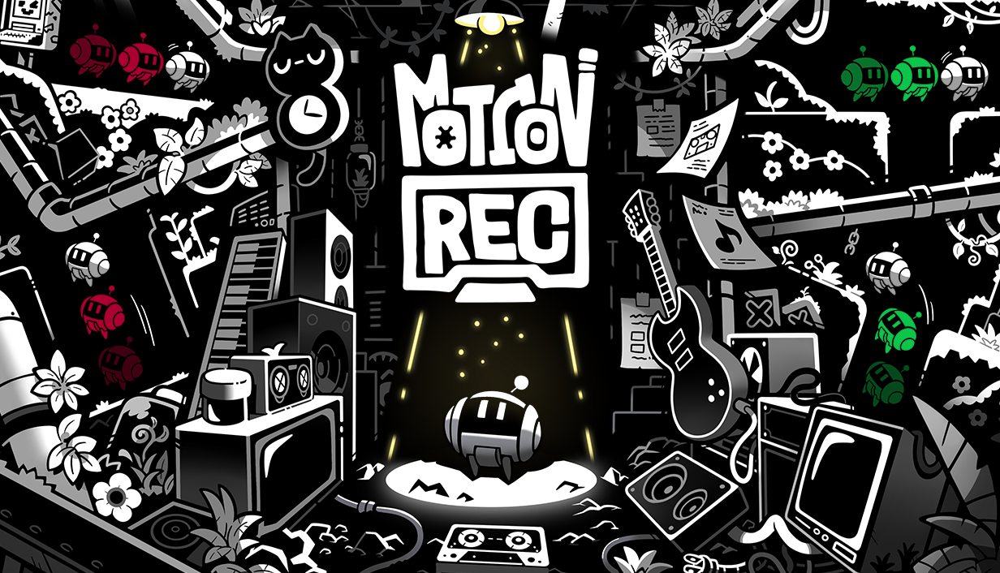

# 📅 Ultimate Daily Full Report — 2026-04-07

**📢 【今日頭條】**

前 Halo Studios 藝術總監及其他員工指控公司存在騷擾與報復行為，這項指控揭露了職場霸凌與公司掩蓋問題的嚴重性，對遊戲業界的企業文化與員工權益保障提出了嚴峻挑戰，引發廣泛關注。
  [Game Developer - Halo Studios 騷擾指控](<https://www.gamedeveloper.com/business/former-halo-studios-art-director-other-employees-accuse-studio-of-harassment-and-retaliation>)
---
**🎨 【引擎相關】**

- **Unreal Engine**：
  - Productivity Software Group 正利用 Unreal Engine 5 改造建築與製造業，透過即時配置器提升產品設計與交付效率，以應對歐洲勞動力短缺和生產力低下的挑戰。
    [Unreal - UE5 改造建築製造業](<https://www.unrealengine.com/spotlights/productivity-software-group-uses-ue5-to-transform-construction-and-manufacturing>)
  - Unreal Engine 為新一代兒童動畫帶來速度與成本效益，使其成為獨立工作室的首選工具，加速迭代並縮短專案週期。
    [Unreal - UE 兒童動畫](<https://www.unrealengine.com/spotlights/unreal-engine-delivers-speed-and-cost-efficiency-for-the-new-wave-of-kids-animation>)
  - Epic Games 公布了三月份的學習內容，涵蓋 Substrate 材質、MetaHuman 等多項主題，旨在幫助開發者提升遊戲開發技能。
    [Unreal - Epic 三月學習內容](<https://www.unrealengine.com/learning/marchs-epic-learning-content-substrate-metahuman-and-more>)
  - 2.5D 電影風格平台遊戲《Darwin’s Paradox!》以一隻隱匿的章魚為主角，展示了 Unreal Engine 在開發其首款作品中的關鍵作用。
    [Unreal - Darwin’s Paradox!](<https://www.unrealengine.com/developer-interviews/a-stealthy-octopus-takes-center-stage-in-the-cinematic-25d-platformer-darwins-paradox>)
  - 搭載 UE5 的《DarkSwarm》旨在提供刺激的戰鬥和難忘的多人遊戲體驗，這款合作戰術射擊遊戲展現了引擎的強大潛力。
    [Unreal - DarkSwarm UE5 戰鬥](<https://www.unrealengine.com/developer-interviews/built-with-ue5-darkswarm-aims-to-deliver-visceral-combat-and-memorable-multiplayer-moments>)
- **Unity**：
  - Unity 總結了 2026 年 3 月份使用 Unity 製作的遊戲發布情況，涵蓋了 GDC、Steam 春季特賣和 Steam Next Fest 期間的眾多頂級遊戲。
    [Unity - 2026 年 3 月遊戲回顧](<https://unity.com/blog/games-made-with-unity-march-2026-releases>)
  - Unity 探討了傳統 3D 工具的隱藏成本，並提出更智慧的方式來建構互動式體驗，強調 3D 視覺化在各行業的應用。
    [Unity - 3D 工具隱藏成本](<https://unity.com/blog/hidden-costs-traditional-3d-tools>)
  - Eden Games 分享了在《Gear.Club Unlimited 3》中以 500 km/h 速度進行渲染的挑戰，展示了在賽車遊戲中兼顧性能與視覺保真度的技術。
    [Unity - Gear.Club Unlimited 3 渲染](<https://unity.com/blog/eden-games-gear-club-unlimited-3>)
  - Unity 提供了在啟動第一個 3D 專案前應考慮的 10 個問題，幫助設計師、行銷人員和工業團隊更好地規劃互動式 3D 體驗。
    [Unity - 10 個 3D 專案問題](<https://unity.com/blog/10-questions-first-no-code-3d-project>)
  - 《Esoteric Ebb》的開發者分享了互動式寫作的挑戰，深入探討了非線性 RPG 的敘事設計決策與八年開發歷程。
    [Unity - Esoteric Ebb 互動寫作](<https://unity.com/blog/interactive-writing-challenges-for-nonlinear-rpg-design>)
  - Unity 廣告推出了由 Vector 驅動的 D28 IAP ROAS 廣告活動，並簡化了 ROAS 廣告活動的入門流程，旨在幫助開發者擴大用戶獲取規模。
    [Unity - Vector-Powered D28 IAP ROAS](<https://unity.com/blog/uads-march-updates>)
- **TA 與特效技術**：
  - Arm Accuracy Super Resolution (ASR) 技術為 UE 行動遊戲帶來桌面級視覺效果，透過時間升頻優化行動裝置的 GPU 負載和功耗效率。
    [TA - Unreal - Arm ASR 行動視覺](<https://www.unrealengine.com/tech-blog/bringing-stunning-visuals-to-ue-mobile-games-with-arm-accuracy-super-resolution>)
  - 一篇文章詳細解析了如何建構並打光一個擁有不同房間的後蘇聯醫院場景，為環境藝術家提供了實用的技術指導。
    [TA - 80.lv - 後蘇聯醫院場景](<https://80.lv/articles/how-to-build-and-light-a-post-soviet-hospital-with-different-rooms>)
  - 一款專為「懶惰綁定藝術家」設計的 Blender 權重繪製工具被介紹，旨在簡化角色綁定過程中的複雜性。
    [TA - 80.lv - Blender 權重繪製工具](<https://80.lv/articles/check-out-this-weight-painting-blender-tool-designed-for-lazy-rigging-artists>)
  - 一篇環境分解文章展示了如何在山區中建造一個冬季城堡環境，提供了場景搭建和視覺呈現的深入洞察。
    [TA - 80.lv - 冬季城堡環境分解](<https://80.lv/articles/breakdown-building-a-winter-environment-of-a-castle-in-a-mountain>)
---
**🎮 【獨立遊戲市場觀察】**

- Steam 平台持續為《Team Fortress 2》發布例行更新，修復了客戶端崩潰、玩家冒充系統訊息等問題，並進行了多項遊戲內部的優化與錯誤修正。
  [Steam - Team Fortress 2 更新](<https://store.steampowered.com/news/265516/>)
  [Steam - Team Fortress 2 更新](<https://store.steampowered.com/news/265126/>)
  [Steam - Team Fortress 2 更新](<https://store.steampowered.com/news/260304/>)
- 獨立遊戲發行商 PLAYISM 宣布，由 HANDSUM 開發的路徑重播型解謎動作遊戲《徑跡迴響》Nintendo Switch／PS5 下載版現已發售，首發期間提供 8 折特惠。
  [巴哈姆特 - 徑跡迴響 Switch/PS5](<https://gnn.gamer.com.tw/detail.php?sn=302949>)
- KONAMI 宣布，由法國遊戲工作室 ZDT 開發的電影風格動作冒險遊戲《達爾文悖論（Darwin's Paradox!）》已在多個平台正式登場，讓玩家體驗章魚英雄的冒險。
  [巴哈姆特 - 達爾文悖論 登場](<https://gnn.gamer.com.tw/detail.php?sn=302948>)
---
**🤝 【在地社群】**

- 巴哈姆特電玩瘋本週介紹了 10 款手機遊戲，包括卡牌遊戲《Card Crawl 2》、冒險遊戲《Easy Delivery Co.》等，為手機遊戲玩家提供了豐富的選擇。
  [巴哈姆特 - 手機週報](<https://gnn.gamer.com.tw/detail.php?sn=302951>)
- 「2026 A.C.F 秋葉原動漫祭」即日起在台北松菸文創園區開幕，形象大使 Enako 帶領眾多嘉賓與活動登場，集結了動漫、Cosplay、遊戲等多元內容，現場氣氛熱鬧。
  [巴哈姆特 - 2026 A.C.F 秋葉原動漫祭](<https://gnn.gamer.com.tw/detail.php?sn=302946>)
---
**💼 【製作人週記建議】**

- 遊戲開發者建議，在「注意力戰爭」中，遊戲應轉向講故事來吸引玩家，強調觀眾具備理解細微之處的能力，鼓勵更深層次的敘事設計。
  [Game Developer - 遊戲如何贏得注意力戰爭](<https://www.gamedeveloper.com/design/how-can-your-game-win-the-attention-war-focus-on-its-writing>)
- Owlchemy Labs 執行長 Andrew Eiche 在 GDC 的訪談中分享了開發過程中的趣事與見解，為遊戲製作人提供了寶貴的行業經驗。
  [Game Developer - GDC 與 Owlchemy Labs CEO 對談](<https://www.gamedeveloper.com/design/laptop-mishaps-and-a-gdc-chat-with-owlchemy-labs-ceo-andrew-eiche>)
- Unity 提出在啟動第一個 3D 專案前應詢問的 10 個關鍵問題，旨在幫助製作人與團隊更好地規劃和執行互動式 3D 體驗，避免潛在的開發陷阱。
  [Unity - 10 個 3D 專案問題](<https://unity.com/blog/10-questions-first-no-code-3d-project>)
---
**🌌 【今日全方位深度總結】**
今日頭條揭示了遊戲業界嚴重的職場騷擾問題，凸顯了企業文化與員工保護的迫切需求。
引擎相關新聞顯示 Unreal Engine 和 Unity 在遊戲開發、非遊戲應用及技術美術領域持續創新，特別是行動渲染優化與環境搭建技術的進展，對遊戲渲染管線與效能優化帶來了新的視角。
獨立遊戲市場方面，Steam 平台持續維護其經典遊戲，同時多款獨立新作在不同平台發布，展現了市場的活力與多樣性。
在地社群動態則聚焦於台灣本土的手機遊戲介紹與大型動漫遊戲展會，反映了本地玩家與社群的活躍。
製作人週記建議強調了敘事在吸引玩家注意力上的重要性，並提供了 3D 專案啟動前的實用規劃建議，對遊戲開發策略具有指導意義。
---