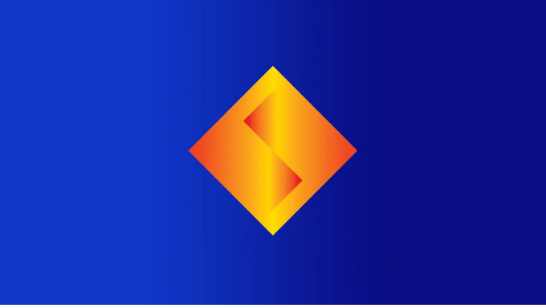
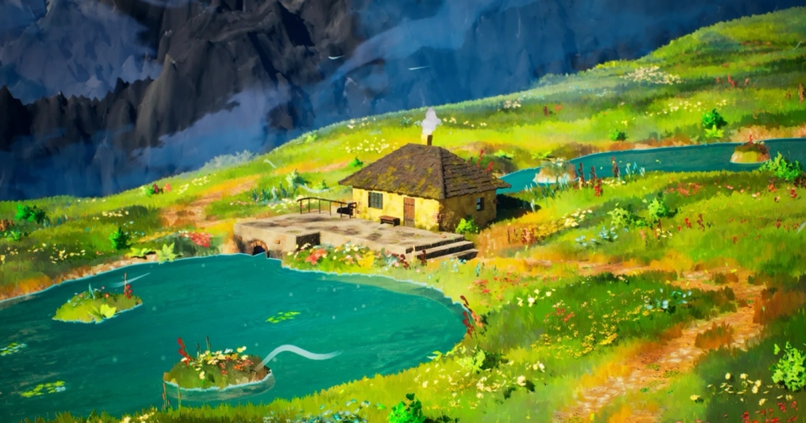
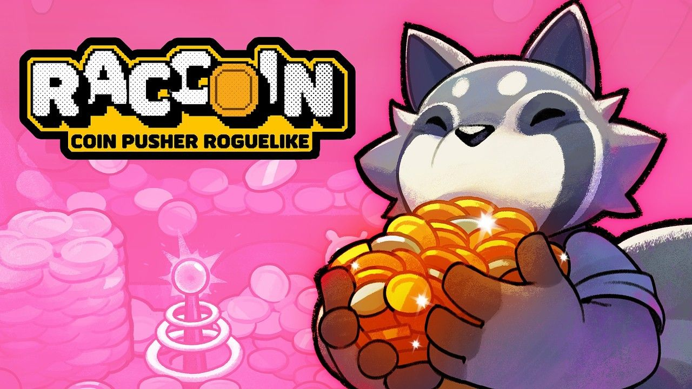
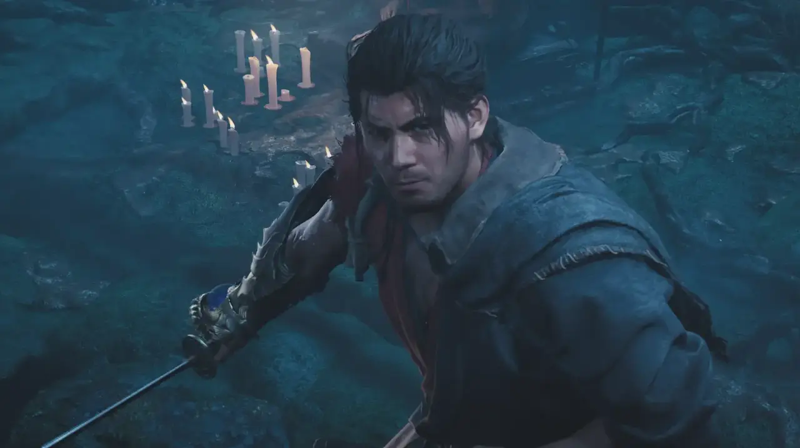

# 📅 Ultimate Daily Full Report — 2026-04-08

**📢 【今日頭條】**

Sony 宣布收購機器學習公司 Cinemersive Labs，此舉旨在將先進的機器學習技術整合至 PlayStation 的視覺運算部門，以期大幅提升遊戲內的視覺效果與渲染技術。這項策略性收購預示著遊戲產業正朝向 AI 驅動的圖形創新與效率優化邁進，將對未來遊戲的開發管線產生深遠影響。
- 🔗 來源: [Game Developer - Sony 收購 Cinemersive Labs](<https://www.gamedeveloper.com/business/sony-to-acquire-machine-learning-company-cinemersive-labs>)
---
**⚙️ 【引擎相關】**

- **Unreal Engine**：
  - Productivity Software Group 正利用 UE5 轉型建築與製造業，透過即時配置器解決勞動力短缺和生產力低下的問題，展現了遊戲引擎在非遊戲領域的強大應用潛力。
    - 🔗 來源: [Unreal - UE5 轉型建築製造](<https://www.unrealengine.com/spotlights/productivity-software-group-uses-ue5-to-transform-construction-and-manufacturing>)
  - Unreal Engine 正成為兒童動畫領域的首選工具，其快速迭代和專案周轉能力，為蓬勃發展的獨立工作室帶來了更多機會。
    - 🔗 來源: [Unreal - UE 助力兒童動畫](<https://www.unrealengine.com/spotlights/unreal-engine-delivers-speed-and-cost-efficiency-for-the-new-wave-of-kids-animation>)
  - Epic Games 發布了三月份的學習內容，涵蓋 Substrate 材質、MetaHuman 等多項主題，旨在幫助開發者提升遊戲開發技能。
    - 🔗 來源: [Unreal - 三月學習內容](<https://www.unrealengine.com/learning/marchs-epic-learning-content-substrate-metahuman-and-more>)
  - 2.5D 平台遊戲《Darwin’s Paradox》展示了 Unreal Engine 在開發電影級視覺效果方面的關鍵作用。
    - 🔗 來源: [Unreal - Darwin’s Paradox](<https://www.unrealengine.com/developer-interviews/a-stealthy-octopus-takes-center-stage-in-the-cinematic-25d-platformer-darwins-paradox>)
  - 採用 UE5 開發的《DarkSwarm》旨在提供刺激的戰鬥和難忘的多人遊戲體驗。
    - 🔗 來源: [Unreal - DarkSwarm](<https://www.unrealengine.com/developer-interviews/built-with-ue5-darkswarm-aims-to-deliver-visceral-combat-and-memorable-multiplayer-moments>)
- **Unity**：
  - Unity 回顧了 2026 年三月使用 Unity 製作的遊戲，包括 GDC、Steam 春季特賣和 Steam Next Fest 期間發布的眾多頂級作品。
    - 🔗 來源: [Unity - 2026 三月遊戲回顧](<https://unity.com/blog/games-made-with-unity-march-2026-releases>)
  - Unity 探討了傳統 3D 工具的隱藏成本，並提出更智慧的方式來構建互動體驗，強調 3D 視覺化在各行業的普及。
    - 🔗 來源: [Unity - 傳統 3D 工具成本](<https://unity.com/blog/hidden-costs-traditional-3d-tools>)
  - Eden Games 分享了《Gear.Club Unlimited 3》如何在 500 公里/小時的速度下實現 60 fps 的渲染，平衡性能與視覺保真度。
    - 🔗 來源: [Unity - Gear.Club Unlimited 3 渲染](<https://unity.com/blog/eden-games-gear-club-unlimited-3>)
  - Unity 提供了在啟動第一個 3D 專案前應考慮的 10 個問題，幫助設計師、行銷人員和工業團隊更好地規劃互動式 3D 體驗。
    - 🔗 來源: [Unity - 啟動 3D 專案的 10 個問題](<https://unity.com/blog/10-questions-first-no-code-3d-project>)
  - Unity 介紹了由 Vector 驅動的 D28 IAP ROAS 活動和簡化的 ROAS 活動上線流程，旨在幫助開發者擴展使用者獲取能力。
    - 🔗 來源: [Unity - Vector 驅動 ROAS 活動](<https://unity.com/blog/uads-march-updates>)
- **3D 模型技術**：
  - PlayStation 計劃透過 Playerbase 服務，將玩家的真實形象掃描進遊戲中，這項技術預示著 3D 數據採集在遊戲中的應用將更加普及。
    - 🔗 來源: [3D - 80.lv - PlayStation 掃描玩家](<https://80.lv/articles/playerbase-is-playstation-s-plan-to-officially-scan-gamers-into-games>)
---
**✨ 【TA 相關】**

- Arm Accuracy Super Resolution (ASR) 技術為 UE 行動遊戲帶來了桌面級的視覺效果，透過時間性升級減少 GPU 負載並提高電源效率，這對行動遊戲的渲染管線優化至關重要。
  - 🔗 來源: [TA - Unreal - Arm ASR 行動遊戲視覺](<https://www.unrealengine.com/tech-blog/bringing-stunning-visuals-to-ue-mobile-games-with-arm-accuracy-super-resolution>)
- Blizzard 解釋了《鬥陣特攻》角色 Anran 的視覺更新，展示了角色藝術設計在回應社群反饋時的調整與優化過程。
  - 🔗 來源: [TA - Game Developer - 鬥陣特攻 Anran 視覺更新](<https://www.gamedeveloper.com/design/blizzard-explains-the-visual-update-to-overwatch-character-anran>)
- Sony 收購機器學習公司 Cinemersive Labs，旨在將機器學習應用於增強遊戲視覺效果和改進渲染技術，這將對未來遊戲的圖形管線產生深遠影響。
  - 🔗 來源: [TA - Game Developer - Sony 收購 Cinemersive Labs](<https://www.gamedeveloper.com/business/sony-to-acquire-machine-learning-company-cinemersive-labs>)
- 80.lv 探討了如何創造受《霍爾的移動城堡》啟發的繪畫風格化環境，分享了風格化渲染和場景搭建的技術美術實踐。
  - 🔗 來源: [TA - 80.lv - 霍爾移動城堡風格化環境](<https://80.lv/articles/creating-a-painterly-like-and-stylized-environment-inspired-by-howl-s-moving-castle>)
- Nightdive Studios 闡述了在遊戲重製中如何專注於「玩家記憶中的樣子」，這反映了在保留原作精髓的同時，運用現代技術提升視覺保真度的技術挑戰。
  - 🔗 來源: [TA - 80.lv - Nightdive 遊戲重製](<https://80.lv/articles/why-nightdive-focuses-on-how-you-remember-it-in-video-game-remasters>)
---
**🎮 【獨立遊戲市場觀察】**

- Steam 平台持續為《Team Fortress 2》發布例行性更新，主要集中在修復客戶端崩潰、遊戲內錯誤以及視覺效果調整等維護性內容，確保遊戲穩定運行。
  - 🔗 來源: [Steam - Team Fortress 2 更新](<https://store.steampowered.com/news/265516/>)
- Unity 回顧了 2026 年三月在 Steam Next Fest 上發布的眾多獨立遊戲試玩版和頂級遊戲，顯示獨立遊戲市場的活躍與多元。
  - 🔗 來源: [Unity - 2026 三月遊戲回顧](<https://unity.com/blog/games-made-with-unity-march-2026-releases>)
- 獨立遊戲《Esoteric Ebb》的開發者分享了設計非線性 RPG 互動式寫作的挑戰，為獨立遊戲敘事設計提供了寶貴經驗。
  - 🔗 來源: [Unity - Esoteric Ebb 互動寫作](<https://unity.com/blog/interactive-writing-challenges-for-nonlinear-rpg-design>)
- 2.5D 平台遊戲《Darwin’s Paradox》以其電影級的視覺效果和獨特的章魚主角，展示了獨立遊戲在創意和技術上的潛力。
  - 🔗 來源: [Unreal - Darwin’s Paradox](<https://www.unrealengine.com/developer-interviews/a-stealthy-octopus-takes-center-stage-in-the-cinematic-25d-platformer-darwins-paradox>)
- 採用 UE5 開發的合作戰術射擊遊戲《DarkSwarm》旨在提供沉浸式的多人體驗，預示著獨立遊戲在複雜類型上的嘗試。
  - 🔗 來源: [Unreal - DarkSwarm](<https://www.unrealengine.com/developer-interviews/built-with-ue5-darkswarm-aims-to-deliver-visceral-combat-and-memorable-multiplayer-moments>)
---
**🤝 【在地社群】**

- 巴哈商城公布了 4 月 5 日當週的預購排行榜，《鬼武者 Way of the Sword》榮登亞軍，反映了台灣玩家對實體遊戲預購的偏好與市場熱度。
  - 🔗 來源: [Bahamut GNN - 巴哈商城預購榜](<https://gnn.gamer.com.tw/detail.php?sn=303026>)
- 世雅股份有限公司宣布將新增「人中之龍」系列商品的實體販售據點並追加更多周邊商品，顯示遊戲周邊商品在台灣市場的持續影響力與在地行銷策略。
  - 🔗 來源: [Bahamut GNN - 人中之龍周邊](<https://gnn.gamer.com.tw/detail.php?sn=303021>)
---
**💼 【製作人週記建議】**

- Unity 深入探討了傳統 3D 工具的隱藏成本，並建議開發者和企業採用更智慧的方式來構建互動體驗，這對製作人評估專案預算和技術選型提供了重要參考。
  - 🔗 來源: [Unity - 傳統 3D 工具成本](<https://unity.com/blog/hidden-costs-traditional-3d-tools>)
- Unity 提出了在啟動第一個 3D 專案前應問的 10 個關鍵問題，旨在幫助製作人或專案經理在初期階段進行全面的規劃與風險評估。
  - 🔗 來源: [Unity - 啟動 3D 專案的 10 個問題](<https://unity.com/blog/10-questions-first-no-code-3d-project>)
- 遊戲開發者分享了如何透過敘事來贏得「注意力之戰」，強調了故事在吸引和留住玩家方面的重要性，為製作人提供了內容策略上的建議。
  - 🔗 來源: [Game Developer - 敘事贏得注意力](<https://www.gamedeveloper.com/design/how-can-your-game-win-the-attention-war-focus-on-its-writing>)
- Unity 推出由 Vector 驅動的 D28 IAP ROAS 活動，旨在幫助製作人優化使用者獲取和變現策略，提升廣告投放效率。
  - 🔗 來源: [Unity - Vector 驅動 ROAS 活動](<https://unity.com/blog/uads-march-updates>)
- 前《Halo Studios》藝術總監及其他員工指控工作室存在騷擾和報復行為，這提醒製作人必須重視工作場所文化和員工福祉，以避免潛在的法律和聲譽風險。
  - 🔗 來源: [Game Developer - Halo Studios 騷擾指控](<https://www.gamedeveloper.com/business/former-halo-studios-art-director-other-employees-accuse-studio-of-harassment-and-retaliation>)
- 《People of Note》的設計師分享了他們如何以「鉤子」方法設計回合制音樂 RPG，讓玩家能以自己喜歡的方式遊玩，這對製作人思考遊戲設計的包容性提供了啟發。
  - 🔗 來源: [Game Developer - People of Note 設計](<https://www.gamedeveloper.com/design/behind-people-of-note-s-methods-for-luring-players-into-enjoying-a-musical>)
---
**🌌 【今日全方位深度總結】**
今日業界焦點集中於 Sony 透過機器學習強化遊戲視覺渲染的戰略佈局，凸顯了 AI 在圖形管線中的核心地位。
Unreal Engine 在跨產業應用上展現強勁增長，同時 Unity 則在 3D 互動體驗和廣告變現方面提供解決方案，而 PlayStation 透過掃描技術將玩家帶入遊戲，展現了 3D 數據採集的新趨勢。
技術美術則在行動平台優化、風格化渲染及重製技術中扮演關鍵角色，持續推動視覺品質與效能的平衡。
獨立遊戲市場持續活躍，Steam 平台提供穩定維護，多款獨立遊戲在敘事設計和技術應用上均有亮點。
在地社群則透過實體遊戲預購與周邊商品展現其獨特活力與市場潛力。
製作人則需在專案管理、市場策略與團隊文化建設上保持敏銳，以應對不斷變化的產業挑戰。
---
