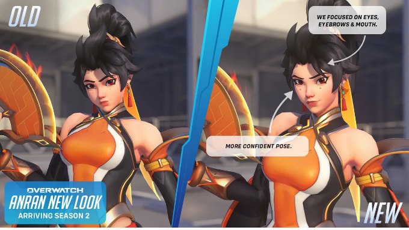
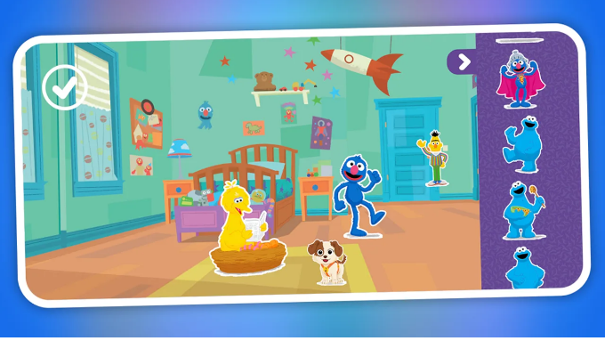

# 📅 Ultimate Daily Full Report — 2026-04-09

**📢 【今日頭條】**

Unreal Engine 5正迅速成為機器人模擬領域的首選平台，不僅作為模擬器，更作為合成數據工廠，為下一代機器人系統提供動力。這標誌著UE5在遊戲產業之外的巨大影響力擴展。
- [Unreal - 機器人模擬](<https://www.unrealengine.com/spotlights/ue5-is-becoming-the-platform-of-choice-for-robotics-simulation>)
---
**⚙️ 【引擎相關】**

- **Unreal Engine**：
  - Unreal Engine 5正被廣泛應用於歐洲的建築與製造業，透過即時配置器解決勞動力短缺和生產力低下的問題，展現其在工業領域的轉型潛力。
    - [Unreal - 建築製造業應用](<https://www.unrealengine.com/spotlights/productivity-software-group-uses-ue5-to-transform-construction-and-manufacturing>)
  - UE5在蓬勃發展的兒童動畫領域展現出卓越的速度與成本效益，成為獨立工作室快速迭代和專案周轉的首選工具，助力新一代兒童動畫製作。
    - [Unreal - 兒童動畫應用](<https://www.unrealengine.com/spotlights/unreal-engine-delivers-speed-and-cost-efficiency-for-the-new-wave-of-kids-animation>)
  - 2.5D電影化平台遊戲《Darwin’s Paradox》的開發團隊分享了Unreal Engine關鍵功能在其首款作品中的應用經驗，展示了引擎在特定遊戲類型開發中的靈活性。
    - [Unreal - Darwin’s Paradox 開發](<https://www.unrealengine.com/developer-interviews/a-stealthy-octopus-takes-center-stage-in-the-cinematic-25d-platformer-darwins-paradox>)
- **Unity**：
  - 一位獨立開發者分享了如何在Unity中構建經典CRPG的經驗，深入探討了開發流程與技術挑戰。
    - [TA - 80.lv - Unity CRPG 開發](<https://80.lv/articles/how-a-solo-developer-is-building-a-classic-crpg-in-unity>)
- **3D 模型技術**：
  - 一篇文章詳細介紹了如何將2D插畫轉化為詳細3D模型的製作流程，為藝術家提供了實用的技術指導。
    - [3D - 80.lv - 2D轉3D模型](<https://80.lv/articles/turning-a-2d-illustration-of-a-woman-holding-a-dragon-into-a-detailed-3d-model>)
---
**✨ 【TA 相關】**

- Epic Games三月份的學習內容涵蓋了Substrate材質、MetaHuman等，旨在提升開發者在引擎底層技術與角色製作方面的技能。
  - [TA - Unreal - Epic 學習內容](<https://www.unrealengine.com/learning/marchs-epic-learning-content-substrate-metahuman-and-more>)
- Arm Accuracy Super Resolution (ASR) 技術為UE行動遊戲帶來桌面級視覺效果，透過時間升頻降低GPU負載並提升能效，優化了行動平台的渲染管線。
  - [TA - Unreal - Arm ASR 行動遊戲](<https://www.unrealengine.com/tech-blog/bringing-stunning-visuals-to-ue-mobile-games-with-arm-accuracy-super-resolution>)
- Eden Games分享了在《Gear.Club Unlimited 3》中以500公里/小時的速度進行渲染，平衡性能與視覺保真度的經驗，展示了賽車遊戲中複雜的渲染優化策略。
  - [TA - Unity - Gear.Club 渲染](<https://unity.com/blog/eden-games-gear-club-unlimited-3>)
- 暴雪解釋了《鬥陣特攻》角色Anran的視覺更新，這項改動是基於社群反饋進行的，體現了角色藝術設計與玩家互動的重要性。
  - [TA - Game Developer - 鬥陣特攻視覺更新](<https://www.gamedeveloper.com/design/blizzard-explains-the-visual-update-to-overwatch-character-anran>)
- Sony收購機器學習公司Cinemersive Labs，旨在應用機器學習技術增強遊戲視覺效果並改進渲染技術，預示著AI在遊戲圖形領域的深度整合。
  - [TA - Game Developer - Sony 收購 Cinemersive](<https://www.gamedeveloper.com/business/sony-to-acquire-machine-learning-company-cinemersive-labs>)
- 透過課程學習如何創建受《原神》啟發的風格化奇幻3D場景，這對於掌握特定藝術風格的場景搭建與材質表現至關重要。
  - [TA - 80.lv - 原神風格場景](<https://80.lv/articles/create-stylized-fantasy-3d-scene-inspired-by-genshin-impact-with-this-course>)
- 一篇文章展示了明亮風格化的外星植被製作，提供了關於程序化生成與材質表現的技術洞察。
  - [TA - 80.lv - 外星植被](<https://80.lv/articles/bright-stylized-alien-like-vegetation>)
- Blender中令人印象深刻的布料與肌肉模擬工作流程，展示了角色動畫與物理模擬的最新技術。
  - [TA - 80.lv - Blender 布料肌肉模擬](<https://80.lv/articles/impressive-cloth-muscle-simulation-workflow-made-in-blender>)
---
**🎮 【獨立遊戲市場觀察】**

- Unity回顧了2026年3月發布的遊戲，涵蓋了GDC、Steam春季特賣和Steam新品節期間的眾多頂級遊戲和試玩版，顯示獨立遊戲市場的活躍。
  - [Unity - 2026年3月遊戲回顧](<https://unity.com/blog/games-made-with-unity-march-2026-releases>)
- Peak共同開發商Landfall成立新的發行品牌Evil Landfall，積極尋求資助開發週期短的趣味獨立遊戲，為獨立開發者提供了新的資金來源。
  - [Game Developer - Landfall 投資獨立遊戲](<https://www.gamedeveloper.com/business/peak-co-developer-landfall-might-finance-your-next-indie-game>)
- 一位開發者分享了從《CorgiSpace》等「短小精悍」遊戲中尋找靈感和希望的經驗，強調了小型專案對於個人創造力的重要性。
  - [Game Developer - CorgiSpace 靈感](<https://www.gamedeveloper.com/design/finding-inspiration-and-a-bit-of-hope-in-corgispace>)
- Steam平台發布了多個《Team Fortress 2》的例行更新，主要修復了客戶端崩潰、材質代理、音效、顏色控制碼漏洞、視覺效果和跳躍預測錯誤等問題，持續維護這款經典遊戲的穩定性。
  - [Steam - Team Fortress 2 更新](<https://store.steampowered.com/news/265516/>)
---
**🤝 【在地社群】**

- TAITO今日宣布，將於4月11日起在日本推出《勇者鬥惡龍》主題的夾娃娃機獎品，包含流浪金屬史萊姆與泡沫史萊姆造型的PC滑鼠，吸引遊戲周邊收藏愛好者。
  - [巴哈姆特 - 勇鬥滑鼠](<https://gnn.gamer.com.tw/detail.php?sn=303095>)
- 由日本知名插畫家大槍葦人親自操刀的美少女養成模擬遊戲《Machine Child》已在Steam上市，讓玩家體驗養女兒的樂趣，引起在地玩家關注。
  - [巴哈姆特 - Machine Child 上市](<https://gnn.gamer.com.tw/detail.php?sn=303094>)
- 3D打磚塊遊戲《彈跳衝擊球》結束了長達近11年的搶先體驗階段，預計於4月22日正式發售，標誌著一款長期開發遊戲的里程碑。
  - [巴哈姆特 - 彈跳衝擊球發售](<https://gnn.gamer.com.tw/detail.php?sn=303093>)
- 《海洋的呼喚》系列續作《古神的呼喚》公布發售日，預定5月12日上市，將帶領玩家進入以物品與觀察為導向的解謎世界。
  - [巴哈姆特 - 古神的呼喚發售](<https://gnn.gamer.com.tw/detail.php?sn=303092>)
- 十銓科技宣布其在電競、影像設備整合及資安領域取得多國專利，特別強調電競系列產品透過獨特散熱設計，確保系統在極限環境下仍維持高效能輸出。
  - [巴哈姆特 - 十銓科技專利](<https://gnn.gamer.com.tw/detail.php?sn=303091>)
- SteelSeries賽睿為慶祝品牌25週年，推出了搭載4000 Hz輪詢率的Aerox 3 Wireless Gen 2系列電競滑鼠，並同步發布新QcK Heavy系列滑鼠墊，提升電競周邊性能。
  - [巴哈姆特 - SteelSeries 電競滑鼠](<https://gnn.gamer.com.tw/detail.php?sn=303090>)
---
**💼 【製作人週記建議】**

- Unity探討了傳統3D工具的隱藏成本，並提出了更智能的方式來構建互動體驗，強調3D可視化在各行業的普及及其商業價值。
  - [Unity - 3D工具成本](<https://unity.com/blog/hidden-costs-traditional-3d-tools>)
- 在啟動第一個3D專案之前，有10個關鍵問題需要考慮，這對於設計產品、培訓員工和吸引客戶的互動3D體驗至關重要，為專案經理提供了實用指南。
  - [Unity - 10個3D專案問題](<https://unity.com/blog/10-questions-first-no-code-3d-project>)
- 《Esoteric Ebb》的開發者分享了設計非線性RPG互動式寫作的挑戰與八年學習旅程，為敘事設計師提供了寶貴的經驗。
  - [Unity - 非線性RPG寫作挑戰](<https://unity.com/blog/interactive-writing-challenges-for-nonlinear-rpg-design>)
- Unity Ads推出了由Vector驅動的D28 IAP ROAS廣告活動和簡化的ROAS廣告活動上線流程，旨在幫助開發者擴展用戶獲取能力，優化營銷策略。
  - [Unity - Unity Ads 更新](<https://unity.com/blog/uads-march-updates>)
- Supercell執行長Ilkka Paananen將獲得BAFTA會士榮譽，表彰其在遊戲產業的卓越貢獻和領導力。
  - [Game Developer - Supercell CEO 獲獎](<https://www.gamedeveloper.com/business/supercell-ceo-ilkka-paananen-to-receive-bafta-fellowship>)
- Netflix推出了針對兒童的「Playground」視訊遊戲應用程式，已在Apple App Store和Google Play上架，顯示其在遊戲內容領域的持續擴張。
  - [Game Developer - Netflix Playground](<https://www.gamedeveloper.com/business/netflix-lunches-playground-video-game-app-for-children>)
---
**🌌 【今日全方位深度總結】**
Unreal Engine 5正迅速擴展其應用範疇，不僅在遊戲領域，更成為機器人模擬、建築與製造業等高科技產業的首選平台，預示著實時3D引擎在多領域的巨大潛力。

引擎相關方面，UE5持續深化其在非遊戲產業的影響力，從機器人模擬到兒童動畫製作，展現其多功能性與效率；同時，Unity也透過獨立開發者的案例，證明其在特定遊戲類型開發上的實用性，而3D模型技術則聚焦於2D轉3D的實踐。

技術美術領域的焦點集中在渲染技術的進步，如Arm ASR為行動遊戲帶來桌面級視覺，以及Sony收購機器學習公司以增強渲染效果；此外，材質製作（Substrate）、場景搭建、角色視覺更新、布料與肌肉模擬等工作流程也持續有新內容與教學分享，顯示業界對視覺品質與效能優化的雙重追求。

獨立遊戲市場持續活躍，Unity回顧了多款在GDC和Steam上發布的遊戲，同時有新的發行商如Landfall投入資金支持短週期獨立遊戲；Steam平台則持續為《Team Fortress 2》等經典遊戲提供例行維護更新，確保遊戲穩定性。

台灣在地社群新聞涵蓋了多款新遊戲的發布（如《Machine Child》、《彈跳衝擊球》、《古神的呼喚》），以及電競周邊硬體（十銓科技、SteelSeries）和遊戲周邊商品（勇者鬥惡龍滑鼠）的動態，展現了多元的在地遊戲文化與產業鏈。

本週的製作人建議側重於3D專案的成本效益分析、初期規劃的關鍵問題，以及非線性敘事設計的挑戰；同時，Unity Ads的用戶獲取工具更新和Netflix進軍兒童遊戲市場，也為製作人提供了市場策略與商業模式的新視角。
---
