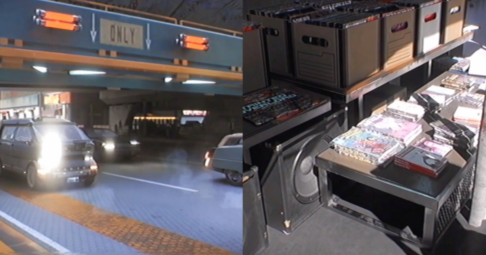
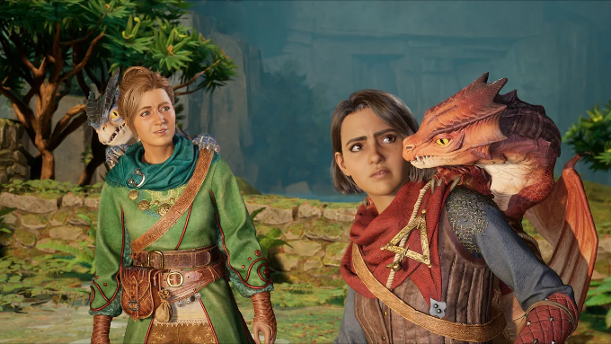
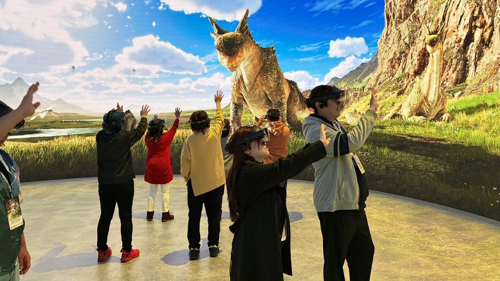

# 📅 Ultimate Daily Full Report — 2026-04-10
**📢 【今日頭條】**

Konami 的足球遊戲《eFootball》宣布全球下載量突破 10 億次，這項里程碑凸顯了其作為免費遊玩遊戲在全球市場的巨大成功與影響力，並為此推出了遊戲內特別活動慶祝。
- [Game Developer - Konami《eFootball》突破 10 億下載](<https://www.gamedeveloper.com/business/konami-s-efootball-tops-1-billion-downloads>)
---
**⚙️ 【引擎相關】**

- **Unreal Engine**：
  - Unreal Engine 5 正迅速成為機器人模擬領域的首選平台，不僅作為模擬器，更作為驅動下一代機器人系統的合成數據工廠。
    - [Unreal - UE5 機器人模擬](<https://www.unrealengine.com/spotlights/ue5-is-becoming-the-platform-of-choice-for-robotics-simulation>)
  - Productivity Software Group 正利用 UE5 改造建築與製造業，透過即時配置器解決勞動力短缺、生產力低下和住房壓力等問題。
    - [Unreal - UE5 改造建築與製造業](<https://www.unrealengine.com/spotlights/productivity-software-group-uses-ue5-to-transform-construction-and-manufacturing>)
  - Unreal Engine 為新一波兒童動畫帶來速度與成本效益，使其成為獨立工作室快速迭代和專案周轉的理想工具。
    - [Unreal - UE5 兒童動畫](<https://www.unrealengine.com/spotlights/unreal-engine-delivers-speed-and-cost-efficiency-for-the-new-wave-of-kids-animation>)
  - Epic Games 於三月推出豐富的學習內容，涵蓋 Substrate 材質、MetaHuman 等，旨在幫助開發者提升遊戲開發技能。
    - [Unreal - Epic 三月學習內容](<https://www.unrealengine.com/learning/marchs-epic-learning-content-substrate-metahuman-and-more>)
  - 電影級 2.5D 平台遊戲《Darwin’s Paradox》中，一隻隱匿的章魚成為主角，開發團隊 ZDT 詳述了 Unreal Engine 關鍵功能在遊戲開發中的作用。
    - [Unreal - Darwin’s Paradox 開發訪談](<https://www.unrealengine.com/developer-interviews/a-stealthy-octopus-takes-center-stage-in-the-cinematic-25d-platformer-darwins-paradox>)
- **Unity**：
  - Unity 總結了 2026 年 3 月使用 Unity 製作的遊戲發布情況，包括在 GDC、Steam 春季特賣和 Steam Next Fest 期間的眾多精彩作品。
    - [Unity - 2026 年 3 月 Unity 遊戲回顧](<https://unity.com/blog/games-made-with-unity-march-2026-releases>)
  - 傳統 3D 工具存在隱藏成本，Unity 提出更智慧的方式來構建互動體驗，強調 3D 可視化在設計、行銷和工業領域的廣泛應用。
    - [Unity - 傳統 3D 工具的隱藏成本](<https://unity.com/blog/hidden-costs-traditional-3d-tools>)
  - Eden Games 在開發《Gear.Club Unlimited 3》時，成功實現了在 500 公里/小時下以 60 fps 渲染大型環境，展現了 Unity 在賽車遊戲性能與視覺保真度上的平衡能力。
    - [Unity - Gear.Club Unlimited 3 渲染技術](<https://unity.com/blog/eden-games-gear-club-unlimited-3>)
  - Unity 提供了在啟動第一個 3D 專案前應考慮的 10 個問題，旨在幫助企業和團隊更好地規劃互動式 3D 體驗。
    - [Unity - 啟動 3D 專案的 10 個問題](<https://unity.com/blog/10-questions-first-no-code-3d-project>)
  - 獨立遊戲《Esoteric Ebb》的開發者 Christoffer Bodegård 分享了設計非線性 RPG 互動式寫作的挑戰與八年開發旅程。
    - [Unity - 非線性 RPG 互動寫作挑戰](<https://unity.com/blog/interactive-writing-challenges-for-nonlinear-rpg-design>)
- **3D 模型技術**：
  - 一篇文章詳細介紹了如何使用 Blender 結合 3D 與 2D 元素，創建一個動畫化的東京立體模型。
    - [3D - 80.lv - Blender 製作東京立體模型](<https://80.lv/articles/creating-animated-tokyo-diorama-in-3d-with-2d-elements-using-blender>)
---
**✨ 【TA 相關】**

- 一款復古 VHS 美學 Mod 讓《電馭叛客 2077》看起來更加真實，展示了後處理效果對遊戲視覺風格的巨大影響。
  - [TA - 80.lv - 《電馭叛客 2077》VHS Mod](<https://80.lv/articles/cyberpunk-2077-somehow-looks-even-more-realistic-with-this-retro-vhs-aesthetic-mod>)
- 一篇文章探討了如何作為長期合作夥伴而非僅僅外包工作室來提供獨特的藝術作品，強調了藝術製作流程中的協作與價值創造。
  - [TA - 80.lv - 獨特藝術交付作為長期夥伴](<https://80.lv/articles/delivering-unique-art-as-long-term-partner-not-just-outsourcing-studio>)
---
**🎮 【獨立遊戲市場觀察】**

- Steam 平台上的《Team Fortress 2》近期發布了多個更新，主要內容包括修復客戶端崩潰、材質代理問題、玩家冒充系統訊息漏洞以及多項遊戲內物品的視覺和功能調整。
  - [Steam - Team Fortress 2 更新](<https://store.steampowered.com/news/265516/>)
- 獨立遊戲週（Indie Games Week）將於 2026 年 4 月 13 日至 17 日線上舉行，屆時將有獨家獨立遊戲訪談和深入的 UE5 開發技巧直播，展示全球獨立工作室如何利用 Epic 生態系統推出傑出遊戲。
  - [Unreal - 獨立遊戲週 2026](<https://www.unrealengine.com/events/indie-games-week-2026>)
- 製作《雙人成行》的 Hazelight Studios 宣布其遊戲總銷量已達 5000 萬套，其中《雙人成行》貢獻了 3000 萬套，顯示了合作遊戲的巨大市場潛力。
  - [Game Developer - Hazelight Studios 總銷量達 5000 萬](<https://www.gamedeveloper.com/business/split-fiction-dev-hazelight-studios-accrues-50m-total-sales>)
- Black Tabby Games 宣布將成立 Black Tabby Publishing 品牌，進軍遊戲發行領域，並將發行《1000xResist》創作者的下一款遊戲。
  - [Game Developer - Black Tabby Games 進軍發行](<https://www.gamedeveloper.com/business/black-tabby-games-slinks-into-game-publishing-with-1000xresist-creator-s-next-game>)
- 《Peak》的共同開發商 Landfall Studios 成立了新的發行品牌 Evil Landfall，尋求投資開發週期短且風格搞怪的獨立遊戲。
  - [Game Developer - Landfall 投資獨立遊戲](<https://www.gamedeveloper.com/business/peak-co-developer-landfall-might-finance-your-next-indie-game>)
---
**🤝 【在地社群】**

- 曾於大阪・關西萬博展出的沉浸式體驗內容《魔物獵人 Bridge》確定將移設至淡路島「二次元之森」，預計於 2027 年度內重新開張。
  - [巴哈姆特 - 《魔物獵人 Bridge》移設淡路島](<https://gnn.gamer.com.tw/detail.php?sn=303185>)
- 由 HitGames Studio 開發的美少女第三人稱射擊遊戲《可愛部隊：自由戰線》已於 2026 年 4 月 9 日登陸 Nintendo Switch 平台，主打卡通渲染風格與都市槍戰題材。
  - [巴哈姆特 - 《可愛部隊：自由戰線》登陸 Switch](<https://gnn.gamer.com.tw/detail.php?sn=303184>)
- 任天堂宣布《節奏天國 奇蹟之星》確定將於 2026 年 7 月 2 日登上 Nintendo Switch 平台，並公布了全新小遊戲片段。
  - [巴哈姆特 - 《節奏天國 奇蹟之星》發售日確定](<https://gnn.gamer.com.tw/detail.php?sn=303183>)
- Nintendo Switch Online 今日新增三款 NAMCOT 經典遊戲，包括《Quinty》、《迷宮塔》和《PAC-MAN》，豐富了會員可遊玩的懷舊遊戲陣容。
  - [巴哈姆特 - Switch Online 新增 NAMCOT 遊戲](<https://gnn.gamer.com.tw/detail.php?sn=303182>)
- hololive 二次元遊戲品牌 holo Indie 宣布，以 hololive 4 期生姬森璐娜為主角的像素解謎遊戲《璐娜的像素公主》已公開 Steam 頁面與宣傳影片。
  - [巴哈姆特 - 《璐娜的像素公主》公開](<https://gnn.gamer.com.tw/detail.php?sn=303181>)
---
**💼 【製作人週記建議】**

- Unity 廣告平台推出了由 Vector 驅動的 D28 IAP ROAS 廣告活動及簡化後的 ROAS 廣告活動上線流程，為遊戲製作人提供了更精準的用戶獲取和變現工具。
  - [Unity - Vector 驅動的 IAP ROAS 廣告活動](<https://unity.com/blog/uads-march-updates>)
- 《1000xResist》的創作者指出，遊戲業界需要一個通用的視訊編解碼器來支援 FMV 遊戲，以避免在跨平台發布時因編解碼器兼容性問題而被迫使用低劣方案，這對製作人而言是重要的技術考量。
  - [Game Developer - FMV 遊戲需要通用視訊編解碼器](<https://www.gamedeveloper.com/programming/1000xresist-creator-the-game-industry-needs-a-universal-codec-for-fmv-games>)
- 開發商 Gunzilla 被指控未能支付員工薪資，有員工稱此問題具「系統性」，且管理層知情卻未採取行動，這對所有遊戲製作人都是一個嚴重的警示，強調了公司治理和員工福利的重要性。
  - [Game Developer - Gunzilla 被控未支付員工薪資](<https://www.gamedeveloper.com/business/off-the-grid-developer-gunzilla-accused-of-failing-to-pay-employees>)
---
**🌌 【今日全方位深度總結】**
今日頭條顯示，Konami 的《eFootball》全球下載量突破 10 億次，再次證明了免費遊玩模式在全球市場的巨大潛力與影響力。
引擎相關方面，Unreal Engine 5 持續擴展其應用邊界，不僅在遊戲開發，更在機器人模擬、建築製造業及兒童動畫領域展現其高效能與多功能性，而 Unity 則透過新功能與案例分享，持續強化其在互動式 3D 體驗和遊戲開發中的地位，特別是在渲染性能與開發流程優化上。
技術美術領域，業界關注於後處理效果如何改變遊戲視覺風格，以及藝術外包合作模式的深度與價值創造，強調了技術與藝術結合的創新潛力。
獨立遊戲市場持續活躍，Steam 平台例行更新維護遊戲生態，同時多個獨立工作室的成功案例和新的發行/投資計畫，為獨立開發者提供了更多機會與資源。
在地社群方面，台灣市場迎來多款遊戲的發布與經典遊戲的加入，同時《魔物獵人 Bridge》的移設也預示著線下體驗設施的發展。
製作人週記建議則聚焦於利用先進的廣告變現工具、解決跨平台技術挑戰（如通用視訊編解碼器），以及警惕公司內部管理不善可能帶來的嚴重後果，這些都是確保專案成功和團隊穩定的關鍵考量。
---
