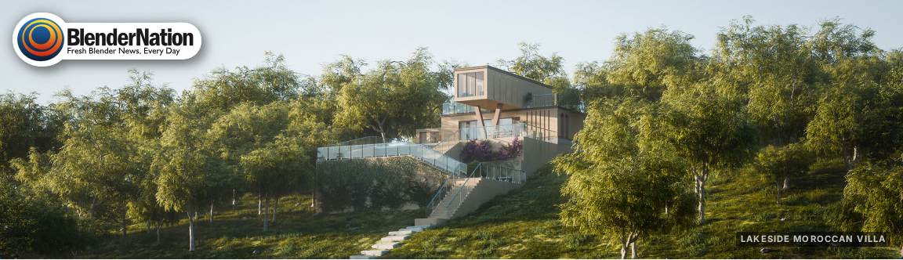
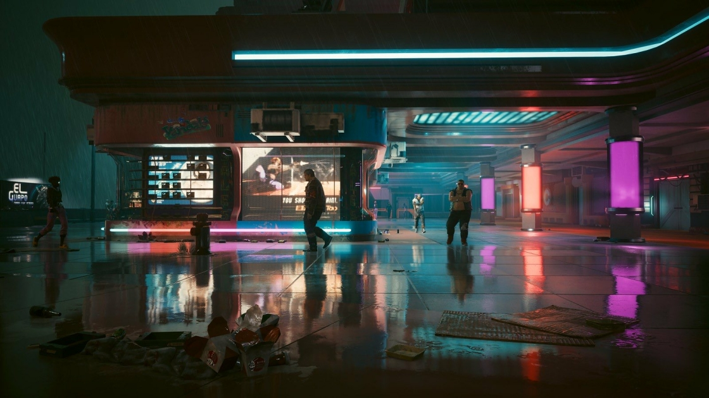
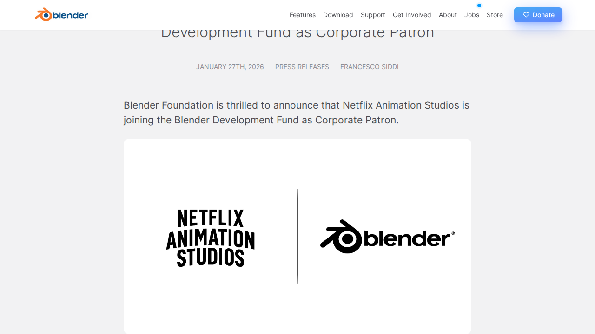
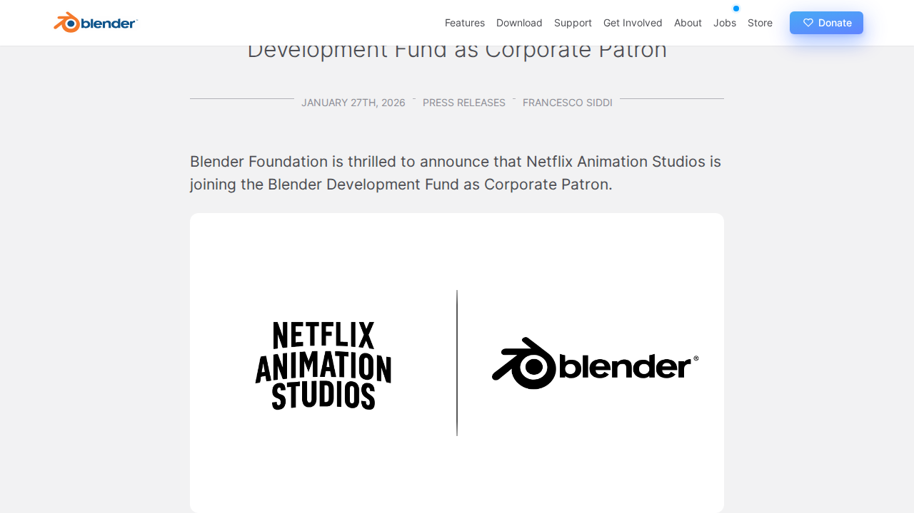

# 📅 Ultimate Daily Full Report — 2026-04-11

**📢 【今日頭條】**

Netflix 動畫工作室宣布加入 Blender 開發基金，成為企業贊助商，這不僅是動畫產業的歷史性一步，也預示著 Blender 在專業動畫製作領域的影響力將持續擴大，為開源工具的發展注入強大動力。
- [Blender - Netflix 加入開發基金](<https://www.blender.org/press/netflix-animation-studios-joins-the-blender-development-fund-as-corporate-patron/>)
---
**⚙️ 【引擎相關】**

- **Unreal Engine**：
  - Unreal Engine 5 正迅速成為機器人模擬領域的首選平台，不僅作為模擬器，更作為驅動下一代機器人系統的合成數據工廠。
    - [Unreal - UE5 機器人模擬](<https://www.unrealengine.com/spotlights/ue5-is-becoming-the-platform-of-choice-for-robotics-simulation>)
  - Productivity Software Group 利用 UE5 改造建築和製造業，透過即時配置器解決勞動力短缺和生產力低下的問題。
    - [Unreal - UE5 改造建築製造業](<https://www.unrealengine.com/spotlights/productivity-software-group-uses-ue5-to-transform-construction-and-manufacturing>)
  - Unreal Engine 為新一代兒童動畫帶來速度與成本效益，使獨立工作室能快速迭代並加速專案周轉。
    - [Unreal - UE5 兒童動畫](<https://www.unrealengine.com/spotlights/unreal-engine-delivers-speed-and-cost-efficiency-for-the-new-wave-of-kids-animation>)
  - Epic Games 在三月份提供了豐富的學習內容，涵蓋 Substrate 材質、MetaHuman 等，旨在幫助開發者提升技能。
    - [Unreal - Epic 三月學習內容](<https://www.unrealengine.com/learning/marchs-epic-learning-content-substrate-metahuman-and-more>)
- **Unity**：
  - 傳統 3D 工具存在隱藏成本，Unity 提出更智慧的方式來構建互動體驗，強調 3D 可視化已不再是遊戲或工程實驗室的專屬能力。
    - [Unity - 傳統 3D 工具成本](<https://unity.com/blog/hidden-costs-traditional-3d-tools>)
  - Eden Games 在《Gear.Club Unlimited 3》中實現了 500 公里/小時的渲染速度，展現了在賽車遊戲中性能與視覺保真度的平衡。
    - [Unity - Gear.Club Unlimited 3 渲染](<https://unity.com/blog/eden-games-gear-club-unlimited-3>)
  - Unity 提供了在啟動第一個 3D 專案前應考慮的 10 個問題，幫助設計師和團隊更好地規劃互動式 3D 體驗。
    - [Unity - 首次 3D 專案指南](<https://unity.com/blog/10-questions-first-no-code-3d-project>)
  - Unity 廣告推出由 Vector 驅動的 D28 IAP ROAS 廣告活動及簡化後的 ROAS 廣告活動上線流程，以提升用戶獲取能力。
    - [Unity - 廣告更新](<https://unity.com/blog/uads-march-updates>)
---
**🧱 【3D 模型技術】**

- Blender 開發團隊在 2025-2026 年冬季優先改進穩定性和整體品質，以提升用戶體驗。
  - [3D - Blender - Winter of Quality 2026](<https://code.blender.org/2026/02/winter-of-quality-2026/>)
- 2025 年 9 月的 Geometry Nodes 工作坊總結了討論內容，顯示該功能持續發展。
  - [3D - Blender - Geometry Nodes 工作坊](<https://code.blender.org/2025/10/geometry-nodes-workshop-september-2025/>)
- Google Summer of Code 2025 的八個專案成果已公布，展示了社區對 Blender 功能擴展的貢獻。
  - [3D - Blender - GSoC 2025 成果](<https://code.blender.org/2025/10/google-summer-of-code-2025-results/>)
- Blender 5.1 版本專注於優化、錯誤修復及改進整個開發流程的關鍵功能。
  - [3D - Blender - Blender 5.1 發布](<https://www.blender.org/press/blender-5-1-release/>)
- Ucupaint 是一款免費的 Blender 紋理繪製插件，支援 Eevee 和 Cycles 渲染器，提供易於使用的圖層管理功能。
  - [3D - BlenderNation - Ucupaint 插件](<https://www.blendernation.com/2026/04/08/discover-ucupaint-a-free-texture-painting-add-on-for-blender/>)
- 一門免費的著色大師班課程深入講解金屬材質的理論與應用，幫助藝術家有效處理不同材料。
  - [3D - BlenderNation - 金屬著色課程](<https://www.blendernation.com/2026/04/09/free-course-shading-masterclass-understanding-metals/>)
---
**✨ 【TA 相關】**

- Blender 5.0 將顯著改進 Geometry Nodes 對體積數據的支援，引入 Volume Grids 功能，提升視覺特效與模擬能力。
  - [TA - Blender - Geometry Nodes 體積網格](<https://code.blender.org/2025/10/volume-grids-in-geometry-nodes/>)
- Blender 5.0 在 Geometry Nodes 中引入了 Bundles 和 Closures，這將優化節點圖的組織與重用性，提升複雜場景的技術美術工作流效率。
  - [TA - Blender - Geometry Nodes Bundles](<https://code.blender.org/2025/08/bundles-and-closures/>)
- Blender 5.0 改變了 Socket Shapes 的含義，這項改動將影響節點連接的視覺邏輯與用戶體驗，對技術美術師理解節點行為至關重要。
  - [TA - Blender - 新的 Socket Shapes](<https://code.blender.org/2025/08/new-socket-shapes/>)
- 了解 Geometry Nodes 在宇宙學研究中的實際科學應用，展示了其在複雜數據可視化方面的潛力。
  - [TA - Blender - Geometry Nodes 宇宙學應用](<https://www.blender.org/user-stories/cosmology-with-geometry-nodes/>)
- BlenderNation 提供了加速 Blender 渲染的技巧，對於處理複雜場景中的高解析度紋理、詳細照明和物理模擬至關重要。
  - [TA - BlenderNation - 加速 Blender 渲染](<https://www.blendernation.com/2026/04/10/how-to-speed-up-blender-rendering/>)
- 《電馭叛客 2077》針對 PS5 Pro 的新更新帶來了令人驚嘆的視覺效果，展示了次世代主機在渲染技術上的巨大潛力與優化成果。
  - [TA - 80.lv - Cyberpunk 2077 PS5 Pro 更新](<https://80.lv/articles/cyberpunk-2077-s-new-ps5-pro-update-is-absolutely-mind-blowing/>)
---
**🎮 【獨立遊戲市場觀察】**

- 《絕地要塞 2》持續發布多項更新，主要集中在客戶端崩潰修復、安全漏洞補丁及遊戲內物品的視覺調整，確保遊戲穩定運行。
  - [Steam - Team Fortress 2 更新](<https://store.steampowered.com/news/265516/>)
- 獨立遊戲週將於 2026 年 4 月 13 日至 17 日線上舉行，屆時將有獨家獨立遊戲訪談和 UE5 開發技巧直播，展示全球獨立工作室如何利用 Epic 生態系統推出傑出遊戲。
  - [Unreal - 獨立遊戲週 2026](<https://www.unrealengine.com/events/indie-games-week-2026>)
- 潛行章魚在電影化的 2.5D 平台遊戲《Darwin’s Paradox》中擔任主角，開發團隊分享了 Unreal Engine 關鍵功能在遊戲開發中的作用。
  - [Unreal - Darwin’s Paradox 開發訪談](<https://www.unrealengine.com/developer-interviews/a-stealthy-octopus-takes-center-stage-in-the-cinematic-25d-platformer-darwins-paradox>)
- Unity 總結了 2026 年 3 月發布的眾多遊戲，包括在 GDC、Steam 春季特賣和 Steam Next Fest 期間推出的頂級作品。
  - [Unity - 2026 年 3 月 Unity 遊戲](<https://unity.com/blog/games-made-with-unity-march-2026-releases>)
- 《Esoteric Ebb》這款非線性 RPG 正在 Steam 上掀起風暴，其開發者分享了互動式寫作和複雜敘事設計的挑戰與經驗。
  - [Unity - Esoteric Ebb 敘事設計](<https://unity.com/blog/interactive-writing-challenges-for-nonlinear-rpg-design>)
- 《心跳文學部》因敏感主題描繪被 Google Play 下架，發行商 Serenity Forge 正努力使其重新上架。
  - [Game Developer - Doki Doki Literature Club 下架](<https://www.gamedeveloper.com/business/doki-doki-literature-club-removed-from-google-play-over-depiction-of-sensitive-themes>)
- 遊戲開發者指出，業界需要一個通用的視訊編解碼器來支援 FMV 遊戲，以避免在跨平台支援時使用不理想的編解碼器。
  - [Game Developer - FMV 遊戲編解碼器](<https://www.gamedeveloper.com/programming/1000xresist-creator-the-game-industry-needs-a-universal-codec-for-fmv-games>)
- Black Tabby Games 成立 Black Tabby Publishing 品牌，將發行《1000xResist》創作者的下一款遊戲，顯示獨立發行商的崛起趨勢。
  - [Game Developer - Black Tabby Games 轉型發行](<https://www.gamedeveloper.com/business/black-tabby-games-slinks-into-game-publishing-with-1000xresist-creator-s-next-game>)
---
**🤝 【在地社群】**

今日無重大本土社群動態，主要新聞集中於日本遊戲廠商 LEVEL5 的新作發表與開發進度更新。
- [Bahamut GNN - 雷頓教授與蒸氣新世界](<https://gnn.gamer.com.tw/detail.php?sn=303266>)
---
**💼 【製作人週記建議】**

- Blender 基金會公布了 2026 年值得期待的專案，包括新工具、協作機會和更廣泛的平台支援，為開發者提供了未來發展方向。
  - [Blender - 2026 年專案展望](<https://www.blender.org/development/projects-to-look-forward-to-in-2026/>)
- 義大利首部使用 Blender 製作的成人動畫系列《Il Baracchino》的創作故事，為製作人提供了開源工具在商業動畫領域應用的案例。
  - [Blender - 製作《Il Baracchino》](<https://www.blender.org/user-stories/creating-il-baracchino-italys-first-adult-animated-series-made-with-blender/>)
- Hazelight Studios 憑藉《雙人成行》等作品累計銷售額突破 5000 萬套，其中《雙人成行》貢獻了 3000 萬套，證明了合作遊戲的巨大市場潛力。
  - [Game Developer - Hazelight Studios 銷售額](<https://www.gamedeveloper.com/business/split-fiction-dev-hazelight-studios-accrues-50m-total-sales>)
- Konami 的《eFootball》下載量突破 10 億次，這款免費遊玩的 PES 重塑作品展示了其在全球市場的廣泛吸引力與成功營運策略。
  - [Game Developer - eFootball 10 億下載](<https://www.gamedeveloper.com/business/konami-s-efootball-tops-1-billion-downloads>)
- BlenderNation 發布了 2026 年 4 月 10 日的 Blender 職位列表，為尋求 Blender 相關工作機會的專業人士提供了市場動態。
  - [BlenderNation - Blender 職位](<https://www.blendernation.com/2026/04/10/blender-jobs-for-april-10-2026/>)
- 《Microlandia》的開發者分享了基於真實世界數據構建社會經濟城市模擬器的經驗，為遊戲設計提供了獨特視角。
  - [製作人 - 80.lv - 開發 Microlandia](<https://80.lv/articles/developing-microlandia-a-socioeconomic-city-builder-based-on-real-world-data/>)
- quicktequila 的遊戲開發者分享了創建街機風格遊戲《Tamashika》的過程，提供了獨立遊戲開發的實踐洞察。
  - [製作人 - 80.lv - 創建 Tamashika](<https://80.lv/articles/game-developer-at-quicktequila-on-creating-the-arcade-style-tamashika-game/>)
---
**🌌 【今日全方位深度總結】**
Netflix 加入 Blender 開發基金成為頭條，預示著開源 3D 工具在專業動畫領域的影響力將持續擴大。
引擎方面，Unreal Engine 在機器人模擬、建築製造及兒童動畫領域展現其即時渲染與數據生成優勢，而 Unity 則強調其在互動式 3D 體驗和遊戲性能優化上的應用。
3D 模型技術板塊，Blender 5.1 的發布與 Geometry Nodes 的持續改進，以及社區工具如 Ucupaint 的推出，共同推動了 DCC 工具的穩定性與功能擴展。
TA 相關新聞聚焦於 Blender Geometry Nodes 的體積數據支援、節點架構優化，以及《電馭叛客 2077》在 PS5 Pro 上的渲染性能提升，顯示了技術美術在視覺品質與效能平衡上的關鍵作用。
獨立遊戲市場方面，《絕地要塞 2》持續維護，同時獨立遊戲週和多款 Unity/Unreal 獨立遊戲的發布與市場表現，揭示了獨立開發者在內容創新與商業模式上的活力。
在地社群今日無重大本土活動，主要為日本 LEVEL5 遊戲新作的發表與開發進度更新。
製作人週記建議則涵蓋了 Blender 的未來專案、Hazelight Studios 的商業成功、eFootball 的全球市場表現，以及獨立遊戲開發的實踐經驗，為業界人士提供了策略與市場洞察。
