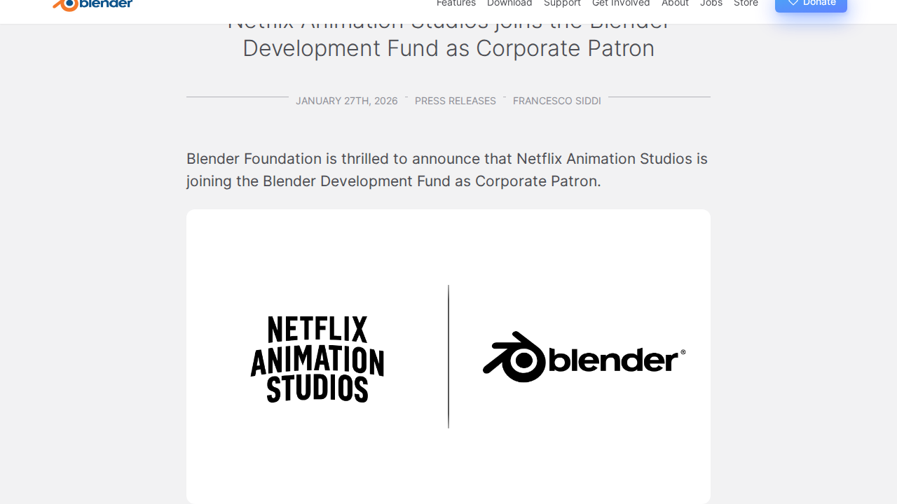
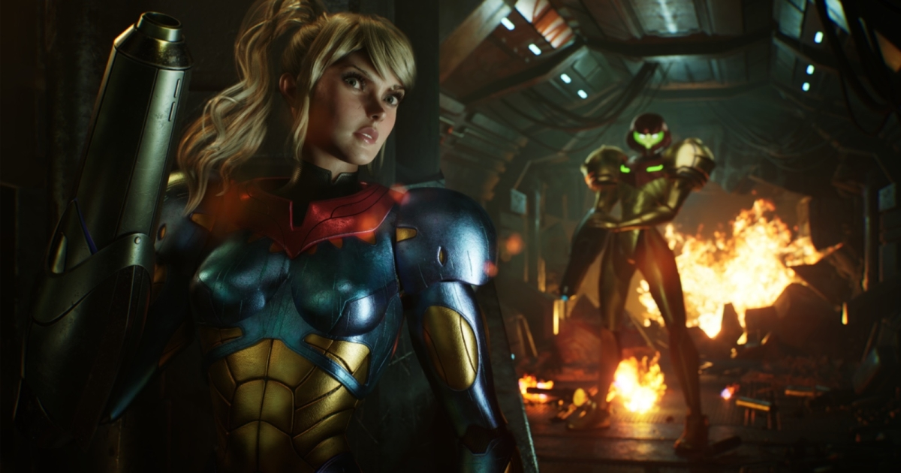
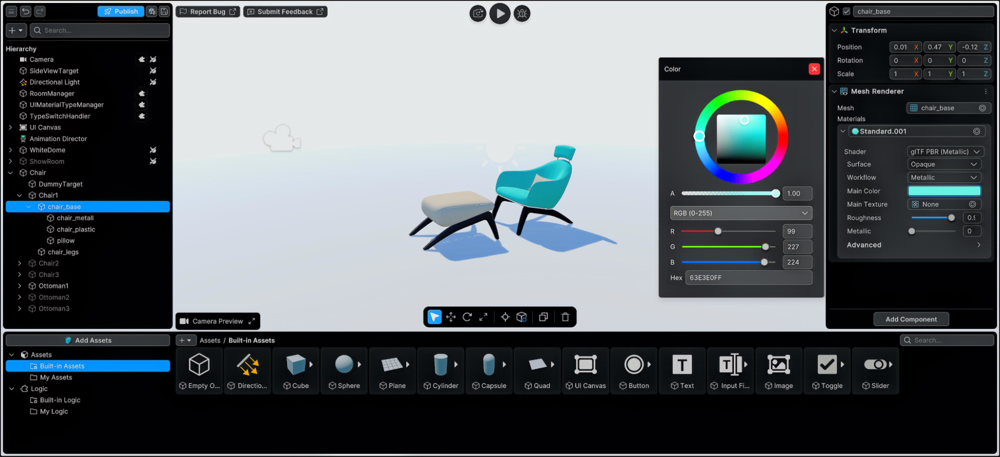

# 📅 Ultimate Daily Full Report — 2026-04-12

**📢 【今日頭條】**

Netflix動畫工作室正式加入Blender開發基金成為企業贊助商，這標誌著開源3D軟體在專業動畫產業中獲得了歷史性的認可與強大支持，預示著Blender未來在功能與穩定性上將有更快速的發展。
- [Blender - Netflix 加入開發基金](<https://www.blender.org/press/netflix-animation-studios-joins-the-blender-development-fund-as-corporate-patron/>)
---
**⚙️ 【引擎相關】**

- **Unreal Engine**：
  - Unreal Engine 5正成為機器人模擬領域的首選平台，不僅作為模擬器，更是驅動下一代機器人系統的合成數據工廠。
    - [Unreal - 機器人模擬](<https://www.unrealengine.com/spotlights/ue5-is-becoming-the-platform-of-choice-for-robotics-simulation>)
  - 歐洲的生產力軟體集團正利用UE5的即時配置器，革新建築與製造業的產品設計與開發流程，以應對勞動力短缺和生產力低下的挑戰。
    - [Unreal - 建築製造業應用](<https://www.unrealengine.com/spotlights/productivity-software-group-uses-ue5-to-transform-construction-and-manufacturing>)
  - Unreal Engine為兒童動畫產業帶來速度與成本效益，使其成為快速迭代、縮短專案週期的首選工具。
    - [Unreal - 兒童動畫應用](<https://www.unrealengine.com/spotlights/unreal-engine-delivers-speed-and-cost-efficiency-for-the-new-wave-of-kids-animation>)
  - 《Darwin’s Paradox》開發團隊分享了Unreal Engine關鍵功能在開發這款電影級2.5D平台遊戲中的重要作用。
    - [Unreal - Darwin’s Paradox](<https://www.unrealengine.com/developer-interviews/a-stealthy-octopus-takes-center-stage-in-the-cinematic-25d-platformer-darwins-paradox>)
- **Unity**：
  - Unity在2026年3月見證了多款頂級遊戲的發布，包括在GDC、Steam春季特賣和Steam Next Fest期間推出的數百個精彩Demo。
    - [Unity - 2026年3月遊戲回顧](<https://unity.com/blog/games-made-with-unity-march-2026-releases>)
  - Eden Games在《Gear.Club Unlimited 3》中實現了60 fps的賽車體驗，展示了Unity在高速渲染和視覺保真度方面的卓越性能。
    - [Unity - Gear.Club Unlimited 3](<https://unity.com/blog/eden-games-gear-club-unlimited-3>)
  - Unity推出了由Vector驅動的D28 IAP ROAS廣告活動，並簡化了ROAS活動的入門流程，以提升用戶獲取能力。
    - [Unity - 廣告活動更新](<https://unity.com/blog/uads-march-updates>)
---
**🧱 【3D 模型技術】**

- Blender 5.0將顯著改進幾何節點對體積數據的支援，並引入新的捆綁包（Bundles）和閉包（Closures）功能，同時更新了節點插槽形狀的意義。
  - [3D - Blender - 幾何節點更新](<https://code.blender.org/2025/10/volume-grids-in-geometry-nodes/>)
- Blender 5.1版本專注於精煉、錯誤修復以及改進整個開發流程的關鍵功能。
  - [3D - Blender - 5.1版本發布](<https://www.blender.org/press/blender-5-1-release/>)
- Blender開發團隊在2025-2026年冬季優先提升了軟體的穩定性和整體品質，並總結了2025年9月幾何節點工作坊的討論內容。
  - [3D - Blender - 品質與幾何節點工作坊](<https://code.blender.org/2026/02/winter-of-quality-2026/>)
- SnapSplit是一款免費的Blender附加元件，可自動化3D列印模型的分割和連接器構建工作流程，特別適用於超出列印床尺寸的模型。
  - [3D - BlenderNation - SnapSplit 外掛](<https://www.blendernation.com/2026/04/11/snapsplit-add-on-automates-splitting-and-connector-building-for-3d-printing/>)
- Blender Artists論壇每週都會分享數百位藝術家的作品，BlenderNation精選了其中最佳作品進行展示。
  - [3D - BlenderNation - 藝術家精選](<https://www.blendernation.com/2026/04/10/best-of-blender-artists-2026-15/>)
- Blender社群分享了如何使用Blender製作義大利首部成人動畫系列《Il Baracchino》，以及幾何節點在宇宙學研究中的實際科學應用案例。
  - [3D - Blender - 動畫與科學應用](<https://www.blender.org/user-stories/creating-il-baracchino-italys-first-adult-animated-series-made-with-blender/>)
---
**✨ 【TA 相關】**

- 80.lv展示了一款令人印象深刻的《Metroid Fusion》動畫同人作品，該作品使用Unreal Engine和ZBrush創作，展現了高水準的技術美術應用。
  - [TA - 80.lv - Metroid Fusion 同人動畫](<https://80.lv/articles/this-metroid-fusion-animated-fan-art-created-with-unreal-engine-and-zbrush-is-really-impressive>)
- 一篇技術文章深入探討了如何使用ZBrush和Unreal Engine創建實時遊戲角色，涵蓋了從高模到低模的製作流程。
  - [TA - 80.lv - 實時遊戲角色製作](<https://80.lv/articles/take-a-look-at-this-real-time-game-character-created-using-zbrush-and-unreal-engine>)
- 《Cyberpunk 2077》針對PS5 Pro的更新帶來了令人驚嘆的視覺效果提升，展示了次世代主機的渲染潛力與優化技術。
  - [TA - 80.lv - Cyberpunk 2077 PS5 Pro 更新](<https://80.lv/articles/cyberpunk-2077-s-new-ps5-pro-update-is-absolutely-mind-blowing>)
- BlenderNation提供了免費的著色大師課程，深入解釋金屬材質的理論特性及其在專案中的應用，對於理解PBR材質至關重要。
  - [TA - BlenderNation - 金屬著色課程](<https://www.blendernation.com/2026/04/09/free-course-shading-masterclass-understanding-metals/>)
- Fox Renderfarm分享了如何加速Blender渲染的技巧，以應對複雜場景的性能挑戰，對於優化渲染管線具有實用價值。
  - [TA - BlenderNation - 加速Blender渲染](<https://www.blendernation.com/2026/04/10/how-to-speed-up-blender-rendering/>)
---
**🎮 【獨立遊戲市場觀察】**

- Steam平台發布了多個《Team Fortress 2》的例行更新，主要集中在錯誤修復、穩定性改進和小型功能調整，確保了遊戲的持續運營。
  - [Indie - Steam - Team Fortress 2 更新](<https://store.steampowered.com/news/265516/>)
- Google Play因敏感主題內容移除了視覺小說《Doki Doki Literature Club》，發行商正努力使其重新上架，凸顯了平台內容審核的挑戰。
  - [Indie - Game Developer - Doki Doki Literature Club 下架](<https://www.gamedeveloper.com/business/doki-doki-literature-club-removed-from-google-play-over-depiction-of-sensitive-themes>)
- Unreal Engine將於4月13日至17日舉辦獨立遊戲週，提供獨家訪談和UE5開發技巧直播，展示獨立工作室如何利用Epic生態系統推出傑出遊戲。
  - [Indie - Unreal - 獨立遊戲週](<https://www.unrealengine.com/events/indie-games-week-2026>)
- Hazelight Studios憑藉其合作遊戲《It Takes Two》等作品，總銷量已突破5000萬套，其中《It Takes Two》貢獻了3000萬套，證明了創新玩法的市場潛力。
  - [Indie - Game Developer - Hazelight Studios 銷量](<https://www.gamedeveloper.com/business/split-fiction-dev-hazelight-studios-accrues-50m-total-sales>)
- Black Tabby Games成立了發行品牌Black Tabby Publishing，將發行《1000xResist》創作者的下一款遊戲，為獨立遊戲發行市場注入新力量。
  - [Indie - Game Developer - Black Tabby Games 發行](<https://www.gamedeveloper.com/business/black-tabby-games-slinks-into-game-publishing-with-1000xresist-creator-s-next-game>)
---
**🤝 【在地社群】**

- 巴哈姆特電玩瘋手機週報介紹了10款手機遊戲，涵蓋了黏土世界、復古像素RPG、恐怖冒險等多樣題材，展現了手遊市場的豐富性。
  - [在地 - 巴哈姆特 - 手機週報](<https://gnn.gamer.com.tw/detail.php?sn=303268>)
- 話題遊戲《主播女孩重度依賴》改編動畫於2026年4月登場，原作遊戲累積了300萬銷量，顯示了遊戲IP跨媒體的巨大潛力。
  - [在地 - 巴哈姆特 - 主播女孩重度依賴動畫](<https://gnn.gamer.com.tw/detail.php?sn=303267>)
- LEVEL5在「LEVEL5 VISION 2026 匠」節目中公開了《雷頓教授與蒸氣新世界》的最新宣傳影片與聲優訪談，並確認將追加新平台，引發玩家期待。
  - [在地 - 巴哈姆特 - 雷頓教授新作](<https://gnn.gamer.com.tw/detail.php?sn=303266>)
- LEVEL5重申《閃電十一人 RE》與《DecaPolice》仍在積極開發中，並宣布《閃電十一人 英雄們的勝利之路》將於2026年6月推出Nintendo Switch 2盒裝版，為粉絲帶來好消息。
  - [在地 - 巴哈姆特 - LEVEL5 開發進度](<https://gnn.gamer.com.tw/detail.php?sn=303265>)
- 《妖怪手錶 噗尼噗尼》開發團隊與LEVEL5聯手打造的手機益智新作《幻想世界的軟綿綿波呦》正式亮相，預計2026年冬季推出，預計將吸引廣大休閒遊戲玩家。
  - [在地 - 巴哈姆特 - 幻想世界的軟綿綿波呦](<https://gnn.gamer.com.tw/detail.php?sn=303263>)
---
**💼 【製作人週記建議】**

- Unity強調傳統3D工具的隱藏成本，並提出更智慧的方式來構建互動體驗，鼓勵企業在產品設計、培訓和客戶互動中利用3D內容，這對製作人而言是成本效益的考量。
  - [Producer - Unity - 3D工具成本](<https://unity.com/blog/hidden-costs-traditional-3d-tools>)
- Unity提供10個問題，幫助開發者在啟動第一個3D專案前進行評估，以確保專案的成功，是製作人進行前期規劃的實用指南。
  - [Producer - Unity - 3D專案啟動指南](<https://unity.com/blog/10-questions-first-no-code-3d-project>)
- 《1000xResist》的創作者呼籲遊戲產業需要一個通用的視訊編解碼器來支援FMV遊戲，以解決跨平台支援的技術挑戰，這對製作人而言是技術選型和風險管理的考量。
  - [Producer - Game Developer - FMV遊戲編解碼器](<https://www.gamedeveloper.com/programming/1000xresist-creator-the-game-industry-needs-a-universal-codec-for-fmv-games>)
- Game Developer的Patch Notes討論了Gunzilla的爭議、Netflix在應用商店的意外增長以及獨立發行商的崛起，反映了業界的動態與挑戰，為製作人提供了市場洞察。
  - [Producer - Game Developer - 業界動態](<https://www.gamedeveloper.com/business/gunzilla-called-out-netflix-s-surprise-app-store-surge-and-indie-publishers-rise-up-patch-notes-47>)
---
**🌌 【今日全方位深度總結】**
頭條新聞揭示了Netflix對Blender開發基金的企業級支持，預示著開源DCC工具在專業動畫領域的影響力持續擴大。
引擎方面，Unreal Engine在機器人模擬、建築製造業及兒童動畫等非遊戲領域展現強勁應用，而Unity則持續優化遊戲發布流程與廣告變現能力。
3D模型技術方面，Blender的幾何節點功能持續進化，5.0和5.1版本帶來了體積數據支援、新節點特性及整體穩定性提升，同時社群也推出了實用的3D列印附加元件。
技術美術領域，多篇文章深入探討了使用Unreal Engine和ZBrush進行角色與環境製作的流程，以及《Cyberpunk 2077》在次世代主機上的渲染優化，並提供了金屬材質著色和Blender渲染加速的實用技巧。
獨立遊戲市場方面，Steam持續為《Team Fortress 2》提供維護更新，同時業界關注《Doki Doki Literature Club》的平台下架事件，而Unreal Engine的獨立遊戲週和Hazelight Studios的成功案例則為獨立開發者帶來了機遇與啟示。
在地社群方面，台灣巴哈姆特GNN報導了多款手機遊戲、熱門遊戲改編動畫的推出，以及LEVEL5多款新作的開發進度與Switch 2盒裝版發售消息，展現了本地市場的多元活力。
製作人週記建議則聚焦於3D專案的成本效益評估、啟動前的關鍵問題，以及FMV遊戲在技術編解碼器上的產業需求，為開發者提供了寶貴的商業與技術策略思考。