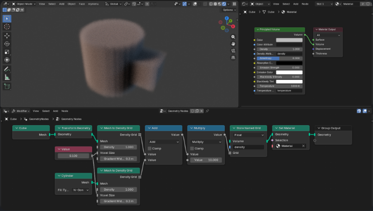
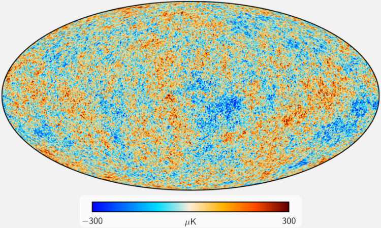
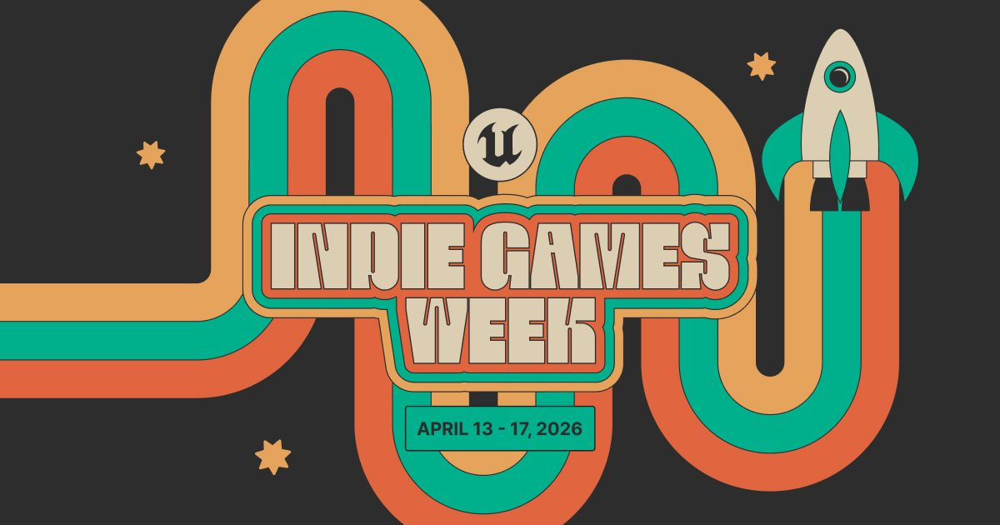
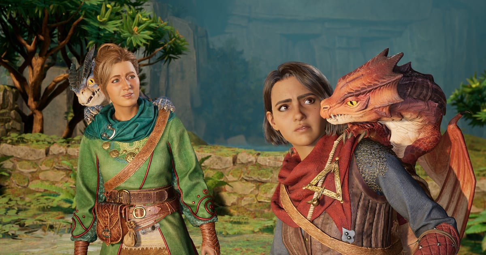

# 📅 Ultimate Daily Full Report — 2026-04-13

**📢 【今日頭條】**

Netflix 動畫工作室宣布加入 Blender 開發基金，成為企業贊助商，這標誌著動畫產業的一個歷史性里程碑。此舉不僅為 Blender 帶來重要的資金支持，也預示著其在專業動畫製作領域的影響力將進一步擴大，可能加速開源工具的發展與普及。
- [Blender - Netflix 贊助開發基金](<https://www.blender.org/press/netflix-animation-studios-joins-the-blender-development-fund-as-corporate-patron/>)
---
**⚙️ 【引擎相關】**

- **Unreal Engine**：
  - Unreal Engine 5 正迅速成為機器人模擬領域的首選平台，不僅作為模擬器，更作為合成數據工廠，為下一代機器人系統提供動力。
    - [Unreal - UE5 機器人模擬](<https://www.unrealengine.com/spotlights/ue5-is-becoming-the-platform-of-choice-for-robotics-simulation>)
  - Productivity Software Group 利用 Unreal Engine 5 改造建築和製造業，透過即時配置器提升產品設計與開發效率，應對歐洲產業面臨的勞動力短缺和生產力挑戰。
    - [Unreal - UE5 改造建築製造業](<https://www.unrealengine.com/spotlights/productivity-software-group-uses-ue5-to-transform-construction-and-manufacturing>)
  - Unreal Engine 在新一波兒童動畫製作中展現出速度和成本效益，成為獨立工作室的首選工具，實現快速迭代和專案周轉。
    - [Unreal - UE5 兒童動畫](<https://www.unrealengine.com/spotlights/unreal-engine-delivers-speed-and-cost-efficiency-for-the-new-wave-of-kids-animation>)
  - 2.5D 電影式平台遊戲《Darwin’s Paradox》的開發團隊分享了 Unreal Engine 的關鍵功能如何在遊戲開發中發揮作用，讓一隻隱匿的章魚成為主角。
    - [Unreal - Darwin’s Paradox 開發訪談](<https://www.unrealengine.com/developer-interviews/a-stealthy-octopus-takes-center-stage-in-the-cinematic-25d-platformer-darwins-paradox>)
- **Unity**：
  - 傳統 3D 工具存在隱藏成本，Unity 提出更智慧的方式來構建互動體驗，強調 3D 可視化已不再是遊戲或工程實驗室的利基能力。
    - [Unity - 3D 工具隱藏成本](<https://unity.com/blog/hidden-costs-traditional-3d-tools>)
  - Eden Games 在其最新賽車遊戲《Gear.Club Unlimited 3》中，成功實現了 500 公里/小時下的 60 fps 渲染，展現了 Unity 在性能與視覺保真度上的平衡能力。
    - [Unity - Gear.Club Unlimited 3 渲染](<https://unity.com/blog/eden-games-gear-club-unlimited-3>)
---
**🧱 【3D 模型技術】**

- Blender 開發團隊在 2025-2026 年冬季優先提升軟體穩定性和整體品質，以「Winter of Quality 2026」為目標，致力於核心體驗的優化。
  - [3D - Blender Winter of Quality 2026](<https://code.blender.org/2026/02/winter-of-quality-2026/>)
- Blender 5.1 版本正式發布，重點在於精煉、錯誤修復以及一些關鍵功能，全面改進了整個製作流程。
  - [3D - Blender 5.1 發布](<https://www.blender.org/press/blender-5-1-release/>)
- Blender 團隊總結了 2025 年 9 月 Geometry Nodes 工作坊的討論內容，持續推進節點幾何功能的發展。
  - [3D - Blender Geometry Nodes 工作坊](<https://code.blender.org/2025/10/geometry-nodes-workshop-september-2025/>)
- Google Summer of Code 2025 的八個專案成果已公布，展示了社群對 Blender 功能擴展的貢獻。
  - [3D - Blender GSoC 2025 成果](<https://code.blender.org/2025/10/google-summer-of-code-2025-results/>)
- Blender 5.0 將顯著提升 Geometry Nodes 對體積數據的支援，引入 Volume Grids 功能，為體積建模帶來新可能。
  - [3D - Blender Geometry Nodes 體積網格](<https://code.blender.org/2025/10/volume-grids-in-geometry-nodes/>)
- Blender 5.0 在 Geometry Nodes 中引入了 Bundles 和 Closures，進一步增強了節點系統的靈活性和功能性。
  - [3D - Blender Geometry Nodes Bundles](<https://code.blender.org/2025/08/bundles-and-closures/>)
- Blender 5.0 改變了 Socket Shapes 的含義，優化了節點介面的視覺識別和用戶體驗。
  - [3D - Blender 新 Socket Shapes](<https://code.blender.org/2025/08/new-socket-shapes/>)
- Blender 展望 2026 年的開發計畫，將推出新工具、加強協作並擴大平台支援。
  - [3D - Blender 2026 年專案展望](<https://www.blender.org/development/projects-to-look-forward-to-in-2026/>)
- JayAnAm 透過比較影片探討了傳統 Blender 工作流程與新興硬表面工具 HardCuts 在變形和布林運算方面的差異，展示了 Blender 的強大與靈活性。
  - [3D - HardCuts vs Blender 工作流](<https://www.blendernation.com/2026/04/12/hardcuts-vs-blender-a-fresh-take-on-deforms-and-boolean-workflows/>)
- SnapSplit 是一款免費的 Blender 附加元件，由 Christoph Medicus 開發，能自動化 3D 列印模型的分割和連接器構建工作流程，特別適用於超出列印床尺寸的模型。
  - [3D - SnapSplit 3D 列印附加元件](<https://www.blendernation.com/2026/04/11/snapsplit-add-on-automates-splitting-and-connector-building-for-3d-printing/>)
- Reggie Perry, Jr. 分享了如何將舊模型「Ren + Stimpy」進行「Gross Up」處理的過程分解，展示了 Blender 在藝術風格化方面的應用。
  - [3D - Ren + Stimpy 藝術分解](<https://www.blendernation.com/2026/04/11/ren-hoek-ren-stimpy-gross-up-process-breakdown/>)
- 一位藝術家使用 Unreal Engine 和 ZBrush 創作了令人印象深刻的《Metroid Fusion》動畫同人作品，展現了 DCC 工具在角色藝術創作上的潛力。
  - [3D - Metroid Fusion 同人動畫](<https://80.lv/articles/this-metroid-fusion-animated-fan-art-created-with-unreal-engine-and-zbrush-is-really-impressive>)
---
**✨ 【TA 相關】**

- Blender 的 Geometry Nodes 在宇宙學研究中展現了實際科學應用，證明其在複雜數據可視化方面的強大能力。
  - [TA - Blender GeoNodes 宇宙學應用](<https://www.blender.org/user-stories/cosmology-with-geometry-nodes/>)
- Fox Renderfarm 提供了加速 Blender 渲染的方法，幫助藝術家解決複雜場景渲染緩慢的問題，優化渲染管線效率。
  - [TA - Blender 渲染加速](<https://www.blendernation.com/2026/04/10/how-to-speed-up-blender-rendering/>)
- 《1000xResist》的創作者呼籲遊戲業界需要一個通用的視訊編解碼器，以解決 FMV 遊戲在跨平台支援時遇到的編碼問題，這對遊戲資產管線至關重要。
  - [TA - 遊戲業通用視訊編解碼器](<https://www.gamedeveloper.com/programming/1000xresist-creator-the-game-industry-needs-a-universal-codec-for-fmv-games>)
- 一位藝術家創造了一個能轉化為電影奇幻場景的森林環境，展示了場景搭建、光照與渲染技術在視覺敘事中的應用。
  - [TA - 電影奇幻森林環境](<https://80.lv/articles/artist-creates-a-forest-environment-that-turns-into-a-cinematic-fantasy-scene>)
- YouTube 指出獨立動畫師正在改變動畫產業，這反映了技術普及和創作工具民主化對動畫製作流程的影響。
  - [TA - 獨立動畫師改變產業](<https://80.lv/articles/according-to-youtube-independant-animators-are-changing-the-industry>)
- Epic Games 三月份的學習內容涵蓋了 Substrate 材質系統、MetaHuman 等，為開發者提供了深入學習渲染技術和角色製作的資源。
  - [TA - Epic 學習內容 Substrate MetaHuman](<https://www.unrealengine.com/learning/marchs-epic-learning-content-substrate-metahuman-and-more>)
---
**🎮 【獨立遊戲市場觀察】**

- Unreal Engine 將於 2026 年 4 月 13 日至 17 日舉辦獨立遊戲週，提供獨家獨立遊戲訪談和 UE5 開發技巧直播，幫助獨立工作室利用 Epic 生態系統推出優秀遊戲。
  - [Unreal - 獨立遊戲週 2026](<https://www.unrealengine.com/events/indie-games-week-2026>)
- Unity 回顧了 2026 年 3 月使用 Unity 製作的遊戲，包括 GDC、Steam 春季特賣和 Steam Next Fest 期間發布的眾多頂級遊戲和試玩版。
  - [Unity - 2026 年 3 月 Unity 遊戲回顧](<https://unity.com/blog/games-made-with-unity-march-2026-releases>)
- Black Tabby Games 宣布將以 Black Tabby Publishing 品牌進軍遊戲發行領域，並將發行《1000xResist》創作者的下一款遊戲，顯示獨立發行商的崛起。
  - [Game Developer - Black Tabby Games 進軍發行](<https://www.gamedeveloper.com/business/black-tabby-games-slinks-into-game-publishing-with-1000xresist-creator-s-next-game>)
- 回合制策略遊戲《Xenonauts 2》已結束搶先體驗，正式發布 1.0 版本，為喜歡 XCOM 類型的玩家帶來完整體驗。
  - [80.lv - Xenonauts 2 正式發布](<https://80.lv/articles/turn-based-xcom-like-xenonauts-2-has-left-early-access-and-reached-1-0-status>)
- 一款探索海底沉洞的遊戲引起關注，展示了獨立遊戲在題材和玩法上的創新潛力。
  - [80.lv - 探索海底沉洞遊戲](<https://80.lv/articles/check-out-this-game-where-you-explore-a-sinkhole-at-the-bottom-of-the-ocean>)
- Team Fortress 2 近期發布了多項更新，主要集中在客戶端崩潰修復、漏洞利用防堵以及遊戲內物品的視覺調整，持續維護遊戲穩定性與體驗。
  - [Steam - Team Fortress 2 更新](<https://store.steampowered.com/news/265516/>)
---
**🤝 【在地社群】**

- 日本人氣聲優歌手水樹奈奈的「VISION」巡演台北場圓滿落幕，吸引大量歌迷熱情支持，展現了台灣在地社群對日本流行文化的熱愛。
  - [巴哈姆特 GNN - 水樹奈奈台北巡演](<https://gnn.gamer.com.tw/detail.php?sn=303270>)
- 巴哈姆特電玩瘋手機週報介紹了多款手機遊戲，包括《星之海》、《海珂：北境極光》等，為在地玩家提供最新的手遊資訊。
  - [巴哈姆特 GNN - 手機週報](<https://gnn.gamer.com.tw/detail.php?sn=303268>)
- 話題遊戲《主播女孩重度依賴》改編動畫於 2026 年 4 月登場，將這款在全球累積 300 萬銷量的作品帶入電視螢幕，引起在地動漫遊戲社群的廣泛討論。
  - [巴哈姆特 GNN - 主播女孩重度依賴動畫](<https://gnn.gamer.com.tw/detail.php?sn=303267>)
- LEVEL5 在線上資訊節目「LEVEL5 VISION 2026 匠」中公開了《雷頓教授與蒸氣新世界》的最新宣傳影片與聲優訪談，並宣布追加新平台，主題曲由久石讓與幾田莉拉打造。
  - [巴哈姆特 GNN - 雷頓教授與蒸氣新世界](<https://gnn.gamer.com.tw/detail.php?sn=303266>)
- LEVEL5 同步更新了《閃電十一人 RE》與《DecaPolice》的開發進度，重申兩款作品仍在積極製作中，讓在地玩家對這些期待已久的遊戲保持信心。
  - [巴哈姆特 GNN - LEVEL5 遊戲開發進度](<https://gnn.gamer.com.tw/detail.php?sn=303265>)
- Blender Artists 論壇每週都會有數百位藝術家分享作品，BlenderNation 精選了 2026 年第 15 週的最佳作品，展示了社群的活躍與創造力。
  - [BlenderNation - Blender Artists 精選](<https://www.blendernation.com/2026/04/10/best-of-blender-artists-2026-15/>)
---
**💼 【製作人週記建議】**

- 義大利首部使用 Blender 製作的成人動畫系列《Il Baracchino》的創作故事，為製作人提供了開源工具在商業動畫領域應用的案例。
  - [Blender - 製作《Il Baracchino》](<https://www.blender.org/user-stories/creating-il-baracchino-italys-first-adult-animated-series-made-with-blender/>)
- Blender 基金會董事會發布新年訊息，為社群帶來新的展望與方向。
  - [Blender - 基金會董事會訊息](<https://www.blender.org/news/a-message-from-the-blender-foundation-board/>)
- Unity 提供了在啟動第一個 3D 專案前應詢問的 10 個問題，幫助製作人進行專案規劃與風險評估。
  - [Unity - 啟動 3D 專案的 10 個問題](<https://unity.com/blog/10-questions-first-no-code-3d-project>)
- 《Esoteric Ebb》的開發者分享了設計非線性 RPG 互動式寫作的挑戰，為製作人提供了敘事設計的寶貴經驗。
  - [Unity - 非線性 RPG 互動寫作挑戰](<https://unity.com/blog/interactive-writing-challenges-for-nonlinear-rpg-design>)
- Unity 廣告推出了由 Vector 驅動的 D28 IAP ROAS 廣告活動及簡化後的 ROAS 廣告活動上線流程，旨在幫助開發者優化用戶獲取和變現策略。
  - [Unity - Unity Ads 更新](<https://unity.com/blog/uads-march-updates>)
- 《Doki Doki Literature Club》因敏感主題描繪被 Google Play 下架，出版商 Serenity Forge 正努力恢復，這提醒製作人需注意內容審核與平台政策。
  - [Game Developer - Doki Doki Literature Club 下架](<https://www.gamedeveloper.com/business/doki-doki-literature-club-removed-from-google-play-over-depiction-of-sensitive-themes>)
- 遊戲開發者雜誌的 Patch Notes 報導了 Gunzilla 被點名、Netflix 在應用商店的意外增長以及獨立發行商的崛起，為製作人提供了業界動態的概覽。
  - [Game Developer - 業界動態 Patch Notes #47](<https://www.gamedeveloper.com/business/gunzilla-called-out-netflix-s-surprise-app-store-surge-and-indie-publishers-rise-up-patch-notes-47>)
- Hazelight Studios 憑藉《It Takes Two》等作品累計達到 5000 萬總銷量，其中《It Takes Two》貢獻了 3000 萬，展示了合作遊戲的巨大市場潛力。
  - [Game Developer - Hazelight Studios 總銷量](<https://www.gamedeveloper.com/business/split-fiction-dev-hazelight-studios-accrues-50m-total-sales>)
- Konami 的《eFootball》下載量突破 10 億次，證明了免費遊玩模式在體育遊戲領域的巨大成功。
  - [Game Developer - eFootball 10 億下載](<https://www.gamedeveloper.com/business/konami-s-efootball-tops-1-billion-downloads>)
- 《俠盜獵車手 6》開發商 Rockstar Games 證實遭到駭客攻擊，少數資料被存取，凸顯了遊戲公司在網路安全方面面臨的嚴峻挑戰。
  - [巴哈姆特 GNN - Rockstar 遭駭客攻擊](<https://gnn.gamer.com.tw/detail.php?sn=303269>)
- BlenderNation 發布了 2026 年 4 月 10 日的 Blender 職位列表，涵蓋了多種職位需求，為尋求 Blender 相關工作的專業人士提供了機會。
  - [BlenderNation - Blender 職位](<https://www.blendernation.com/2026/04/10/blender-jobs-for-april-10-2026/>)
---
**🌌 【今日全方位深度總結】**
今日頭條揭示 Netflix 贊助 Blender 開發基金，預示著開源工具在專業動畫領域的影響力將持續擴大，對業界生態產生深遠影響。

引擎相關方面，Unreal Engine 5 不僅在遊戲開發中持續發力，更在機器人模擬、建築製造業及兒童動畫等非遊戲領域展現其強大的即時渲染與數據處理能力；Unity 則強調其在互動 3D 體驗和賽車遊戲高性能渲染上的優勢，特別是針對管線效率與視覺保真度的平衡。

3D 模型技術板塊，Blender 官方與社群持續推進核心功能與工作流優化，從 5.1 版本發布、Geometry Nodes 的體積數據支援，到硬表面建模工具的比較與 3D 列印附加元件的創新，都顯示其在 DCC 工具領域的活躍發展。

TA 相關新聞則聚焦於技術美術的應用與挑戰，包括 Blender Geometry Nodes 在宇宙學可視化中的實際案例、渲染農場的效能優化、遊戲產業對通用視訊編解碼器的需求，以及 Epic 對 Substrate 材質系統等前沿渲染技術的推廣，這些都直接影響著遊戲與動畫的視覺品質與開發效率。

獨立遊戲市場觀察顯示，Unreal 和 Unity 都在積極支持獨立開發者，透過專屬活動和遊戲展示推動市場活力，同時也有新的獨立發行商崛起，以及 Steam 平台持續的遊戲維護更新。

在地社群方面，台灣市場展現了對日本流行文化、手機遊戲、動漫改編作品的熱情，以及對 LEVEL5 等遊戲開發商新作的關注，同時 Blender 社群的藝術作品展示也體現了在地創作者的活躍。

製作人週記建議則涵蓋了從開源工具的商業應用、專案規劃、敘事設計、用戶獲取策略，到內容審核風險、行業銷售數據與網路安全挑戰等多個面向，為遊戲製作人提供了全面的經營與開發洞察。
