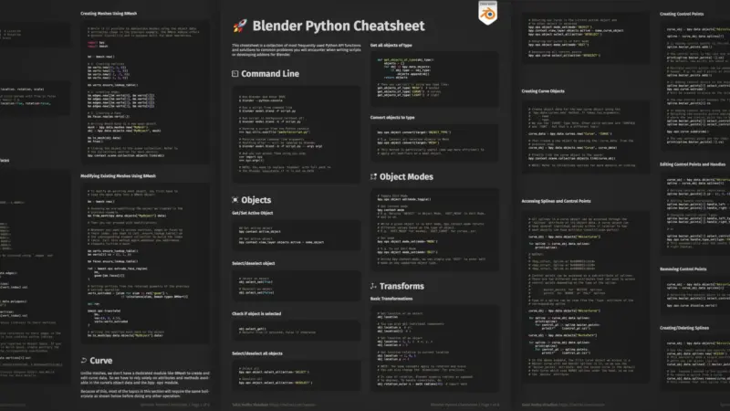
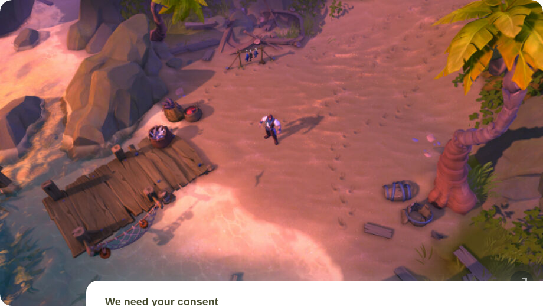

# 📅 Ultimate Daily Full Report — 2026-04-14
**📢 【今日頭條】**

據報導，Epic Games 正與迪士尼合作，計劃於 2026 年 11 月推出一款以迪士尼為主題的撤離射擊遊戲，旨在重振《要塞英雄》的聲勢。這項耗資 15 億美元的合作案，預示著 Epic 在其核心遊戲策略上將有重大轉變，並可能開創 IP 聯動的新模式。
- [Game Developer - Epic 迪士尼射擊遊戲](<https://www.gamedeveloper.com/business/report-epic-hoping-to-reinvigorate-fortnite-with-disney-themed-extraction-shooter>)
---
**⚙️ 【引擎相關】**

- **Unreal Engine**：
  - Fab 春季創作者特賣活動已啟動，提供超過 13 萬種 Fab 產品高達七折優惠，涵蓋素材、模板、材質及遊戲系統等，為開發者提供豐富資源。
    - [Unreal - Fab 春季特賣](<https://www.unrealengine.com/news/the-fab-spring-creator-sale-has-started>)
  - Timberline 的 13 人獨立團隊運用 UE5 打造了《Beastro》，這款遊戲巧妙融合了牌組構築、烹飪與木偶劇戰鬥，呈現出獨特的視覺風格與魅力。
    - [Unreal - Timberline Beastro UE5](<https://www.unrealengine.com/developer-interviews/timberlines-beastro-serves-up-a-flavorful-twist-on-a-variety-of-genres-with-ue5>)
---
**🧱 【3D 模型技術】**

- Blender Python 速查表提供了一個方便的參考，幫助開發者利用 Python 和 Blender API 進行批次處理資產或自動化工作流程，提升生產效率。
  - [3D - BlenderNation - Python 速查表](<https://www.blendernation.com/2026/04/13/blender-python-cheatsheet-a-handy-reference-for-the-blender-api-2/>)
- 一篇關於如何使用 3ds Max 製作受《異塵餘生》電視劇啟發的 CGI 電影短片的文章，展示了 DCC 工具在影視級內容創作中的應用與技巧。
  - [3D - 80.lv - 異塵餘生 CGI](<https://80.lv/articles/fallout-tv-series-inspired-cgi-cinematic-in-3ds-max>)
---
**✨ 【TA 相關】**

- Albion Online 開發團隊分享了他們如何在十年內打造一款沙盒 MMORPG 的經驗，深入探討了長期開發中的技術與藝術挑戰，特別是在內容擴展與效能優化方面的策略。
  - [TA - 80.lv - Albion Online 開發](<https://80.lv/articles/how-albion-online-devs-built-a-sandbox-mmorpg-across-an-entire-decade>)
- 一家獨立工作室分享了他們如何創作一款玩具車冒險遊戲《Obstacle Overdrive》的技術與藝術實現過程，包括場景搭建、物理模擬與視覺風格的考量。
  - [TA - 80.lv - Obstacle Overdrive](<https://80.lv/articles/obstacle-overdrive-how-an-indie-studio-created-a-toy-car-adventure-game>)
---
**🎮 【獨立遊戲市場觀察】**

- Team Fortress 2 近期發布了多項更新，主要針對遊戲內錯誤修復、視覺效果調整及安全性問題進行改進，顯示了老牌遊戲持續維護的重要性。
  - [Steam - Team Fortress 2 更新](<https://store.steampowered.com/news/265126/>)
- 獨立遊戲開發團隊 Janson RAD 製作的射擊新作《神射砲艦 Gunboat God》已於 Steam 平台上市，玩家將在這款橫向射擊遊戲中迎戰 70 種敵軍與巨型 BOSS。
  - [巴哈姆特 - 神射砲艦上市](<https://gnn.gamer.com.tw/detail.php?sn=303331>)
- 獨立遊戲工作室斜陽過客公開新作《證明你是人類》，這是一款冒險遊戲，玩家的任務是設法說服人工智慧它不是人類，題材新穎。
  - [巴哈姆特 - 證明你是人類](<https://gnn.gamer.com.tw/detail.php?sn=303329>)
- 由 Hey Bird! 製作的中世紀推理冒險新作《墨血》將於 4 月 23 日展開遊戲測試，玩家可於 Steam 頁面申請參與，化身教廷審判官對抗邪教徒。
  - [巴哈姆特 - 墨血測試](<https://gnn.gamer.com.tw/detail.php?sn=303328>)
---
**🤝 【在地社群】**

- 台灣獨立遊戲團隊 SIGONO 與集英社遊戲合作開發的敘事冒險新作《OPUS：心相吾山》即將於 4 月 16 日正式推出，搶先體驗心得顯示其真摯情感令人感受到滿滿溫暖。
  - [巴哈姆特 - OPUS 心相吾山](<https://gnn.gamer.com.tw/detail.php?sn=303333>)
---
**💼 【製作人週記建議】**

- Roblox 正在為兒童和青少年引入基於年齡的帳戶，將限制他們訪問某些體驗和通訊功能，這對平台內容策略和用戶管理有重要啟示。
  - [Game Developer - Roblox 年齡帳戶](<https://www.gamedeveloper.com/business/roblox-is-introducing-age-based-accounts-for-children-and-teens>)
- BANDAI NAMCO Entertainment 公開了《空戰奇兵 8：希孚之翼》的製作團隊訪談影片，旨在打造集系列 30 年大成的頂點之作，揭示了大型專案的開發願景與挑戰。
  - [巴哈姆特 - 空戰奇兵 8 訪談](<https://gnn.gamer.com.tw/detail.php?sn=303330>)
- Rockstar 駭客在原定截止日期前洩露了更多數據，凸顯了遊戲產業在資訊安全方面面臨的持續挑戰與風險，提醒開發商需加強防護。
  - [80.lv - Rockstar 駭客洩漏](<https://80.lv/articles/rockstar-hackers-leak-data-ahead-of-previously-stated-deadline>)
- Capcom 的新作《人機迷網》預計在 2026 年成為又一熱門大作，其上市前試玩報導顯示了其富有實驗精神與市場潛力，值得關注。
  - [80.lv - Pragmata 預期熱門](<https://80.lv/articles/pragmata-looks-to-be-another-big-hit-for-capcom-in-2026>)
- CAPCOM 研發的動作射擊遊戲《人機迷網》在經歷數次延期後，終於即將於 4 月正式發售，這款富有實驗精神的作品備受期待，其發售策略值得研究。
  - [巴哈姆特 - 人機迷網試玩](<https://gnn.gamer.com.tw/detail.php?sn=303332>)
---
**🌌 【今日全方位深度總結】**
Epic 與迪士尼合作開發《要塞英雄》主題射擊遊戲，預示著大型 IP 聯動與平台策略的未來走向，對市場格局影響深遠。
引擎方面，Unreal Engine 的市場活動與 UE5 獨立遊戲案例展示了其生態系的活躍與技術應用廣度，特別是對於獨立團隊的賦能。
3D 模型技術板塊，Blender Python API 的應用與 3ds Max 在影視 CGI 中的實踐，突顯了自動化流程與專業 DCC 工具在提升內容創作效率與品質中的關鍵作用。
TA 相關新聞揭示了 MMORPG 長期開發的技術挑戰與獨立遊戲在技術實現上的創新，強調了技術美術在解決複雜渲染、優化與藝術風格實現中的核心價值。
獨立遊戲市場持續活躍，Steam 平台維護更新不斷，同時多款風格獨特的獨立新作如《神射砲艦》、《證明你是人類》和《墨血》陸續發布或測試，展現了市場的多元性。
在地社群方面，台灣獨立遊戲《OPUS：心相吾山》的推出，展現了本土開發團隊在敘事遊戲領域的深厚實力與情感表達能力。
製作人週記建議則聚焦於平台用戶策略、大型遊戲開發訪談、資安風險管理以及市場對新作的預期，為遊戲開發與營運提供了多維度的思考與前瞻性洞察。
