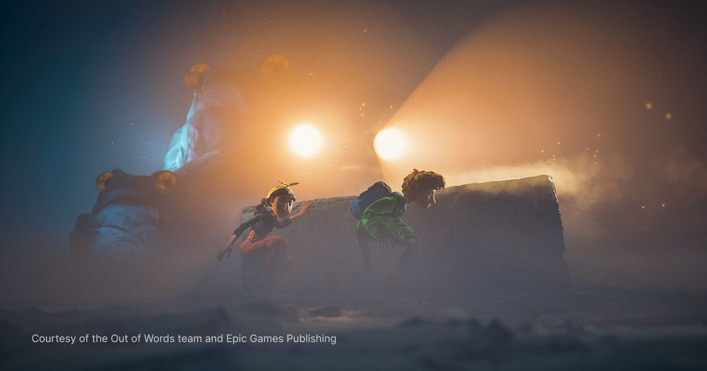
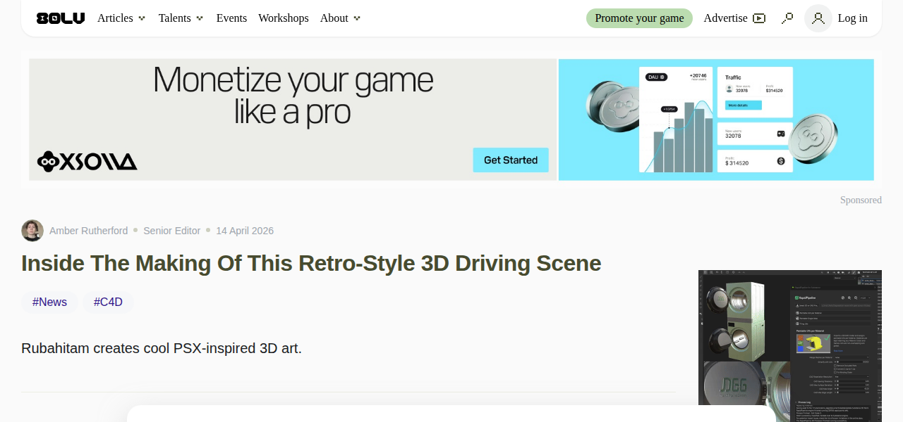
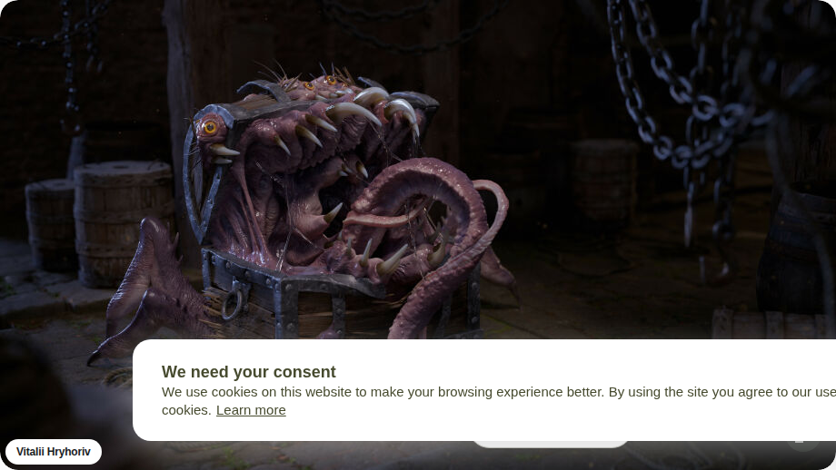
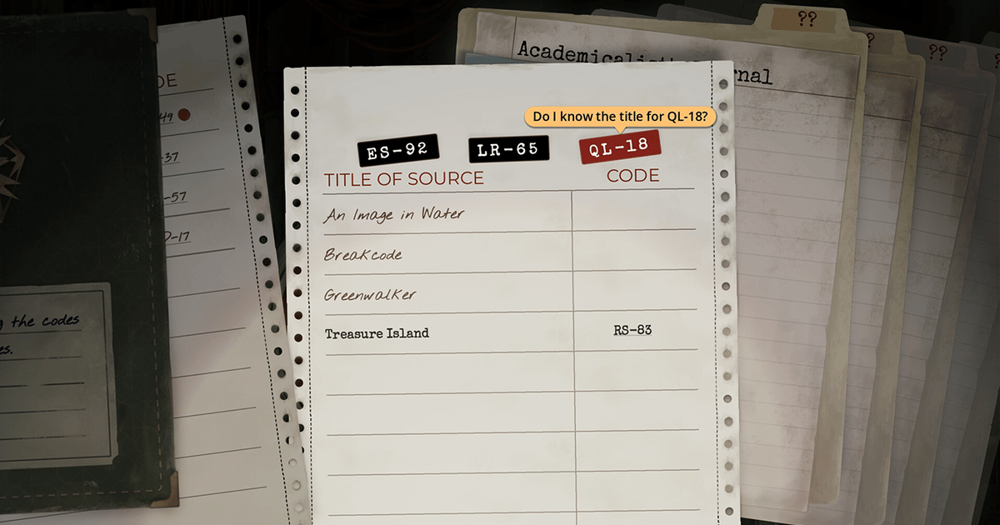
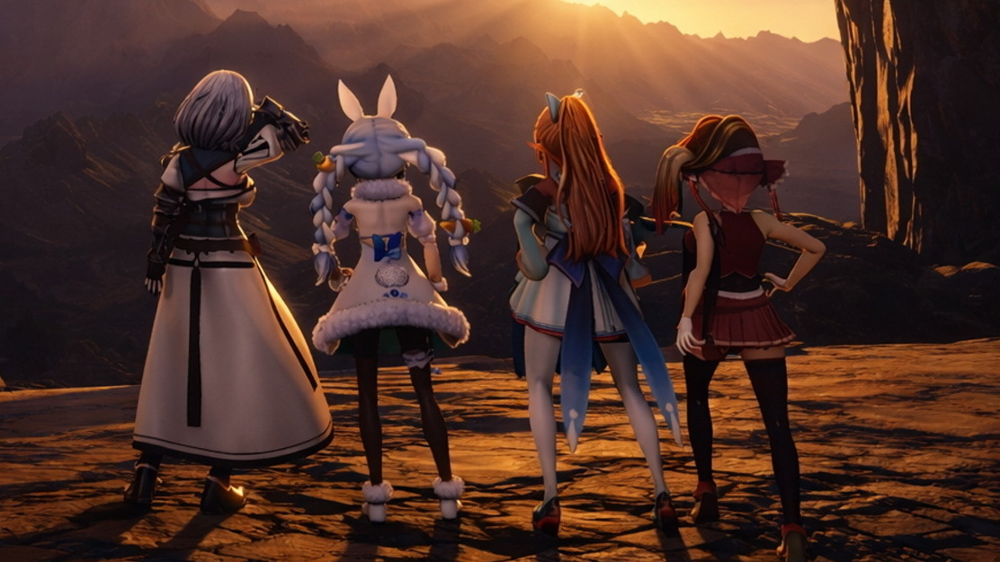

# 📅 Ultimate Daily Full Report — 2026-04-15

**📢 【今日頭條】**

由 40 位丹麥獨立開發者手工打造的合作冒險遊戲《Out of Words》，巧妙地將傳統藝術與現代科技（如 UE5 的 Nanite、Lumen 和藍圖系統）融合，呈現出獨特的定格動畫風格與物理謎題，展現了技術與藝術結合的無限可能。
- [Unreal - Out of Words 融合傳統藝術與現代科技](<https://www.unrealengine.com/developer-interviews/crafted-by-hand-out-of-words-melds-traditional-art-with-modern-tech-using-ue5>)
---
**⚙️ 【引擎相關】**

今日無 Unreal Engine 或 Unity 相關的重大更新或案例分享。
---
**🧱 【3D 模型技術】**

- Blender 5.1.1 Release Candidate 現已開放測試，修復了約 70 個初始版本中的問題，鼓勵用戶協助測試以確保穩定性。
  - [3D - BlenderNation - 協助測試 Blender 5.1.1 RC](<https://www.blendernation.com/2026/04/14/help-test-blender-5-1-1-release-candidate/>)
- 一位 3D 角色與道具藝術家分享了他在製作《蝙蝠俠：阿卡漢之影》與《星際爭霸戰：神童號》等遊戲中的工作經驗與心得，揭示了高水準 3D 資產製作的幕後。
  - [3D - 80.lv - 3D 角色與道具藝術家訪談](<https://80.lv/articles/3d-character-prop-artist-on-working-on-batman-arkham-shadow-star-trek-prodigy-supernova/>)
- 一篇技術文章展示了如何製作一個細節豐富、偽裝成寶箱的恐怖生物模型，其精湛的雕刻與貼圖技術值得借鑒。
  - [3D - 80.lv - 偽裝成寶箱的恐怖生物](<https://80.lv/articles/terrifyingly-detailed-creature-disguised-as-a-treasure-chest/>)
---
**✨ 【TA 相關】**

- 一篇文章深入探討了在將遊戲移植到 Switch 平台時，當傳統優化不再奏效，甚至需要重寫引擎底層的挑戰與解決方案，強調了底層技術美術的重要性。
  - [TA - 80.lv - Switch 移植優化挑戰](<https://80.lv/articles/when-optimization-stops-working-inside-the-switch-port-of-secret-of-the-mimic-that-required-rewriting-the-engine/>)
- 另一篇文章揭示了復古風格 3D 駕駛場景的製作過程，從概念到最終渲染的技術細節，展示了場景搭建與渲染技術的應用。
  - [TA - 80.lv - 復古風格 3D 駕駛場景製作](<https://80.lv/articles/inside-the-making-of-this-retro-style-3d-driving-scene/>)
---
**🎮 【獨立遊戲市場觀察】**

- 獨立遊戲開發商 Inkle 的共同創辦人分享了他們的敘事解謎遊戲《TR-49》如何在短短三小時內回本的成功經驗，為獨立開發者提供了寶貴的市場洞察。
  - [Game Developer - Inkle 共同創辦人談 TR-49 成功](<https://www.gamedeveloper.com/business/inkle-co-founder-explains-how-tr-49-broke-even-in-three-hours/>)
- Steam 平台近期發布了多個《Team Fortress 2》的例行性更新，主要針對遊戲內物品的視覺效果、錯誤修復及遊戲穩定性進行了調整，確保了遊戲的持續運營。
  - [Steam - Team Fortress 2 更新](<https://store.steampowered.com/news/260304/>)
---
**🤝 【在地社群】**

- 烏克蘭工作室 GSC Game World 揭露了《浩劫殺陣 2：車諾比之心》免費更新「封印的真相」的內容，將帶領玩家進入 X-18 實驗室，豐富遊戲體驗。
  - [巴哈姆特 GNN - 《浩劫殺陣 2》免費更新](<https://gnn.gamer.com.tw/detail.php?sn=303395/>)
- hololive 子公司 CCMC 宣布推出以 hololive 3 期生為主角的 3D 動作遊戲《HOLO-KINGDOM》，並同步釋出免費試玩版，吸引粉絲關注。
  - [巴哈姆特 GNN - hololive 3D 動作新作《HOLO-KINGDOM》](<https://gnn.gamer.com.tw/detail.php?sn=303394/>)
- 任天堂的招牌作品《動物森友會》系列迎來了 25 週年紀念，官方為此發送了遊戲內特別道具以慶祝這一里程碑。
  - [巴哈姆特 GNN - 《動物森友會》25 週年](<https://gnn.gamer.com.tw/detail.php?sn=303393/>)
- 「BitSummit PUNCH」執行委員會公布了今年的官方 PR 支援者、新增贊助企業以及 Game Jam 的相關資訊，持續推動獨立遊戲社群發展與交流。
  - [巴哈姆特 GNN - BitSummit PUNCH 活動資訊](<https://gnn.gamer.com.tw/detail.php?sn=303392/>)
- 韓國遊戲《午夜行者》因 Steam 評價褒貶不一，總監致歉並承諾將在六月前推出大改版以改善遊戲體驗，展現了對玩家回饋的重視。
  - [巴哈姆特 GNN - 《午夜行者》總監致歉與改版承諾](<https://gnn.gamer.com.tw/detail.php?sn=303391/>)
---
**💼 【製作人週記建議】**

- 數據與玩家情緒顯示，真實的 LGBTQ 敘事在遊戲中具有重要價值，開發者應有決心去實現，以滿足多元玩家群體的需求。
  - [Game Developer - LGBTQ 敘事價值](<https://www.gamedeveloper.com/design/data-and-player-sentiment-highlight-the-value-of-authentic-lgbtq-narratives/>)
- Capcom 的開發者們分享了新作《Pragmata》如何將解謎與科幻戰鬥融合，創造出獨特遊戲體驗的製作過程，提供了遊戲設計的寶貴見解。
  - [Game Developer - Capcom《Pragmata》製作分享](<https://www.gamedeveloper.com/design/how-capcom-s-pragmata-blends-puzzle-solving-with-sci-fi-combat/>)
- Bloober Team 的 CEO 指出，在當今市場上僅依賴單一遊戲會帶來過高風險，因此他們正轉型為多專案結構，以分散風險並尋求更穩健的發展。
  - [Game Developer - Bloober CEO 談多專案策略](<https://www.gamedeveloper.com/business/chronos-the-new-dawn-dev-bloober-team-transitions-to-a-multi-project-structure/>)
- Amazon 正在縮減其雲端遊戲服務 Luna 的規模，已購買的遊戲將於 6 月 10 日後停止運作且不提供退款，顯示雲端遊戲市場仍面臨挑戰。
  - [Game Developer - Amazon Luna 服務縮減](<https://www.gamedeveloper.com/business/amazon-is-downscaling-video-game-service-luna/>)
- 英國政府承諾投入 2850 萬英鎊，透過英國遊戲基金以定向補助的形式支持當地遊戲開發者，展現了政府對遊戲產業的扶持。
  - [Game Developer - 英國政府支持遊戲開發](<https://www.gamedeveloper.com/business/uk-government-commits-28-5-million-to-supporting-local-game-developers/>)
---
**🌌 【今日全方位深度總結】**
今日頭條聚焦於《Out of Words》如何利用 UE5 技術融合傳統藝術，展現了技術美術在遊戲視覺風格創新上的潛力，特別是 Nanite 和 Lumen 等渲染技術的應用。
引擎相關方面，今日未有 Unreal Engine 或 Unity 的重大更新，但業界對新技術的探索與應用持續進行中，技術美術需持續關注引擎發展趨勢。
3D 模型技術板塊顯示 Blender 穩定版更新與 80.lv 上的角色、生物及道具製作案例，強調了 DCC 工具的迭代與藝術家在資產創作上的精進，尤其在細節雕刻與貼圖流程上的技術深度。
TA 相關新聞則深入探討了 Switch 平台優化挑戰與引擎底層重寫，以及復古 3D 場景的渲染與搭建，凸顯了技術美術在效能與視覺呈現間的平衡藝術，以及對渲染管線的理解。
獨立遊戲市場觀察到《TR-49》的快速回本案例，以及 Steam 平台《Team Fortress 2》的例行性維護更新，反映了獨立遊戲的商業潛力與持續營運的重要性，特別是社群維護的價值。
在地社群方面，巴哈姆特 GNN 報導了多款遊戲的更新、新作發表與週年慶祝，以及 BitSummit PUNCH 的活動資訊，展現了台灣遊戲社群的活躍與多元性，為在地開發者提供了交流平台。
製作人週記建議涵蓋了從 LGBTQ 敘事價值、Capcom 的遊戲設計理念、Bloober Team 的多專案策略，到 Amazon Luna 的服務調整與英國政府對遊戲開發者的資金支持，提供了豐富的產業趨勢與經營策略洞察，強調了市場風險管理與多元化發展的重要性。
