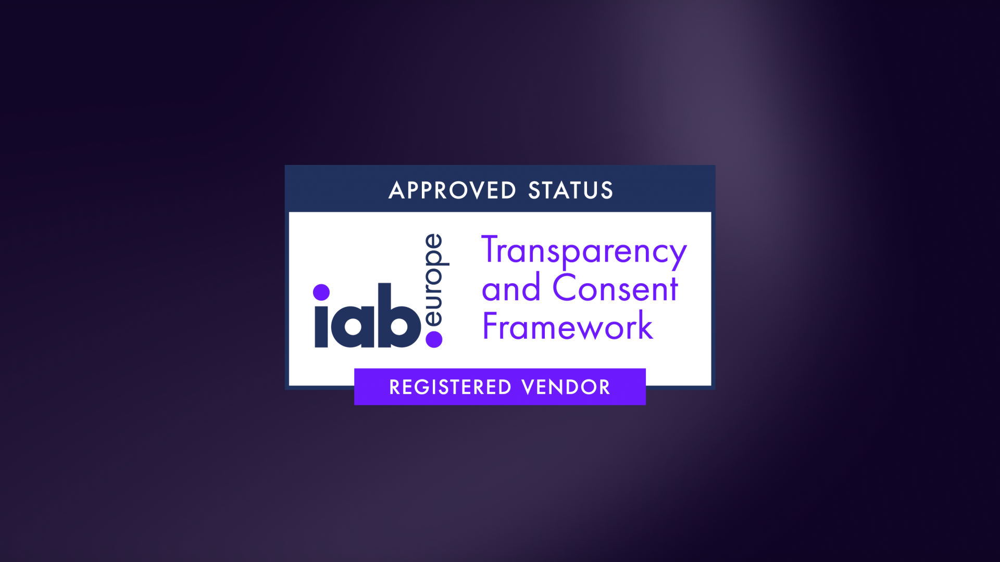
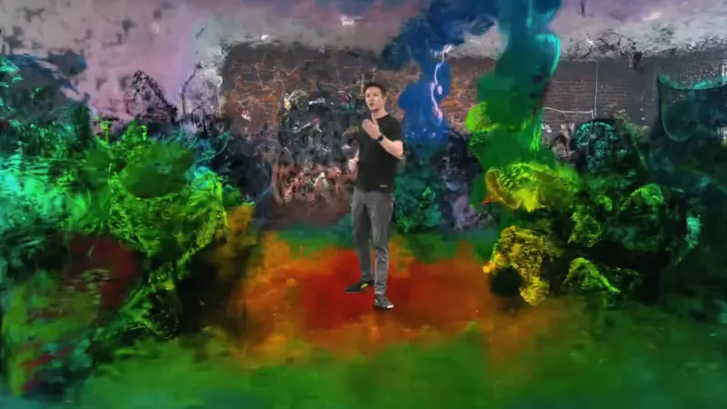
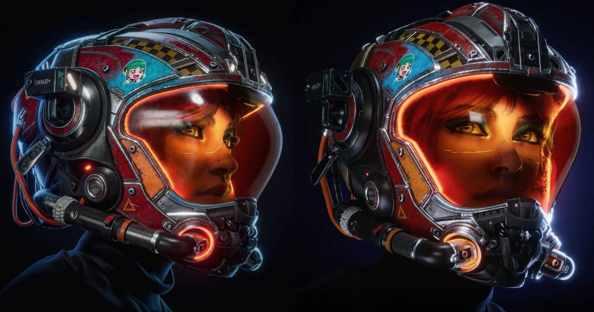
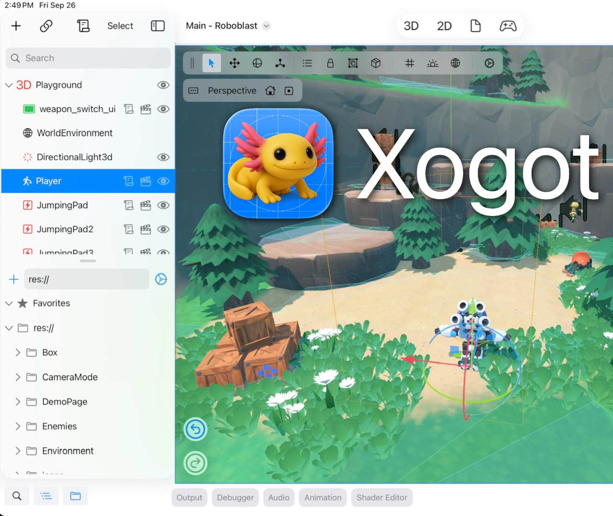
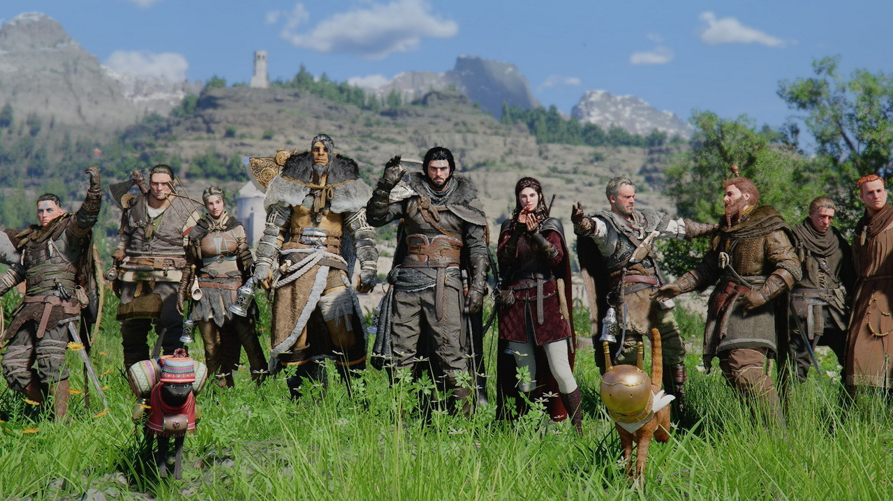
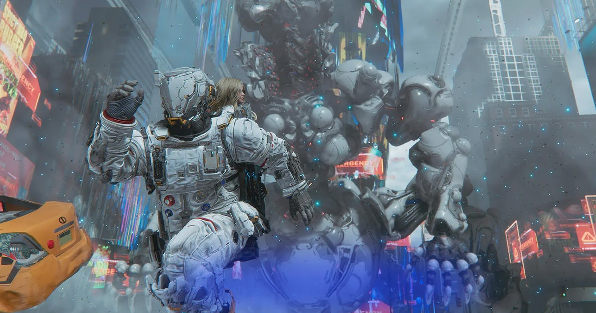

# 📅 Ultimate Daily Full Report — 2026-04-16
**📢 【今日頭條】**

Rockstar Games 遭到駭客組織威脅並公開竊取數據後，意外揭示了《GTA 線上模式》穩健的收益與用戶統計，反而促使母公司 Take-Two 股價不跌反升，展現了其核心產品的強勁市場表現。
- [巴哈姆特 GNN - GTA 線上模式數據流出股價反升](<https://gnn.gamer.com.tw/detail.php?sn=303453>)
---
**⚙️ 【引擎相關】**

- **Unity**：
  - Unity 宣布成為 IAB Europe 透明度與同意框架 (TCF) 的核准參與者，這將有助於其在歐洲經濟區 (EEA) 內提供符合規範且透明的遊戲內廣告服務。
    - [Unity - 加入 IAB Europe TCF 框架](<https://unity.com/blog/unity-joins-iab-europe-tcf-compliant-data-use-advertising>)
---
**🧱 【3D 模型技術】**

- Corridor Crew 團隊發布了一份關於 Gaussian Splats 技術的精彩概述，這項相對較新的 3D 掃描技術能夠生成包含反射和半透明等特徵的超逼真場景。
  - [3D - BlenderNation - Gaussian Splats 技術解析](<https://www.blendernation.com/2026/04/15/non-blender-how-go-gaussian-splats-work/>)
- Blender 開發者會議記錄公布，涵蓋了 2026 年 4 月 13 日的每週專案與模組進度，包括使用者介面、合成器、專案更新以及視埠與 EEVEE 模組會議的討論。
  - [3D - BlenderNation - Blender 開發者會議記錄](<https://www.blendernation.com/2026/04/15/blender-developers-meeting-notes-13-april-2026/>)
---
**✨ 【TA 相關】**

- 一位藝術家展示了使用 Substance 3D Painter 和 Unreal Engine 創建頭盔紋理的演示，詳細說明了從材質製作到引擎內呈現的技術美術流程。
  - [TA - 80.lv - 頭盔紋理演示](<https://80.lv/articles/artist-shows-a-helmet-texturing-demo-created-with-substance-3d-painter-and-unreal-engine>)
---
**🎮 【獨立遊戲市場觀察】**

- Xibbon 的 Miguel de Icaza 分享了他在 iOS 平台上開發 Xogot 的經驗，展示了 Godot 引擎在行動裝置遊戲開發上的潛力。
  - [Indie - Godot Engine Blog - Xogot 案例分享](<https://godotengine.org/article/godot-showcase-xogot/>)
- Steam 平台上的《Team Fortress 2》近期發布了多項更新，內容包含錯誤修復與小幅功能調整，持續維護遊戲體驗。
  - [Indie - Steam News - Team Fortress 2 更新](<https://store.steampowered.com/news/259771/>)
- Indie Pass 平台正積極探索解決獨立遊戲開發者面臨的遊戲曝光度問題，旨在提升獨立遊戲的市場可見性。
  - [Indie - 80.lv - Indie Pass 解決獨立遊戲曝光度](<https://80.lv/articles/how-indie-pass-hopes-to-solve-indie-game-discoverability-for-devs>)
- 一家獨立工作室分享了他們如何創造一款融合了黑色幽默與恐怖元素的解謎遊戲，提供了獨立遊戲設計與開發的寶貴見解。
  - [Indie - 80.lv - 獨立工作室解謎遊戲開發](<https://80.lv/articles/how-an-indie-studio-created-a-puzzle-game-that-mixes-dark-humor-horror>)
- 復古卡通風格射擊遊戲《MOUSE: P.I. For Hire》發布了新的黑色電影風格宣傳片，展示其獨特的視覺風格。
  - [Indie - 80.lv - MOUSE: P.I. For Hire 新宣傳片](<https://80.lv/articles/retro-cartoon-style-shooter-mouse-p-i-for-hire-gets-new-noir-cinematic-trailer>)
---
**🤝 【在地社群】**

- 韓國遊戲研發商珍艾碧絲宣布，旗下開放世界動作冒險遊戲《赤血沙漠》全球銷售量已達 500 萬套，並持續推出新技能、UI 修正與內容最佳化等更新。
  - [巴哈姆特 GNN - 赤血沙漠全球銷售破 500 萬](<https://gnn.gamer.com.tw/detail.php?sn=303452>)
- 免費戰爭沙盒遊戲《帝國神話：王權》S1 賽季「王權覺醒」將於明日上線，同步推出新的競技戰場，主打快節奏 PvP 與大規模勢力對抗。
  - [巴哈姆特 GNN - 帝國神話：王權 S1 賽季上線](<https://gnn.gamer.com.tw/detail.php?sn=303451>)
- 《Pokemon Pokopia》預告將舉辦「跳大繩大賽」遊戲內活動，玩家可與妙蛙種子互動並根據最佳紀錄獲得獎勵。
  - [巴哈姆特 GNN - Pokemon Pokopia 跳大繩大賽](<https://gnn.gamer.com.tw/detail.php?sn=303450>)
- 以《沉默之丘 2 重製版》聞名的波蘭恐怖遊戲開發商 Bloober Team 宣布擴編高階管理層，並轉向多專案製作架構，目前共有 7 款恐怖遊戲正在開發中。
  - [巴哈姆特 GNN - Bloober Team 擴編開發 7 款恐怖新作](<https://gnn.gamer.com.tw/detail.php?sn=303449>)
- Roguelike 卡牌地下城探索遊戲《吸血鬼爬行者》公開了由知名遊戲作曲家下村陽子譜寫的主題曲，為遊戲增添獨特氛圍。
  - [巴哈姆特 GNN - 吸血鬼爬行者公開下村陽子主題曲](<https://gnn.gamer.com.tw/detail.php?sn=303448>)
---
**💼 【製作人週記建議】**

- 《RuneScape》開發商宣布將其 IP 擴展至亞太地區，計畫將《RuneScape: Dragonwilds》本地化為簡體中文、日文和韓文，以開拓新市場。
  - [Game Developer - RuneScape 擴展亞太市場](<https://www.gamedeveloper.com/business/runescape-developer-to-expand-its-ip-to-the-asian-pacific-region>)
- 據報導，Xbox 新任主管 Asha Sharma 在內部備忘錄中表示 Game Pass「變得太貴」，認為該訂閱服務需要更好的「價值方程式」。
  - [Game Developer - Xbox Game Pass 價值問題](<https://www.gamedeveloper.com/business/report-xbox-new-chief-says-game-pass-has-become-too-expensive->)
- 遊戲律師 Nick Allan 建議開發者應深入理解所有權問題，並謹慎使用生成式 AI，以避免潛在的法律風險。
  - [Game Developer - 遊戲律師談 AI 與所有權](<https://www.gamedeveloper.com/business/video-game-lawyer-implores-devs-to-understand-ownership-and-swerve-generative-ai>)
- ID@Xbox 全球總監指出 Xbox Game Pass 是一個「發現乘數」，能為遊戲帶來正向的滾雪球效應，提升遊戲的曝光度與玩家基礎。
  - [Game Developer - Xbox Game Pass 發現乘數](<https://www.gamedeveloper.com/business/id-xbox-global-director-says-xbox-game-pass-is-a-discovery-multiplier>)
- 數據和玩家情緒顯示，真實的 LGBTQ 敘事在遊戲中具有重要價值，開發者應有決心實現真正的代表性。
  - [Game Developer - LGBTQ 敘事價值](<https://www.gamedeveloper.com/design/data-and-player-sentiment-highlight-the-value-of-authentic-lgbtq-narratives>)
- Capcom 的 Cho Yonghee 等人討論了《Pragmata》如何將解謎與科幻戰鬥融合，創造出一個具有獨特吸引力的新 IP。
  - [Game Developer - Capcom Pragmata 設計理念](<https://www.gamedeveloper.com/design/how-capcom-s-pragmata-blends-puzzle-solving-with-sci-fi-combat>)
- 針對現代手遊設計中玩家流失的問題，文章探討了如何透過設計策略來解決，以提升玩家留存率。
  - [Game Developer - 手遊玩家流失解決方案](<https://80.lv/articles/how-to-solve-player-drop-off-in-modern-mobile-game-design>)
---
**🌌 【今日全方位深度總結】**
今日頭條揭示了 Rockstar Games 即使面臨數據洩露，其《GTA 線上模式》的強勁表現仍能提振母公司股價，凸顯了成熟服務型遊戲的市場韌性。

引擎方面，Unity 透過加入 IAB Europe TCF 框架，強化了其在歐洲市場的廣告合規性，這對依賴廣告變現的開發者來說是重要的信任基礎。

3D 模型技術方面，Gaussian Splats 作為新興的 3D 掃描技術，其生成逼真場景的能力預示著未來資產創建流程的潛在變革，而 Blender 的開發進度則持續推動開源 DCC 工具的演進。

TA 相關領域，Substance 3D Painter 與 Unreal Engine 結合的頭盔紋理演示，展示了現代遊戲資產管線中材質製作與引擎渲染的緊密協作，強調了技術美術在視覺品質實現中的關鍵作用。

獨立遊戲市場觀察到 Godot 引擎在行動平台上的應用案例，以及 Indie Pass 等平台嘗試解決獨立遊戲曝光度問題，同時 Steam 上的《Team Fortress 2》持續更新，顯示了長青遊戲的維護策略。

在地社群方面，多款遊戲如《赤血沙漠》、《帝國神話：王權》和《Pokemon Pokopia》的銷售里程碑、賽季更新與活動預告，以及 Bloober Team 的擴張與新作開發，反映了區域市場的活躍與多元發展。

製作人週記建議則涵蓋了從 IP 國際化、訂閱服務價值評估、AI 法律風險、遊戲發現機制、LGBTQ 敘事重要性到具體遊戲設計理念和手遊玩家流失策略等多個面向，為遊戲開發者提供了全面的商業與設計思考。
---
