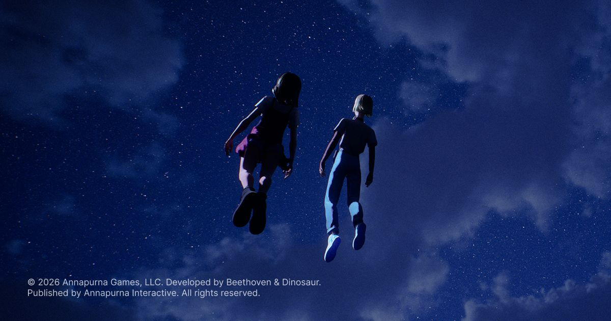
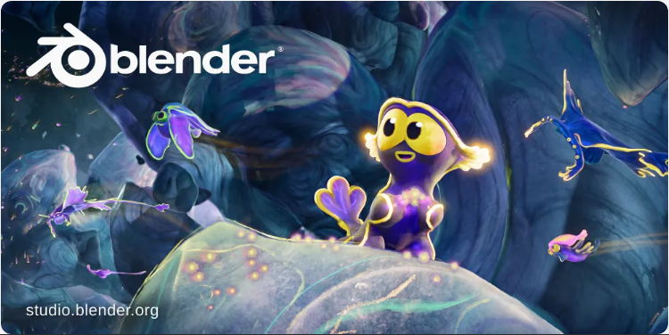
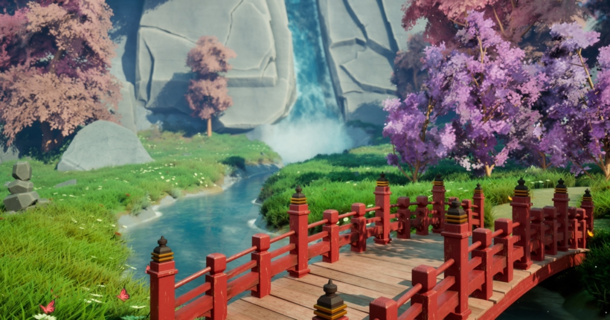
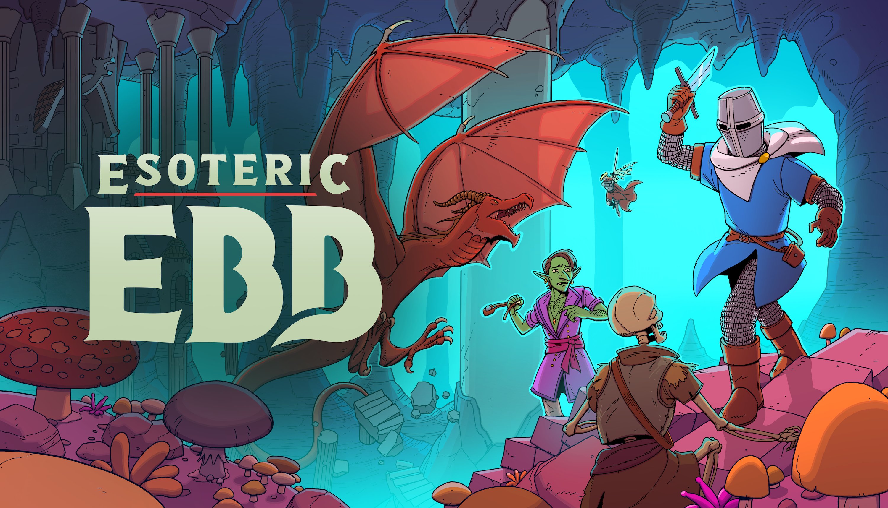
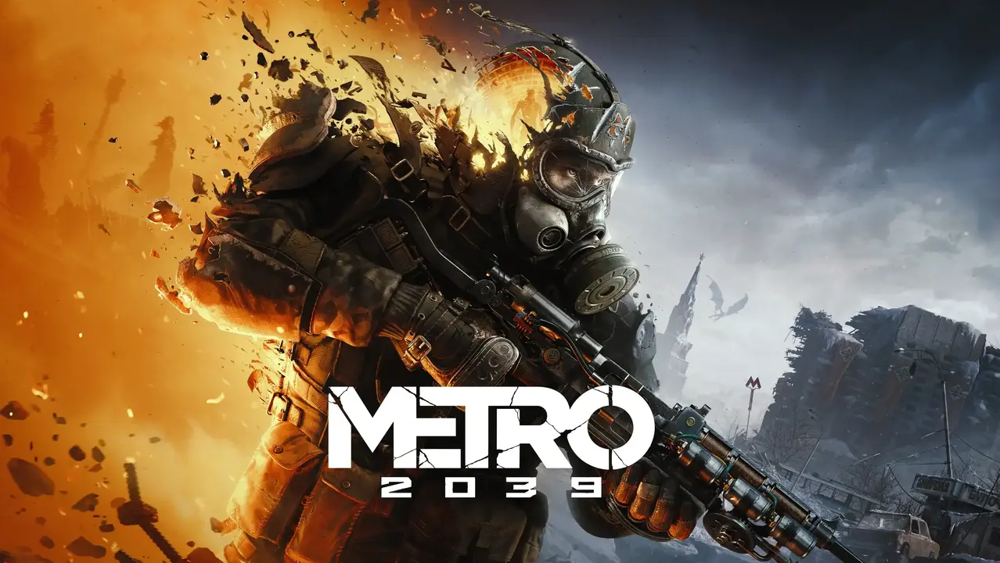

# 📅 Ultimate Daily Full Report — 2026-04-17

**📢 【今日頭條】**

Netflix 動畫工作室正式加入 Blender 開發基金，成為企業贊助商，這不僅是動畫產業的歷史性里程碑，也預示著開源 3D 軟體在主流商業應用中獲得了前所未有的認可與支持，將極大推動 Blender 的未來發展。
- [Blender - Netflix 贊助](<https://www.blender.org/press/netflix-animation-studios-joins-the-blender-development-fund-as-corporate-patron/>)
---
**⚙️ 【引擎相關】**

- **Unreal Engine**：
  - 獨立工作室 Beethoven & Dinosaur 分享了他們如何利用 Unreal Engine 5 製作充滿懷舊感的音樂故事遊戲《Mixtape》，展示了 UE5 如何為小型團隊提供關鍵技術支援。
    - [Unreal - Mixtape 製作](<https://www.unrealengine.com/developer-interviews/mixtape-making-the-magic-of-nostalgia-come-alive-in-unreal-engine-5>)
  - Unreal Engine 宣布將於 2026 年 4 月 13 日至 17 日舉辦獨立遊戲週，期間將分享獨家訪談和 UE5 開發技巧直播，展示全球獨立工作室如何利用 Epic 生態系統推出傑出遊戲。
    - [Unreal - 獨立遊戲週](<https://www.unrealengine.com/events/indie-games-week-2026>)
  - Unreal Engine 5 正逐漸成為機器人模擬領域的首選平台，不僅作為模擬器，更作為合成數據工廠，為下一代機器人系統提供動力。
    - [Unreal - UE5 機器人模擬](<https://www.unrealengine.com/spotlights/ue5-is-becoming-the-platform-of-choice-for-robotics-simulation>)
- **Unity**：
  - Unity 回顧了 2026 年 3 月使用 Unity 製作的遊戲發布情況，包括在 GDC、Steam 春季特賣和 Steam Next Fest 期間推出的眾多頂級遊戲和試玩版。
    - [Unity - 2026 三月遊戲回顧](<https://unity.com/blog/games-made-with-unity-march-2026-releases/>)
---
**🧱 【3D 模型技術】**

- Blender 5.1 版本正式發布，此次更新主要聚焦於優化、錯誤修復以及改進整個開發流程的關鍵功能。
  - [3D - Blender 5.1 發布](<https://www.blender.org/press/blender-5-1-release/>)
- Blender 開發團隊在 2025-2026 年冬季優先提升了軟體的穩定性和整體品質，以確保用戶體驗。
  - [3D - Blender 品質之冬 2026](<https://code.blender.org/2026/02/winter-of-quality-2026/>)
- 2025 年 9 月的 Geometry Nodes 工作坊總結了相關討論內容，預示著節點系統的進一步發展。
  - [3D - Geometry Nodes 工作坊](<https://code.blender.org/2025/10/geometry-nodes-workshop-september-2025/>)
- Blender 5.0 將顯著改進 Geometry Nodes 對體積數據的支援，引入 Volume Grids 功能，提升體積建模能力。
  - [3D - Geometry Nodes 體積網格](<https://code.blender.org/2025/10/volume-grids-in-geometry-nodes/>)
- Blender 5.0 在 Geometry Nodes 中引入了 Bundles 和 Closures，為節點操作帶來新的靈活性和組織方式。
  - [3D - Geometry Nodes Bundles](<https://code.blender.org/2025/08/bundles-and-closures/>)
- Blender 5.0 改變了 Socket Shapes 的含義，優化了節點連接的視覺識別和功能性。
  - [3D - Blender 新 Socket 形狀](<https://code.blender.org/2025/08/new-socket-shapes/>)
- Google Summer of Code 2025 的八個 Blender 相關專案成果已公布，展示了社群對軟體發展的貢獻。
  - [3D - GSoC 2025 成果](<https://code.blender.org/2025/10/google-summer-of-code-2025-results/>)
- Wacom 提供為期四週的免費 Blender 基礎工作坊「The Painterly Path to 3D」，旨在幫助 2D 藝術家輕鬆過渡到 3D 創作，重拾創作樂趣。
  - [3D - Wacom Blender 工作坊](<https://www.blendernation.com/2026/04/16/free-blender-fundamentals-workshop-by-wacom-the-painterly-path-to-3d/>)
- 一段新的比較影片探討了傳統 Blender 工作流程與新興硬表面工具 HardCuts 在變形和布林運算方面的差異，為藝術家提供了新的選擇。
  - [3D - HardCuts vs Blender](<https://www.blendernation.com/2026/04/12/hardcuts-vs-blender-a-fresh-take-on-deforms-and-boolean-workflows/>)
- 義大利首部使用 Blender 製作的成人動畫系列《Il Baracchino》已開發完成，講述了脫口秀世界的 gritty 故事，展現 Blender 在動畫製作中的應用潛力。
  - [3D - Blender 製作動畫系列](<https://www.blender.org/user-stories/creating-il-baracchino-italys-first-adult-animated-series-made-with-blender/>)
- Blender 基金會展望 2026 年的開發計畫，預告將推出新工具、加強協作並擴大平台支援。
  - [3D - Blender 2026 展望](<https://www.blender.org/development/projects-to-look-forward-to-in-2026/>)
---
**✨ 【TA 相關】**

- 80.lv 介紹了如何使用 Houdini 製作風格化橋樑工具，並將其整合到 Unreal Engine 5 中，展示了程序化生成在遊戲場景搭建中的應用。
  - [TA - 80.lv - Houdini 風格化橋樑](<https://80.lv/articles/creating-a-houdini-tool-that-generates-stylized-bridges-for-unreal-engine-5>)
- 80.lv 提供了一篇教學，詳細說明如何在 Blender 中為風格化 3D 角色綁定平面眼睛，這對於技術美術師處理卡通風格角色動畫至關重要。
  - [TA - 80.lv - Blender 平面眼睛綁定](<https://80.lv/articles/tutorial-how-to-rig-flat-eyes-for-stylized-3d-characters-in-blender>)
- Blender 的 Geometry Nodes 在宇宙學研究中展現了實際的科學應用，證明其在複雜數據可視化方面的強大能力。
  - [TA - Blender - Geometry Nodes 宇宙學](<https://www.blender.org/user-stories/cosmology-with-geometry-nodes/>)
- Unity 介紹了 Eden Games 如何在《Gear.Club Unlimited 3》中實現 500 公里/小時的渲染速度，同時保持 60 fps 的流暢度和視覺保真度，這對渲染效能優化是極大的挑戰。
  - [TA - Unity - Gear.Club Unlimited 3 渲染](<https://unity.com/blog/eden-games-gear-club-unlimited-3>)
- Natsura 0.6 版植被建模工具集現已推出，為環境藝術家提供了更高效的植物資產創建解決方案。
  - [TA - 80.lv - Natsura 植被工具](<https://80.lv/articles/foliage-modeling-toolset-natsura-0-6-now-available/>)
- iRender 推出了 Credit Back 返現系統，可將渲染農場成本降低高達 60%，為工作室和個人藝術家提供了顯著的成本優化方案。
  - [TA - 80.lv - iRender 渲染農場](<https://80.lv/articles/what-is-irender-s-credit-back-a-cashback-system-that-reduces-render-farm-costs-up-to-60>)
---
**🎮 【獨立遊戲市場觀察】**

- 長期舉辦的遊戲開發競賽 Ludum Dare 宣布將於 2028 年 10 月正式結束，這項活動曾催生出《Celeste》和《Inscryption》等多款成功作品。
  - [Game Developer - Ludum Dare 結束](<https://www.gamedeveloper.com/production/ludum-dare-will-officially-end-in-october-2028>)
- 獨立遊戲開發團隊 Domnaier 公開了新作《獸人酒吧：人類禁止！》的遊玩宣傳影片，這是一款結合經營模擬與動作射擊要素的遊戲，玩家需找出混入店裡的偽裝人類。
  - [巴哈姆特 - 獸人酒吧](<https://gnn.gamer.com.tw/detail.php?sn=303532>)
- Steam 平台發布了 Team Fortress 2 的多項更新，主要集中在客戶端崩潰修復、視覺錯誤修正以及 2025 年聖誕節活動內容，確保遊戲穩定性與節慶體驗。
  - [Steam - Team Fortress 2 更新](<https://store.steampowered.com/news/265516/>)
- Unity 博客分享了《Esoteric Ebb》這款非線性 RPG 的互動寫作挑戰與設計過程，揭示了複雜敘事設計的幕後故事。
  - [Unity - Esoteric Ebb 敘事設計](<https://unity.com/blog/interactive-writing-challenges-for-nonlinear-rpg-design>)
---
**🤝 【在地社群】**

- 4A Games 在「Xbox First Look: Metro 2039」直播中揭曉了《戰慄深隧》系列最新作《戰慄深隧 2039》，預計今年冬季在 Xbox Series X|S、PlayStation 等平台登場。
  - [巴哈姆特 - 戰慄深隧 2039](<https://gnn.gamer.com.tw/detail.php?sn=303537>)
- EA 美商藝電公開了《戰地風雲 6》與《戰地風雲 禁區衝突》的 2026 年更新路線圖，預告將有經典地圖、海戰內容以及一系列新功能回歸。
  - [巴哈姆特 - 戰地風雲 6 路線圖](<https://gnn.gamer.com.tw/detail.php?sn=303536>)
- 改編自 CAPCOM 經典格鬥遊戲《快打旋風》的同名真人電影釋出首支正式預告片，展現激烈的街頭格鬥場面，預定 10 月 16 日上映。
  - [巴哈姆特 - 快打旋風 真人電影](<https://gnn.gamer.com.tw/detail.php?sn=303535>)
- KONAMI 宣布《網球王子 學園祭的王子們》及《網球王子 心跳求生》兩款戀愛冒險遊戲將於 7 月底推出，並支援中文，滿足在地玩家需求。
  - [巴哈姆特 - 網球王子 戀愛遊戲](<https://gnn.gamer.com.tw/detail.php?sn=303534>)
- 《索尼克賽車 交叉世界》發布免費更新，新增《Angry Birds》系列的「怒鳥紅」角色，並同步舉辦期間限定的合作賽事「Angry Birds 祭典」。
  - [巴哈姆特 - 索尼克賽車 怒鳥紅](<https://gnn.gamer.com.tw/detail.php?sn=303533>)
- Blender 基金會董事會發布新年賀詞，向社群傳達祝福與未來展望。
  - [Blender - 基金會新年賀詞](<https://www.blender.org/news/a-message-from-the-blender-foundation-board/>)
---
**💼 【製作人週記建議】**

- Unity 探討了傳統 3D 工具的隱藏成本，並提出了更智能的方式來構建互動體驗，這對於製作人評估專案預算和工具選擇至關重要。
  - [Unity - 傳統 3D 工具成本](<https://unity.com/blog/hidden-costs-traditional-3d-tools>)
- Unity 建議在啟動第一個 3D 專案前應考慮的 10 個問題，涵蓋了從設計到商業應用的多個層面，為製作人提供了實用的決策指南。
  - [Unity - 首次 3D 專案問題](<https://unity.com/blog/10-questions-first-no-code-3d-project>)
- Ubisoft Halifax 的工會成員在工作室關閉後達成了和解協議，這反映了遊戲產業裁員和工作室重組對員工的影響，值得製作人關注勞資關係。
  - [Game Developer - Ubisoft Halifax 和解](<https://www.gamedeveloper.com/business/ubisoft-halifax-union-members-agree-settlement-after-studio-closure>)
- 美國眾議員 Maxwell Frost 對沙烏地阿拉伯收購 EA 表示抗議，擔憂 EA 可能利用 AI 導致大量裁員，這揭示了大型併購案背後的潛在風險和社會影響。
  - [Game Developer - 沙烏地收購 EA 抗議](<https://www.gamedeveloper.com/business/us-representative-maxwell-frost-voices-protest-over-saudi-buyout-of-ea>)
- Epic Games 執行長 Tim Sweeney 對 Unity 與 Fortnite 的合作發表評論，提供了對業界合作與競爭格局的獨到見解。
  - [80.lv - Tim Sweeney 評論](<https://80.lv/articles/tim-sweeney-comments-on-unity-fortnite-collaboration>)
---
**🌌 【今日全方位深度總結】**
今日頭條顯示，Netflix 對 Blender 的企業級支持，預示著開源工具在商業動畫管線中的地位顯著提升，對整個 3D 產業鏈影響深遠。
引擎方面，Unreal Engine 5 在遊戲開發、獨立遊戲推廣及機器人模擬領域持續擴展其應用廣度，而 Unity 則回顧了其平台上的遊戲發布盛況。
3D 模型技術板塊，Blender 5.1 的發布與 Geometry Nodes 的多項更新，包括體積數據支援和新節點功能，持續強化其作為 DCC 工具的專業能力，同時社群也積極推廣學習資源與工作流程優化。
TA 相關新聞揭示了技術美術領域的多元發展，從 Houdini 在 UE5 中的程序化場景生成，到 Blender 角色綁定技巧，再到 Unity 賽車遊戲的極限渲染優化，以及渲染成本控制方案，都體現了對效率與視覺品質的雙重追求。
獨立遊戲市場方面，老牌遊戲開發競賽 Ludum Dare 的結束標誌著一個時代的轉變，同時也有新興獨立遊戲的發布與 Steam 平台例行更新，展現了市場的活力與挑戰。
在地社群方面，多款重量級遊戲如《戰慄深隧 2039》和《戰地風雲 6》的更新路線圖在本地市場引起關注，同時也有 IP 改編電影和在地化遊戲的推出，豐富了玩家的選擇。
製作人週記建議則聚焦於產業的商業策略與風險管理，從 3D 工具的成本效益分析，到大型併購案對員工的潛在影響，以及對行業合作的深度評論，為製作人提供了多維度的思考。
