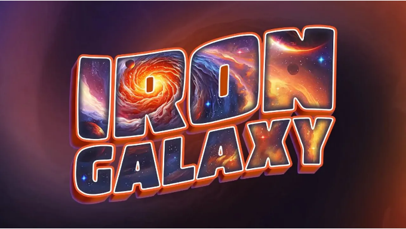
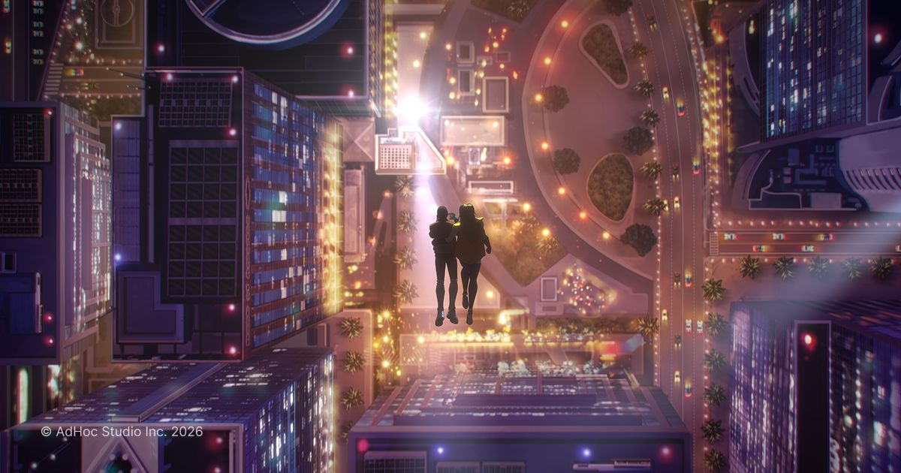
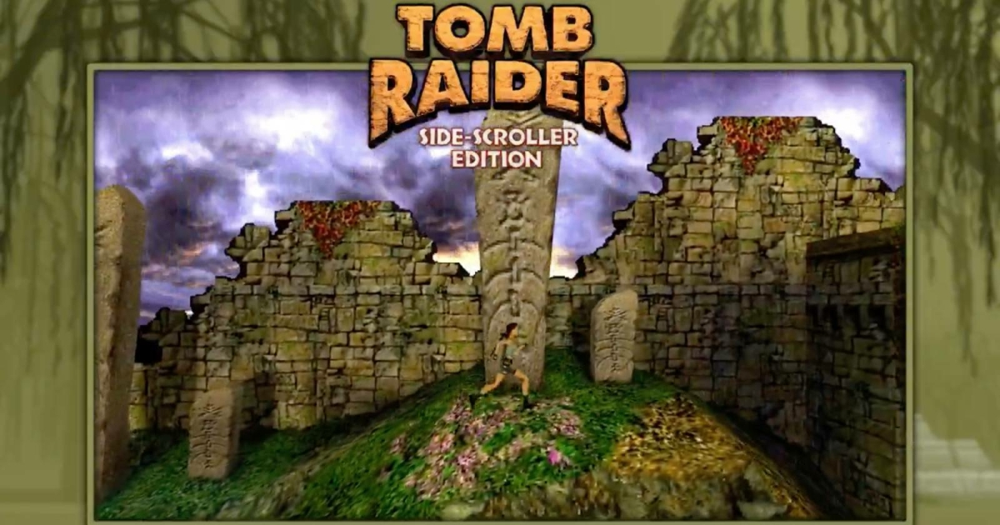
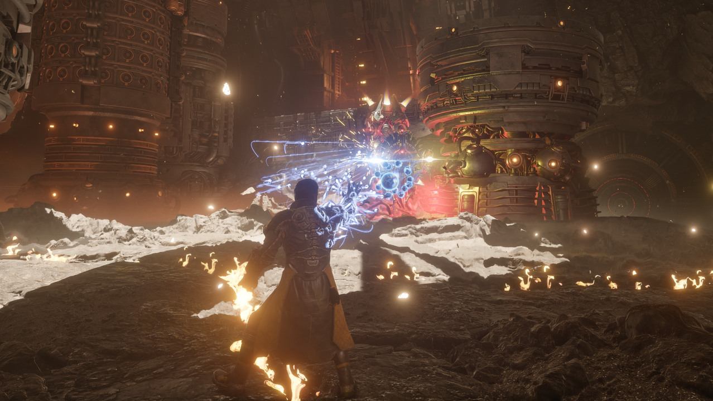
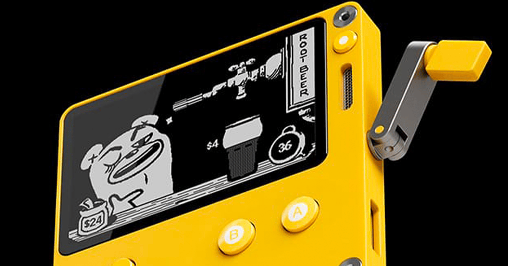

# 📅 Ultimate Daily Full Report — 2026-04-18

**📢 【今日頭條】**

遊戲業界近期面臨嚴峻挑戰，Iron Galaxy Studios 宣布裁員，並表示將把當前市場狀況視為永久性趨勢，這反映出遊戲開發商在面對經濟壓力時，正採取更為保守的策略以適應市場變化。
- [Game Developer - Iron Galaxy Studios 裁員](<https://www.gamedeveloper.com/business/iron-galaxy-studios-lays-off-a-number-of-workers-as-it-reduces-company-size>)
---
**⚙️ 【引擎相關】**

- **Unreal Engine**：
  - AdHoc 工作室利用 Unreal Engine 成功打造了 2025 年的敘事型熱門遊戲《Dispatch》，該作在 10 天內售出超過百萬套，證明小型團隊也能透過 UE 推動創新的章節式敘事。
    - [Unreal - AdHoc 運用 UE 打造《Dispatch》](<https://www.unrealengine.com/developer-interviews/how-adhoc-used-unreal-engine-to-deliver-2025s-narrative-driven-hit-dispatch>)
  - Timberline 的 13 人獨立團隊運用 UE5 製作了《Beastro》，這款遊戲巧妙融合了牌組構築、烹飪與木偶劇戰鬥，展現了獨特的視覺風格與魅力。
    - [Unreal - Timberline 運用 UE5 打造《Beastro》](<https://www.unrealengine.com/developer-interviews/timberlines-beastro-serves-up-a-flavorful-twist-on-a-variety-of-genres-with-ue5>)
  - Fab 春季創作者特賣活動已開跑，提供超過 13 萬種 Fab 產品高達七折的優惠，涵蓋素材、模板、材質與遊戲系統等，為開發者提供豐富的資源選擇。
    - [Unreal - Fab 春季創作者特賣](<https://www.unrealengine.com/news/the-fab-spring-creator-sale-has-started>)
- **Unity**：
  - Unity 官方回顧了 2026 年 3 月份使用 Unity 製作的遊戲，該月因 GDC、Steam 春季特賣和 Steam Next Fest 而異常繁忙，許多頂級遊戲和數百個精彩試玩版相繼推出。
    - [Unity - 2026 年 3 月 Unity 遊戲回顧](<https://unity.com/blog/games-made-with-unity-march-2026-releases>)
---
**🧱 【3D 模型技術】**

- BlenderNation 發布了 2026 年 4 月 17 日的 Blender 職位清單，其中包含電影製作駐地 3D 建模師（60 個職缺）、初級 3D 美術師（資產清理與優化）以及資深/總監級 VFX 美術師等職位，顯示業界對 Blender 技能的需求持續增長。
  - [3D - BlenderNation - Blender 職位](<https://www.blendernation.com/2026/04/17/blender-jobs-for-april-17-2026/>)
- BlenderNation 也精選了 2026 年第 16 週 Blender Artists 論壇上的最佳作品，展示了社群藝術家們的卓越創作。
  - [3D - BlenderNation - Blender Artists 精選](<https://www.blendernation.com/2026/04/17/best-of-blender-artists-2026-16/>)
- 80.lv 刊載了如何使用 ZBrush 雕刻隱藏寺廟的詳細環境教學，為環境藝術家提供了實用的工作流程指導。
  - [3D - 80.lv - ZBrush 雕刻隱藏寺廟](<https://80.lv/articles/how-to-sculpt-a-detailed-environment-of-a-hidden-temple-using-zbrush>)
- 另一篇 80.lv 文章探討了 3D 美術師如何看待 Substance 3D Painter 在現代製作管線中的角色，強調其在材質製作流程中的重要性。
  - [3D - 80.lv - Substance Painter 在管線中的角色](<https://80.lv/articles/3d-artist-on-substance-3d-painter-s-role-in-modern-pipelines>)
- Plasticity 2026.1 版本更新增加了新指令並改進了舊有功能，持續提升其在 3D 建模領域的應用效率。
  - [3D - 80.lv - Plasticity 2026.1 更新](<https://80.lv/articles/plasticity-2026-1-adds-new-commands-improves-old-ones>)
---
**✨ 【TA 相關】**

- 80.lv 報導了粉絲們如何將經典的《古墓奇兵》重新構想為 2.5D 橫向捲軸遊戲，這類項目常涉及將 3D 資產轉換為 2D 視角下的視覺呈現，對技術美術而言是個有趣的挑戰。
  - [TA - 80.lv - 粉絲重構《古墓奇兵》為 2.5D](<https://80.lv/articles/fans-reimagine-classic-tomb-raider-as-2d-side-scroller>)
---
**🎮 【獨立遊戲市場觀察】**

- Steam 平台近期發布了《Team Fortress 2》的多次更新，主要內容包括修復了玩家利用顏色控制碼冒充系統訊息的問題，以及修復了遊戲中的一些視覺錯誤和動畫問題，確保遊戲穩定性。
  - [Steam - Team Fortress 2 更新](<https://store.steampowered.com/news/265126/>)
---
**🤝 【在地社群】**

- CAPCOM 的新感覺科幻動作冒險新作《人機迷網》已正式上市，遊戲以解謎與動作融合的獨特系統，描寫在近未來月面世界中尋找返回地球之路的搭檔故事。
  - [巴哈姆特 GNN - CAPCOM《人機迷網》上市](<https://gnn.gamer.com.tw/detail.php?sn=303614>)
- 索尼互動娛樂旗下 Housemarque 工作室開發的科幻射擊新作《沙羅週期》搶先公開了 PS5 Pro 強化與 PS5 功能詳情，承諾為玩家帶來極致的影音與觸覺回饋饗宴。
  - [巴哈姆特 GNN - 《沙羅週期》PS5 Pro 強化詳情](<https://gnn.gamer.com.tw/detail.php?sn=303613>)
- 發行商傑仕登宣布，由 Aniplex 與 Akatsuki Games 合作開發的俯視視角 2D 動作角色扮演遊戲《海珂：北境極光》PS5 與 Nintendo Switch 實體版將於 6 月 25 日發售。
  - [巴哈姆特 GNN - 《海珂：北境極光》實體版發售](<https://gnn.gamer.com.tw/detail.php?sn=303612>)
- CFK 宣布由 VISUAL LIGHT 開發的 Nintendo Switch 動作防禦新作《通通丟出去：殭屍入侵》將於 4 月 23 日透過 Nintendo eShop 全球發售。
  - [巴哈姆特 GNN - 《通通丟出去：殭屍入侵》Switch 版發售](<https://gnn.gamer.com.tw/detail.php?sn=303611>)
- Vaka, Inc. 宣布，實況播放量突破 600 萬次的日常侵蝕恐怖遊戲《翌日 -鬼字之屋-》Nintendo Switch 及 PlayStation 4 版本已於 4 月 16 日發售。
  - [巴哈姆特 GNN - 《翌日 -鬼字之屋-》登陸家用主機](<https://gnn.gamer.com.tw/detail.php?sn=303610>)
- 世雅股份有限公司宣布，《足球經理 26》即日起在 PC（Steam）與 Xbox Series X|S 平台限期開放免費遊玩，並同步舉行史低 6 折特賣活動。
  - [巴哈姆特 GNN - 《足球經理 26》限期免費遊玩與特賣](<https://gnn.gamer.com.tw/detail.php?sn=303609>)
---
**💼 【製作人週記建議】**

- Game Developer 刊載文章，探討如何支持初級開發者並磨練創意，強調寫作技巧與進入遊戲產業的技能培養。
  - [Game Developer - 支持初級開發者與磨練創意](<https://www.gamedeveloper.com/design/supporting-juniors-and-sharpening-your-creativity>)
- Panic 公司宣布，將不會發行使用某些形式生成式 AI 的 Playdate 遊戲，但對程式碼開發中使用的「AI 輔助」則例外，這為 AI 在遊戲開發中的應用劃定了界線。
  - [Game Developer - Panic 對生成式 AI 遊戲的政策](<https://www.gamedeveloper.com/production/panic-won-t-release-playdate-titles-that-use-some-forms-of-generative-ai>)
- Egosoft 製作太空模擬遊戲三十年的經驗顯示，服務「利基」受眾是可持續的商業模式，即使市場變化，核心玩家群體依然存在。
  - [Game Developer - Egosoft 服務利基受眾的經驗](<https://www.gamedeveloper.com/pc/what-egosoft-s-three-decades-of-making-space-sims-tells-us-about-serving-niche-audiences>)
- 最新一期 Patch Notes 討論了 Ubisoft 工會工人達成和解、遊戲開發者的法律建議，以及 Xbox Game Pass 是否過於昂貴等業界熱點議題。
  - [Game Developer - Ubisoft 工會、法律建議與 Game Pass 討論](<https://www.gamedeveloper.com/business/ubisoft-union-workers-agree-settlement-some-legal-advice-for-game-devs-and-is-xbox-game-pass-too-expensive->)
- Ludum Dare 遊戲開發競賽宣布將於 2028 年 10 月正式結束，這標誌著一個長期且具影響力的遊戲開發社群活動的終結。
  - [80.lv - Ludum Dare 將於 2028 年結束](<https://80.lv/articles/ludum-dare-to-officially-end-in-october-2028>)
---
**🌌 【今日全方位深度總結】**
今日頭條揭示了遊戲業界因市場壓力而進行裁員的嚴峻現實，反映出開發商對未來趨勢的謹慎態度。
引擎相關方面，Unreal Engine 透過成功案例展示了其在敘事型遊戲和多類型融合遊戲開發中的強大能力，同時 Unity 也持續展示其生態系統的活躍度，特別是在遊戲發行與市場活動中的表現。
3D 模型技術板塊強調了 Blender 在業界職位需求中的重要性，以及 ZBrush、Substance Painter 和 Plasticity 等 DCC 工具在環境雕刻、材質管線和建模效率提升方面的最新進展。
TA 相關內容則透過粉絲將經典遊戲重製為 2.5D 的案例，展現了技術美術在視覺風格轉換與跨平台呈現上的潛力與挑戰。
獨立遊戲市場觀察主要關注了 Steam 平台對《Team Fortress 2》的例行維護更新，確保了老牌遊戲的穩定運營。
在地社群方面，台灣市場迎來了多款新作的發售與預告，涵蓋了科幻動作、射擊、RPG 和模擬經營等多種類型，其中《沙羅週期》對 PS5 Pro 強化細節的揭露，也預示了次世代主機在渲染與沉浸感上的技術提升。
製作人週記建議則聚焦於業界的人才培養、AI 應用政策、利基市場策略以及勞資關係等多元議題，為開發者提供了從宏觀趨勢到微觀實踐的寶貴洞察。
