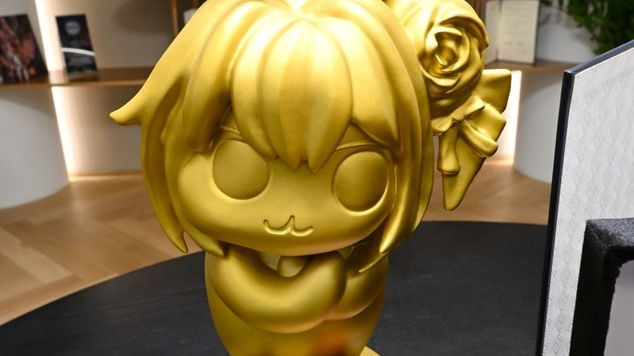
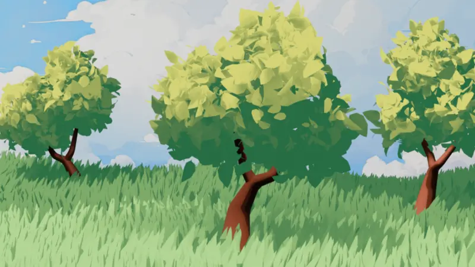
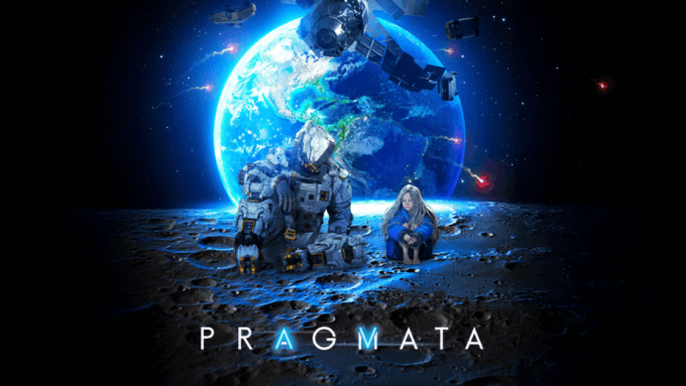
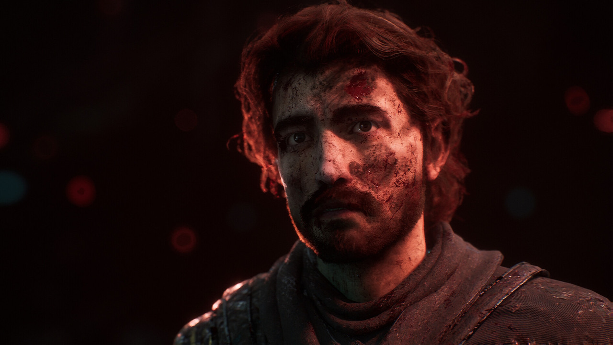
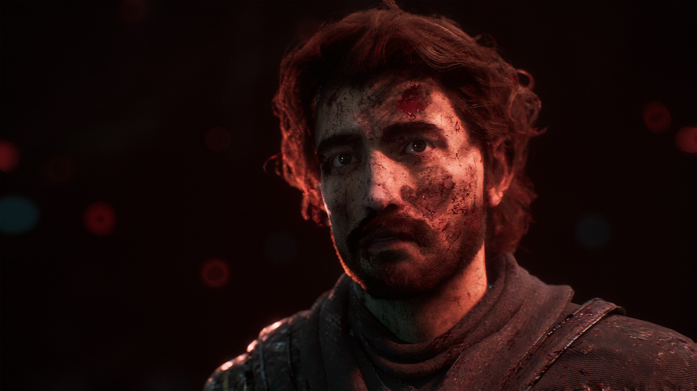

# 📅 Ultimate Daily Full Report — 2026-04-19

**📢 【今日頭條】**

韓國知名遊戲開發商 Shift Up 近期開放總部探訪，揭露了《劍星》續作與《勝利女神：妮姬》新作專案的開發進度。金亨泰製作人強調遊戲開發需投入大量心力與時間，並以「遊戲是靠屁股做出來的東西」這句名言，深刻闡述了遊戲製作的艱辛與堅持，為業界帶來寶貴的開發哲學洞察。
  - [巴哈姆特 - 探訪 Shift Up 總部](<https://gnn.gamer.com.tw/detail.php?sn=303616>)
---
**⚙️ 【引擎相關】**

- **Unreal Engine**：
  - 丹麥獨立開發團隊 Out of Words 運用 Unreal Engine 5 打造了一款融合傳統藝術與現代科技的合作冒險遊戲。該作巧妙結合停格動畫、物理謎題與玩家溝通機制，並廣泛利用 Nanite、Lumen 及藍圖等 UE5 核心功能，展現了引擎在藝術表現上的強大潛力。
    - [Unreal - Out of Words 訪談](<https://www.unrealengine.com/developer-interviews/crafted-by-hand-out-of-words-melds-traditional-art-with-modern-tech-using-ue5>)
---
**🧱 【3D 模型技術】**

- BlenderNation 分享了一篇教學，利用幾何節點快速創建風格化且具繪畫感的樹木，展示了 Blender 在藝術化資產生成方面的靈活性與效率。
  - [3D - BlenderNation - 風格化樹木教學](<https://www.blendernation.com/2026/04/18/stylized-tree-tutorial/>)
- 80.lv 介紹了一個基於 2D 插畫創作的超現實 3D 角色，探討了將平面藝術轉化為立體模型的設計與技術挑戰，以及如何捕捉原畫的精髓。
  - [3D - 80.lv - 超現實 3D 角色](<https://80.lv/articles/have-a-look-at-this-surreal-3d-character-based-on-a-2d-illustration>)
- 80.lv 深入報導了《Killing Floor 3》中一個恐怖頭目生物的設計細節，由首席角色藝術家分享了其從概念到最終 3D 模型實現的創作過程與技術考量。
  - [3D - 80.lv - Killing Floor 3 頭目生物](<https://80.lv/articles/lead-character-artist-details-a-terrifying-boss-creature-from-killing-floor-3>)
---
**✨ 【TA 相關】**

- 80.lv 介紹了一款用於 Substance 3D Designer 的「液態玻璃放大鏡」工具，展示了材質製作在視覺效果上的創新應用，為技術美術師提供了新的創作可能性。
  - [TA - 80.lv - 液態玻璃放大鏡](<https://80.lv/articles/liquid-glass-magnifier-a-substance-3d-designer-tool>)
- Capcom 團隊在 80.lv 的訪談中，分享了如何利用 RE Engine 打造出令人驚豔的全新科幻 IP《Pragmata》，深入探討了引擎技術在視覺呈現與渲染管線上的關鍵作用。
  - [TA - 80.lv - Pragmata 與 RE Engine](<https://80.lv/articles/pragmata-interview-how-capcom-delivered-a-stunning-new-sci-fi-ip-with-re-engine>)
- 80.lv 呈現了一種看似怪誕卻又奇異美麗的材質，其外觀酷似內臟，展現了材質藝術家在創造獨特視覺體驗方面的創意與技術，挑戰了傳統美學觀念。
  - [TA - 80.lv - 怪誕材質](<https://80.lv/articles/this-grotesque-material-is-oddly-beautiful-even-though-it-looks-like-intestines>)
---
**🎮 【獨立遊戲市場觀察】**

- 2026 年 BAFTA 遊戲大獎揭曉，《光與影：33 號遠征隊》與《超英派遣中心（Dispatch）》成為最大贏家，各奪得三項大獎，顯示了業界對創新與藝術性作品的肯定，無論其開發規模大小。
  - [巴哈姆特 - 2026 BAFTA 遊戲大獎](<https://gnn.gamer.com.tw/detail.php?sn=303615>)
- Steam 平台上的《Team Fortress 2》近期發布了多個例行更新，包含錯誤修復與節日內容，持續維護遊戲的穩定性與玩家體驗，展現了長青遊戲的營運策略。
  - [Steam - Team Fortress 2 更新](<https://store.steampowered.com/news/260304/>)
---
**🤝 【在地社群】**

- 巴哈姆特電玩瘋手機週報介紹了 12 款手機遊戲，涵蓋了《貓娘樂園 世界連結》、《環形戰爭》等多種類型，為台灣玩家提供了最新的手遊資訊與市場動態。
  - [巴哈姆特 - 手機週報](<https://gnn.gamer.com.tw/detail.php?sn=303618>)
- 巴哈姆特 ACG 創作大賽迎來 15 週年，站長 sega 回顧了賽事發展歷程，強調頒獎茶會是創作者們交流與充電的重要時刻，展現了在地社群對原創內容的長期支持與培育。
  - [巴哈姆特 - ACG 創作大賽 15 週年](<https://gnn.gamer.com.tw/detail.php?sn=303617>)
---
**💼 【製作人週記建議】**

今日的業界動態提醒製作人，遊戲開發不僅需要技術創新，更需要對藝術與玩家體驗的深刻理解。從 Shift Up 製作人金亨泰的「遊戲是靠屁股做出來的東西」這句話中，我們看到堅持與投入是成功的基石。同時，獨立遊戲《Out of Words》融合傳統藝術與現代科技的案例，也鼓勵製作人勇於探索跨領域的創意結合，並善用引擎的最新功能來實現獨特願景。此外，BAFTA 遊戲大獎的結果也再次證明，無論規模大小，具備創新精神與高品質的作品終將獲得市場與評論的雙重肯定，這應成為所有製作人追求的目標。
---
**🌌 【今日全方位深度總結】**
今日頭條揭示了 Shift Up 製作《劍星》續作與《妮姬》新作的幕後哲學，強調遊戲開發的毅力與投入，為業界樹立了榜樣。
引擎相關新聞展示了 Unreal Engine 5 在融合傳統藝術與現代技術方面的強大能力，特別是 Nanite 與 Lumen 等渲染管線的應用，為藝術家提供了廣闊的創作空間與技術支持。
3D 模型技術方面，Blender 幾何節點的風格化樹木教學，以及 80.lv 關於 2D 轉 3D 角色與生物設計的分享，突顯了資產創作流程的多元化與技術深度，鼓勵藝術家探索不同風格的表現。
TA 相關報導則深入探討了 Substance Designer 的材質工具應用，以及 Capcom 如何利用 RE Engine 實現科幻 IP 的視覺效果，展現了技術美術在渲染、材質與引擎優化上的關鍵作用與前沿技術。
獨立遊戲市場觀察顯示，BAFTA 遊戲大獎肯定了創新作品，而 Steam 上的例行更新則反映了遊戲生命週期維護的重要性，提醒開發者持續關注玩家體驗。
在地社群方面，巴哈姆特的手機遊戲週報與 ACG 創作大賽的回顧，展現了台灣遊戲社群的活躍與對原創內容的持續支持，為本地開發者提供了交流與展示的平台。
製作人週記建議則從金亨泰的開發哲學出發，鼓勵製作人堅持不懈，並從跨領域融合與技術創新中尋找新的突破點，以打造出受市場認可的高品質作品，同時不忘藝術與技術的平衡。
